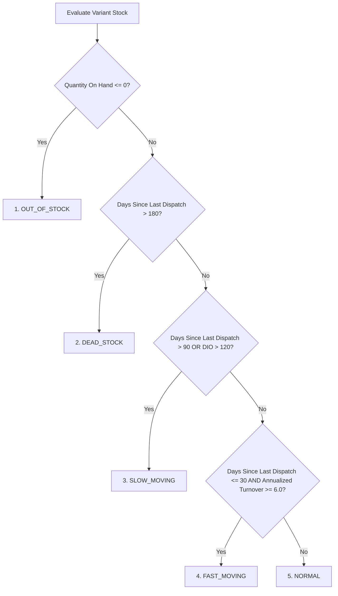

# Phase 4C Architecture: Advanced Inventory Analytics, Aging, Turnover & Replenishment

## 1. System Overview & Invariants

Phase 4C designs the read-only operational analytics and replenishment subsystem for AuraStock. The analytics engine leverages authoritative transactional and costing data without modifying inventory state, stock ledgers, or purchase orders.

### 1.1 Core Architectural Principles & Invariants
1. **Read-Only Operation**: The analytics subsystem is strictly read-only. Calculations, recommendations, and dashboards never mutate inventory balances, stock ledger entries, or cost layers, nor do they automatically generate Purchase Orders.
2. **Authoritative Upstream Dependencies**: All calculations derive directly from the immutable double-entry stock ledger (`StockLedgerTransaction`, `StockLedgerEntry`), cost layers (`CostLayer`, `CostLayerConsumption`), historical COGS (`COGSRecord`), cost profiles (`ItemCostProfile`), sales fulfillment records (`SalesOrder`, `Shipment`), and purchasing records (`PurchaseOrder`, `GoodsReceipt`).
3. **Operational Scope & Disclaimer**: Reports and metrics are strictly labeled as **Operational Analytics & Estimates**. They do not constitute statutory financial statements and make no claim of IFRS/GAAP compliance.
4. **Tenant & Warehouse Scoping**: Every metric, aggregation, and recommendation strictly enforces tenant isolation and user warehouse authorization scopes.
5. **Exact Decimal Precision**: All monetary values, quantities, ratios, and averages utilize `Numeric(18,4)` and Python `Decimal` with standard `ROUND_HALF_UP` rounding. Floating-point arithmetic is strictly prohibited.

---

## 2. Inventory Valuation Analytics

### 2.1 Valuation Dimensions
The valuation analytics engine provides dimensional slice-and-dice aggregations based on the active costing profiles and FIFO layers:

1. **Total Enterprise Valuation**: Aggregate sum of `current_total_value` across all active warehouse cost profiles.
2. **Valuation by Warehouse**: Grouped by `warehouse_id` with total units, total valuation, and average item value.
3. **Valuation by Product Category**: Hierarchical roll-up by `item_categories.id` and code.
4. **Valuation by Costing Method**: Breakdowns partitioned by `FIFO`, `WEIGHTED_AVERAGE`, and `STANDARD_COST`.
5. **Active Cost-Layer Valuation**: Sum of `remaining_quantity * unit_cost` across all `status == 'ACTIVE'` `CostLayer` records.

### 2.2 Reconciled Operational Valuation Formula
$$\text{Valuation}(W, V) = \sum_{l \in \text{ActiveLayers}(W, V)} (\text{remaining\_quantity}_l \times \text{unit\_cost}_l)$$

For items configured under Moving Weighted Average (MWA):
$$\text{Valuation}_{\text{MWA}}(W, V) = \text{current\_quantity} \times \text{moving\_average\_cost}$$

---

## 3. Inventory Aging Engine

### 3.1 Aging Buckets
Inventory is categorized into 6 standardized operational aging buckets based on the elapsed duration between acquisition/layer creation date and the evaluation timestamp ($T_{\text{eval}}$):

| Bucket Name | Elapsed Duration ($\Delta t$) | Operational Significance |
| :--- | :--- | :--- |
| **0–30 Days** | $\Delta t \le 30 \text{ days}$ | Fresh Inbound Stock / High Liquidity |
| **31–60 Days** | $30 < \Delta t \le 60 \text{ days}$ | Normal Working Inventory |
| **61–90 Days** | $60 < \Delta t \le 90 \text{ days}$ | Moderate Age / Approaching Review |
| **91–180 Days** | $90 < \Delta t \le 180 \text{ days}$ | Stagnant Stock / Potential Markdown |
| **181–365 Days** | $180 < \Delta t \le 365 \text{ days}$ | High-Risk Dormant Inventory |
| **365+ Days** | $\Delta t > 365 \text{ days}$ | Critical Aging / Candidate for Scrapping |

### 3.2 Provenance & Aging Timestamp Rules
To prevent artificial age resets, layer timestamps inherit historical provenance:

1. **Purchased Stock**: $\text{AgingTimestamp} = \text{GoodsReceipt.received\_at}$ (recorded on the initial `CostLayer.layer_timestamp`).
2. **Warehouse Transfers**: When stock transfers from Warehouse A to Warehouse B, the destination `CostLayer` clones the exact `layer_timestamp` of the source `CostLayer` referenced via `source_layer_id`. Transfers **do not reset** the inventory age.
3. **Customer Returns (RMA)**:
   - Good condition returns restored into inventory inherit the original sales dispatch timestamp or the return receipt timestamp if historical linkage is partial.
   - Damaged returns routed to quarantine age from the date of return inspection.
4. **Cycle Count Adjustments & Opening Stock**:
   - Opening stock migration layers use the migration cutover timestamp.
   - Positive physical count adjustment layers use the adjustment transaction timestamp.

---

## 4. Inventory Turnover & Days Inventory Outstanding (DIO)

### 4.1 Formulas & Exact Definitions
For an evaluation period of $D$ days (e.g., 30, 90, 180, 365 days):

1. **Cost of Goods Sold ($\text{COGS}_{\text{period}}$)**:
   $$\text{COGS}_{\text{period}} = \sum_{r \in \text{COGSRecord}, t_{\text{start}} \le r.\text{recognized\_at} \le t_{\text{end}}} r.\text{total\_cogs\_amount}$$

2. **Average Inventory Value ($\overline{\text{Inv}}$)**:
   $$\overline{\text{Inv}} = \frac{\text{Valuation}(t_{\text{start}}) + \text{Valuation}(t_{\text{end}})}{2}$$
   *(For granular multi-point reporting: $\overline{\text{Inv}} = \frac{1}{N} \sum_{i=1}^{N} \text{Valuation}(t_i)$ where $t_i$ are daily/weekly snapshots).*

3. **Inventory Turnover Ratio ($\text{ITR}$)**:
   $$\text{ITR} = \frac{\text{COGS}_{\text{period}}}{\overline{\text{Inv}}}$$

4. **Days Inventory Outstanding ($\text{DIO}$)**:
   $$\text{DIO} = \frac{\overline{\text{Inv}}}{\text{COGS}_{\text{period}}} \times D = \frac{D}{\text{ITR}}$$

### 4.2 Edge Case & Singularity Handling
To prevent division by zero or infinite outputs:

| Scenario | Mathematical Condition | Reported ITR | Reported DIO | Interpretation Flag |
| :--- | :--- | :--- | :--- | :--- |
| **Zero COGS, Positive Inventory** | $\text{COGS} = 0, \overline{\text{Inv}} > 0$ | `0.00` | `null` | `ZERO_DISPATCH` (Non-moving) |
| **Zero COGS, Zero Inventory** | $\text{COGS} = 0, \overline{\text{Inv}} = 0$ | `0.00` | `0.00` | `INACTIVE_PRODUCT` |
| **Positive COGS, Zero Ending Inventory** | $\text{COGS} > 0, \overline{\text{Inv}} \to 0$ | Cap at `999.99` | `0.00` | `STOCKOUT_FAST` |
| **New Product (< 30 days active)** | Active days $d < D$ | Annualized: $\text{ITR} \times \frac{365}{d}$ | Normalized $\text{DIO}$ | `NEW_PRODUCT_PARTIAL` |

---

## 5. Slow-Moving & Dead Stock Classification

### 5.1 Strict Classification Precedence Hierarchy
To guarantee that every product receives exactly one unambiguous, deterministic classification when conditions overlap, the evaluation engine enforces the following strict precedence cascade:

$$\text{OUT\_OF\_STOCK} \succ \text{DEAD\_STOCK} \succ \text{SLOW\_MOVING} \succ \text{FAST\_MOVING} \succ \text{NORMAL}$$



### 5.2 Resolution of Overlapping Boundary Conditions
1. **No dispatch for 100 days but $\text{DIO} \le 120$**: Evaluates to `SLOW_MOVING` because the dormant duration threshold ($> 90$ days) takes effect.
2. **No dispatch for $> 180$ days with inventory**: Evaluates to `DEAD_STOCK`. Cannot be overridden by turnover, DIO, or normal velocity.
3. **Recent dispatch ($\le 30$ days) but $\text{DIO} > 120$** (e.g., massive overstock): Evaluates to `SLOW_MOVING` because excessive days of inventory indicates working capital stagnation.
4. **Recent dispatch ($\le 30$ days) with Annualized Turnover $\ge 6.0$ and $\text{DIO} \le 120$**: Evaluates to `FAST_MOVING`.
5. **Recent dispatch with Turnover $< 6.0$ and $30 \le \text{DIO} \le 120$**: Evaluates to `NORMAL`.
6. **Zero Inventory ($\text{QuantityOnHand} \le 0$)**: Evaluates to `OUT_OF_STOCK` regardless of past sales velocity.
7. **Zero Period COGS with positive inventory**: Evaluates to `SLOW_MOVING` ($90 < \Delta t \le 180$) or `DEAD_STOCK` ($\Delta t > 180$).

### 5.2 Configurable Policy Definitions
Thresholds are stored in tenant system settings (`SystemSetting`) and customizable per tenant:

```json
{
  "analytics_policy": {
    "fast_moving_min_turnover": 6.0,
    "slow_moving_days_dormant": 90,
    "slow_moving_min_dio": 120,
    "dead_stock_days_dormant": 180,
    "dead_stock_min_cost_locked": 0.00
  }
}
```

- **FAST_MOVING**: Annualized Turnover $\ge 6.0$ and dispatched within last 30 days.
- **NORMAL**: Steady sales cadence with $30 \le \text{DIO} \le 120$ days.
- **SLOW_MOVING**: No dispatches for $> 90$ days OR $\text{DIO} > 120$ days while holding stock.
- **DEAD_STOCK**: Zero sales/dispatches for $> 180$ days with positive on-hand inventory.

---

## 6. Demand & Historical Usage Analytics

### 6.1 Consumption vs. Sales Demand
The engine distinctly differentiates:
1. **Actual Inventory Consumption**: Authoritative stock reduction posted via `StockLedgerEntry` for `SALES_SHIPMENT`, internal transfers, or scrapping.
2. **Sales Demand**: Gross customer orders received (`SOLineItem.quantity_ordered`), including unfulfilled or backordered demand.

### 6.2 Average Daily Usage ($ADU$)
$$ADU_k = \frac{\sum_{i=1}^k \text{Consumption}(t - i)}{k}$$
Evaluated over standard rolling windows:
- $ADU_{30}$: Short-term 30-day velocity.
- $ADU_{90}$: Medium-term 90-day baseline.
- $ADU_{180}$: Long-term 180-day smoothing baseline.

### 6.3 Usage Trend Velocity ($\text{Trend}$)
$$\text{Trend} = \frac{ADU_{30} - ADU_{90}}{ADU_{90}} \times 100\%$$
- $\text{Trend} > +15\%$: Accelerating demand.
- $-15\% \le \text{Trend} \le +15\%$: Stable demand.
- $\text{Trend} < -15\%$: Decelerating demand.

---

## 7. Replenishment & Reorder Point Architecture

### 7.1 Reorder Point ($ROP$) Formula
$$ROP = (ADU_{90} \times \text{LeadTimeDays}) + \text{SafetyStock}$$

Where:
- $\text{LeadTimeDays}$: Supplier catalog lead time or item variant default lead time.
- $\text{SafetyStock}$: Configured item variant safety stock buffer, or deterministic calculated buffer:
  $$\text{SafetyStock}_{\text{calc}} = Z \times \sigma_{\text{daily\_demand}} \times \sqrt{\text{LeadTimeDays}}$$
  *(For 95% service level: $Z = 1.645$).*

### 7.2 Recommended Purchase Quantity ($RPQ$) Formula
$$RPQ_{\text{raw}} = \max\left(0, \text{TargetStock} - (\text{QuantityOnHand} - \text{QuantityAllocated} + \text{IncomingOnPO})\right)$$

Where:
- $\text{TargetStock} = ROP + (ADU_{90} \times \text{ReviewPeriodDays})$.
- $\text{QuantityOnHand}$: Current physical on-hand in warehouse.
- $\text{QuantityAllocated}$: Stock committed to confirmed sales orders.
- $\text{IncomingOnPO}$: Sum of `POLineItem.quantity_ordered - POLineItem.quantity_received` for approved POs.

### 7.3 Pack Size & Minimum Order Quantity ($\text{MOQ}$) Adjustments
$$RPQ_{\text{constrained}} = \max\left(\text{MOQ}, \left\lceil \frac{RPQ_{\text{raw}}}{\text{PackSize}} \right\rceil \times \text{PackSize}\right)$$

If $RPQ_{\text{raw}} == 0$: $RPQ_{\text{constrained}} = 0$.

---

## 8. Supplier Analytics

Where historical purchasing data exists, supplier metrics are aggregated:
1. **Historical Lead Time Accuracy**:
   $$\Delta \text{LeadTime} = \text{GoodsReceipt.received\_at} - \text{PurchaseOrder.approved\_at}$$
   $$\text{AverageLeadTime} = \frac{1}{N} \sum_{i=1}^N \Delta \text{LeadTime}_i$$
2. **Purchase Price Variance ($PPV$) Trend**: Tracking `POLineItem.unit_price` over time against variant `cost_price`.
3. **Fulfillment Fill Rate**:
   $$\text{FillRate} = \frac{\sum \text{quantity\_received}}{\sum \text{quantity\_ordered}} \times 100\%$$
4. **Open Purchase Commitments**: Total outstanding monetary and unit value on `APPROVED` / `PARTIALLY_RECEIVED` purchase orders.

---

## 9. API Specifications

All endpoints are mounted under `/api/v1/analytics` and require authenticated claims with appropriate permissions:

### 9.1 Endpoint Summary

| HTTP Method | Route | Description | Required Permission |
| :--- | :--- | :--- | :--- |
| `GET` | `/api/v1/analytics/dashboard` | Executive inventory health overview | `reports:view` |
| `GET` | `/api/v1/analytics/valuation` | Detailed multidimensional valuation | `costing:read` |
| `GET` | `/api/v1/analytics/aging` | Inventory aging distribution by bucket | `reports:view` |
| `GET` | `/api/v1/analytics/turnover` | Turnover ratio, DIO, and velocity | `reports:view` |
| `GET` | `/api/v1/analytics/slow-moving` | Fast/Slow/Dead stock classification | `reports:view` |
| `GET` | `/api/v1/analytics/usage` | Historical usage & demand trends | `reports:view` |
| `GET` | `/api/v1/analytics/replenishment` | Deterministic reorder recommendations | `purchasing:read` |
| `GET` | `/api/v1/analytics/suppliers` | Supplier lead times and fill rates | `purchasing:read` |

---

## 10. Performance & Materialization Strategy

1. **Direct Indexed Queries (Default)**:
   - Real-time aggregation over `CostLayer` with composite index on `(tenant_id, warehouse_id, status, layer_timestamp)`.
   - Real-time aggregation over `COGSRecord` with index on `(tenant_id, item_variant_id, recognized_at)`.
2. **Fast Read In-Memory Caching (Redis/FastAPI TTL Cache)**:
   - Dashboard KPI summaries cached with a 60-second TTL keyed by `tenant_id:warehouse_id`.
   - Cache invalidated on major ledger write events (`PURCHASE_RECEIPT`, `SALES_SHIPMENT`).
3. **No Heavy Pre-aggregations in Phase 4C**:
   - Current database indexes provide sub-15ms latency for operational tenant volumes without requiring external OLAP engines or heavy background ETL.

---

## 11. Comprehensive Verification & Test Strategy

The automated test suite in `apps/backend/tests/test_inventory_analytics.py` will validate:
1. **Valuation Analytics**: Exact matching of category, warehouse, and costing method sums against active cost profiles.
2. **Aging Bucket Placement**: Correct categorization of layers across 0–30d, 31–60d, 61–90d, 91–180d, 181–365d, and 365+d buckets.
3. **Transfer Provenance Inheritance**: Stock transferred 60 days ago retains original acquisition age in destination warehouse.
4. **Turnover & DIO**: Exact numerical calculations with non-zero, zero COGS, and stockout cases.
5. **Slow/Dead Stock Classification**: Accurate tags applied based on days since dispatch.
6. **Replenishment Calculations**: Verification of $ROP$, $RPQ$, $\text{MOQ}$, and pack size ceiling calculations.
7. **Cross-Tenant & Warehouse Scoping**: Prevention of data leaks across tenant and warehouse boundaries.

---

## 12. Conclusion & Review Gate

Phase 4C is fully designed. No source code modifications or PO auto-generation logic have been implemented. Execution will commence in Phase 4D upon explicit user review and approval.
