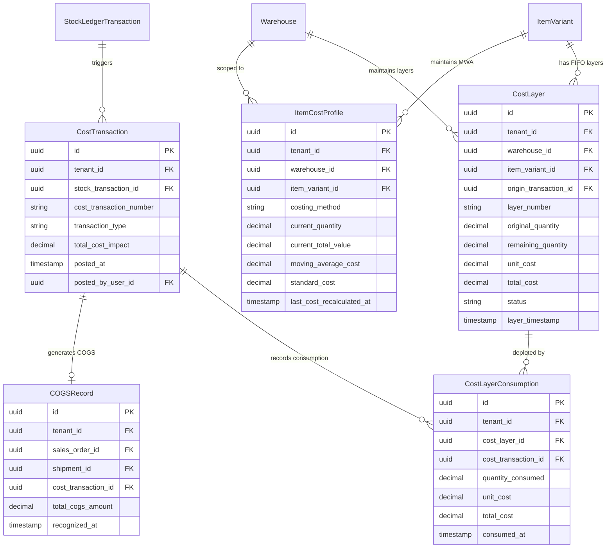

# Advanced Inventory Costing & Valuation Architecture Specification
**Phase 4A Design Document — AuraStock Enterprise Inventory Management System**

---

## 1. Architectural Foundation & Existing System Inspection

### 1.1 Existing Inventory Ledger & Mutation Points
The AuraStock system maintains a double-entry, append-only inventory ledger with physical stock balances cached at the location bin level:
- **`StockLedgerTransaction` & `StockLedgerEntry`**: Immutable transaction records recording every quantity change with `transaction_type` (`PURCHASE_RECEIPT`, `SALES_SHIPMENT`, `STOCK_TRANSFER`, `STOCK_ADJUSTMENT`, `SALES_RETURN`, `CYCLE_COUNT`).
- **`StockBalanceCache`**: Fast-lookup balance projection tracking `(location_bin_id, item_variant_id, batch_id)` with database check constraints:
  - $\text{quantity\_on\_hand} \ge 0$
  - $\text{quantity\_allocated} \ge 0$
  - $\text{quantity\_on\_hand} \ge \text{quantity\_allocated}$
- **Transaction Boundaries**: All physical movements are orchestrated in single atomic transactions where `StockEngine.post_transaction()` uses `SELECT ... FOR UPDATE` row locks and yields control to the outer business workflow for atomic `db.commit()`.

### 1.2 Identified Inventory Mutation Entry Points
1. **Goods Receipt (GRN)**: `PurchaseService.receive_goods()` $\rightarrow$ Inbound physical stock (`PURCHASE_RECEIPT`).
2. **Sales Order Allocation**: `SalesService.allocate_stock()` $\rightarrow$ Increments `quantity_allocated`.
3. **Sales Order Dispatch**: `SalesService.dispatch_sales_order()` $\rightarrow$ Decrements `quantity_allocated` and deducts physical `quantity_on_hand` (`SALES_SHIPMENT`).
4. **Sales Returns**: `SalesService.process_sales_return()` $\rightarrow$ Inbounds returned units (`SALES_RETURN`).
5. **Stock Transfers**: `StockEngine.post_transaction()` $\rightarrow$ Moves stock between bins/warehouses (`STOCK_TRANSFER`).
6. **Stock Adjustments**: `record_stock_adjustment()` $\rightarrow$ Resolves physical count discrepancies (`STOCK_ADJUSTMENT`).

---

## 2. Costing Data Model

### 2.1 Scope & Granularity: Warehouse-Level Costing Domain
Physical inventory is stored at the granular **Location Bin** level (`LocationBin`). However, inventory costing (FIFO layers and Moving Weighted Average) operates at the **`(tenant_id, warehouse_id, item_variant_id)`** boundary.
- **Rationale**: Moving an item between storage bins within the same warehouse (e.g. from Aisle 01 to Aisle 04) is a physical relocation, not a cost-basis transformation. Maintaining costing layers at the warehouse level prevents unnatural fragmentation while preserving distinct landed costs across separate physical warehouses.

### 2.2 Entity Relationship Diagram (ERD)



### 2.3 Entity Schema Specifications

#### 1. `CostLayer` (FIFO Layer Tracking)
- `id`: UUID (Primary Key)
- `tenant_id`: UUID (Indexed)
- `warehouse_id`: UUID (Foreign Key to `warehouses.id`, Indexed)
- `item_variant_id`: UUID (Foreign Key to `item_variants.id`, Indexed)
- `origin_transaction_id`: UUID (Foreign Key to `stock_ledger_transactions.id`, Indexed)
- `layer_number`: String (Unique business reference, e.g. `LAYER-202608-00001`)
- `original_quantity`: Numeric(18, 4) (Check: $> 0$)
- `remaining_quantity`: Numeric(18, 4) (Check: $\ge 0 \text{ and } \le \text{original\_quantity}$)
- `unit_cost`: Numeric(18, 4) (Check: $\ge 0$)
- `total_cost`: Numeric(18, 4) (Original quantity $\times$ Unit cost)
- `status`: String (`ACTIVE`, `DEPLETED`, `CANCELLED`)
- `layer_timestamp`: DateTime with Timezone (Deterministic FIFO ordering)

#### 2. `CostLayerConsumption` (Layer Traceability)
- `id`: UUID (Primary Key)
- `tenant_id`: UUID (Indexed)
- `cost_layer_id`: UUID (Foreign Key to `cost_layers.id`, Indexed)
- `cost_transaction_id`: UUID (Foreign Key to `cost_transactions.id`, Indexed)
- `quantity_consumed`: Numeric(18, 4) (Check: $> 0$)
- `unit_cost`: Numeric(18, 4) (Unit cost of the source layer)
- `total_cost`: Numeric(18, 4) (`quantity_consumed * unit_cost`)
- `consumed_at`: DateTime with Timezone

#### 3. `ItemCostProfile` (Moving Weighted Average Running State)
- `id`: UUID (Primary Key)
- `tenant_id`: UUID (Indexed)
- `warehouse_id`: UUID (Foreign Key to `warehouses.id`)
- `item_variant_id`: UUID (Foreign Key to `item_variants.id`)
- `costing_method`: String (`FIFO`, `WEIGHTED_AVERAGE`, `STANDARD_COST`)
- `current_quantity`: Numeric(18, 4) (Current on-hand quantity)
- `current_total_value`: Numeric(18, 4) (Current total valuation in warehouse)
- `moving_average_cost`: Numeric(18, 4) (Running weighted average unit cost)
- `standard_cost`: Numeric(18, 4) (Fallback standard unit cost)
- `last_cost_recalculated_at`: DateTime with Timezone
- **Unique Constraint**: `(tenant_id, warehouse_id, item_variant_id)`

#### 4. `CostTransaction` (Cost Journal Header)
- `id`: UUID (Primary Key)
- `tenant_id`: UUID (Indexed)
- `stock_transaction_id`: UUID (Foreign Key to `stock_ledger_transactions.id`, Indexed)
- `cost_transaction_number`: String (Unique)
- `transaction_type`: String (`RECEIPT_COST`, `DISPATCH_COGS`, `TRANSFER_COST`, `ADJUSTMENT_COST`, `RETURN_COST`)
- `total_cost_impact`: Numeric(18, 4) (Total monetary value of the cost movement)
- `posted_at`: DateTime with Timezone
- `posted_by_user_id`: UUID (Foreign Key to `users.id`)

#### 5. `COGSRecord` (Authoritative Cost of Goods Sold)
- `id`: UUID (Primary Key)
- `tenant_id`: UUID (Indexed)
- `sales_order_id`: UUID (Foreign Key to `sales_orders.id`, Indexed)
- `shipment_id`: UUID (Foreign Key to `shipments.id`, Indexed)
- `cost_transaction_id`: UUID (Foreign Key to `cost_transactions.id`, Indexed)
- `total_cogs_amount`: Numeric(18, 4) (Immutable COGS total)
- `recognized_at`: DateTime with Timezone

---

## 3. FIFO Costing Algorithm Specification

### 3.1 FIFO Lifecycle Rules
1. **Layer Creation**: Every inbound receipt (`PURCHASE_RECEIPT`, positive count adjustment, or inbound transfer) creates an active `CostLayer` with `remaining_quantity = original_quantity` and `layer_timestamp = posted_at`.
2. **Layer Depletion Ordering**: When an outbound consumption occurs (`SALES_SHIPMENT`, negative adjustment, outbound transfer), active layers for the `(warehouse_id, item_variant_id)` are locked and selected ordered by `layer_timestamp ASC, id ASC`.
3. **Partial & Complete Consumption**:
   - If `layer.remaining_quantity >= required_qty`:
     - Layer remains `ACTIVE` with `remaining_quantity -= required_qty`.
     - Record `CostLayerConsumption(quantity=required_qty, unit_cost=layer.unit_cost)`.
     - Requirement fulfilled ($0$ remaining).
   - If `layer.remaining_quantity < required_qty`:
     - Deduct entire `layer.remaining_quantity`.
     - Layer status updated to `DEPLETED` with `remaining_quantity = 0`.
     - Record `CostLayerConsumption` for that layer's full balance.
     - Decrement `required_qty` and proceed to the next oldest layer.

### 3.2 Concrete FIFO Example Walkthrough

#### Scenario:
- **Layer A**: Received 100 units @ ₹50.00 (Total ₹5,000.00)
- **Layer B**: Received 100 units @ ₹55.00 (Total ₹5,500.00)
- **Layer C**: Received 100 units @ ₹60.00 (Total ₹6,000.00)
- **Total Initial Inventory**: 300 units = ₹16,500.00

#### Operation: Dispatch 120 units
1. Lock layers for `(warehouse_1, variant_1)` in deterministic order (`Layer A`, `Layer B`, `Layer C`).
2. **Consume Layer A**:
   - Quantity available = 100 units.
   - Consume 100 units @ ₹50.00 = ₹5,000.00.
   - Layer A `remaining_quantity` becomes `0.00` $\rightarrow$ Status: `DEPLETED`.
   - Remaining dispatch required = 20 units.
3. **Consume Layer B**:
   - Quantity available = 100 units.
   - Consume 20 units @ ₹55.00 = ₹1,100.00.
   - Layer B `remaining_quantity` becomes `80.00` $\rightarrow$ Status: `ACTIVE`.
   - Remaining dispatch required = 0 units.
4. **Layer C**: Untouched (100 units @ ₹60.00 = ₹6,000.00).

#### Result:
- **Recognized COGS**: ₹5,000.00 + ₹1,100.00 = **₹6,100.00**
- **Remaining Inventory**:
  - Layer B: 80 units @ ₹55.00 = ₹4,400.00
  - Layer C: 100 units @ ₹60.00 = ₹6,000.00
  - **Total Remaining Valuation**: 180 units = **₹10,400.00**
- **Reconciliation Check**: Initial (₹16,500.00) − COGS (₹6,100.00) = Remaining Valuation (₹10,400.00). Invariant verified.

---

## 4. Moving Weighted Average (MWA) Specification

### 4.1 Mathematical Formula
When new stock is received into a warehouse:
$$\bar{C}_{\text{new}} = \frac{(Q_{\text{current}} \times \bar{C}_{\text{current}}) + (Q_{\text{inbound}} \times C_{\text{inbound}})}{Q_{\text{current}} + Q_{\text{inbound}}}$$
Where:
- $Q_{\text{current}}$ = Current physical on-hand quantity before receipt.
- $\bar{C}_{\text{current}}$ = Current moving average unit cost.
- $Q_{\text{inbound}}$ = Quantity being received in the transaction.
- $C_{\text{inbound}}$ = Unit cost of the incoming receipt.

### 4.2 Concrete MWA Example Walkthrough

#### Step 1: Initial State
- Current on-hand: 100 units @ ₹50.00 = ₹5,000.00. Average = **₹50.00/unit**.

#### Step 2: Inbound Purchase Receipt
- Inbound receipt: 100 units @ ₹60.00 = ₹6,000.00.
- Calculation:
  $$\bar{C}_{\text{new}} = \frac{₹5,000.00 + ₹6,000.00}{100 + 100} = \frac{₹11,000.00}{200} = ₹55.00/\text{unit}$$
- Updated State: 200 units, Total Valuation = ₹11,000.00, Running Average = **₹55.00/unit**.

#### Step 3: Outbound Dispatch
- Dispatch: 120 units.
- COGS Calculation: $120 \text{ units} \times ₹55.00 = \mathbf{₹6,600.00}$.
- Post-Dispatch State:
  - Remaining Quantity: $200 - 120 = 80\text{ units}$.
  - Unit Average Cost: Unchanged at **₹55.00/unit**.
  - Total Remaining Valuation: $80 \times ₹55.00 = \mathbf{₹4,400.00}$.
- **Immutability Guarantee**: Subsequent receipts (e.g. at ₹70/unit) update future average cost, but the historical COGS of ₹6,600.00 for this dispatch is permanently immutable.

---

## 5. Warehouse Transfers (Warehouse A $\rightarrow$ Warehouse B)

### 5.1 Inter-Warehouse Cost Preservation (Zero P&L)
An internal transfer between warehouses must never generate artificial accounting profit or loss.

```
Warehouse A (Source)                          Warehouse B (Destination)
┌────────────────────────┐                   ┌────────────────────────┐
│ Deplete Cost Basis:    │                   │ Inbound Cost Basis:    │
│ - FIFO: Oldest Layers  │ ───────────────>  │ - FIFO: Cloned Layers  │
│ - MWA: Running Average │   Transfer Qty    │   with Origin Metadata │
│   at Source            │   & Unit Costs    │ - MWA: Inflow blended  │
└────────────────────────┘                   │   into Dest Running Avg│
                                             └────────────────────────┘
```

1. **FIFO Transfer Mechanism (Layer Cloning with Provenance)**:
   - Source Warehouse A depletes its oldest FIFO layers for the requested transfer quantity.
   - For each depleted slice $(Q_i, C_i)$, a new `CostLayer` is created in Destination Warehouse B:
     - `warehouse_id`: Warehouse B
     - `original_quantity`: $Q_i$
     - `remaining_quantity`: $Q_i$
     - `unit_cost`: $C_i$ (Exact acquisition cost preserved)
     - `origin_transaction_id`: Points to the transfer `StockLedgerTransaction`
     - Provenance metadata recorded in `CostTransaction`.
2. **MWA Transfer Mechanism**:
   - Source Warehouse A calculates transfer value: $Q_{\text{transfer}} \times \bar{C}_{\text{source}}$.
   - Source total value decrements by this amount.
   - Destination Warehouse B receives $Q_{\text{transfer}}$ at unit cost $\bar{C}_{\text{source}}$, recalculating Warehouse B's moving average according to the standard MWA formula.

---

## 6. Inventory Adjustments & Count Corrections

### 6.1 Negative Adjustments (Shrinkage, Damage, Write-Off)
- **Behavior**: Acts as an outbound cost consumption.
- **FIFO**: Depletes the oldest active cost layers in the warehouse.
- **MWA**: Consumes at the current running moving average cost.
- **Classification**: Creates a `CostTransaction` tagged as `ADJUSTMENT_LOSS` (non-operating expense), preserving complete audit traceability.

### 6.2 Positive Adjustments (Stock Found, Opening Balance)
- **Requirement**: Must have an explicitly defined cost basis. The costing engine never invents financial figures.
- **Cost Source Hierarchy**:
  1. Operator-provided `unit_cost` in the API/UI request payload (e.g. from physical count audit or invoice reconciliation).
  2. Fallback to `ItemVariant.cost_price` (standard cost defined in catalog master).
  3. If both are zero/null, transaction requires administrative override flag (`allow_zero_cost_adjustment: true`) and logs a high-severity audit warning.
- **FIFO**: Creates a new `CostLayer` with the validated cost basis.
- **MWA**: Blends the positive quantity and validated unit cost into the warehouse's running average.

---

## 7. Customer & Supplier Returns Costing Rules

### 7.1 Customer Returns (Sales Return / RMA)
1. **Saleable / Good Condition Return**:
   - **Cost Basis**: Must restore original cost basis. The return request references the specific `sales_order_id` / `shipment_id`.
   - The cost engine queries the historical `CostLayerConsumption` associated with that shipment and restores cost layers at the exact original unit costs (reinstating the original cost basis rather than current market or average price).
   - Reversing cost entry created: Credits COGS (negative COGS impact) and debits inventory valuation.
2. **Damaged Condition Return**:
   - Inbounded directly to a designated Quarantine/Damage Bin (`type = "DAMAGE"`).
   - Cost is isolated in a quarantined valuation layer or immediately written down to salvage/scrap value, preventing prime saleable inventory from being corrupted by damaged asset values.

### 7.2 Supplier Returns (Return to Vendor / Debit Memo)
- Directly reverses the originating `PurchaseOrder` or `GoodsReceipt` cost layer.
- If the original receipt layer has already been partially consumed by subsequent dispatches, the supplier return is fulfilled from remaining active layers, or requires an administrative variance journal if original units were consumed at a lower cost.

---

## 8. Financial & Quantity Precision Strategy

To prevent floating-point inaccuracies and cumulative rounding drift:

| Domain | Database Type | Python Type | Rounding Mode | Precision |
| :--- | :--- | :--- | :--- | :--- |
| **Physical Quantities** | `Numeric(18, 4)` | `decimal.Decimal` | `ROUND_HALF_UP` | $4$ decimal places ($0.0001$) |
| **Unit Costs** | `Numeric(18, 4)` | `decimal.Decimal` | `ROUND_HALF_UP` | $4$ decimal places ($0.0001$) |
| **Transaction Totals / COGS**| `Numeric(18, 4)` | `decimal.Decimal` | `ROUND_HALF_UP` | $4$ decimal places ($0.0001$) |
| **Currency Display / Reports**| Formatted String | `decimal.Decimal` | `ROUND_HALF_UP` | $2$ decimal places ($0.01$) |

- **Rounding Variance Account**: Cumulative fractional cent discrepancies ($< \$0.01$) arising from split-layer allocations are balanced into a `rounding_variance` tracking field in `CostTransaction`.

---

## 9. Concurrency, Locking & Anti-Deadlock Strategy

Simultaneous dispatches, receipts, and transfers must not cause race conditions, double consumption, or deadlocks.

### 9.1 Deterministic Pessimistic Locking Hierarchy
When executing any cost-relevant transaction:
1. **Acquire Locks on Cost Profile**:
   ```sql
   SELECT * FROM item_cost_profiles
   WHERE tenant_id = :tenant_id AND warehouse_id = :warehouse_id AND item_variant_id = :variant_id
   FOR UPDATE;
   ```
2. **Acquire Locks on Active FIFO Layers (if FIFO)**:
   ```sql
   SELECT * FROM cost_layers
   WHERE tenant_id = :tenant_id AND warehouse_id = :warehouse_id AND item_variant_id = :variant_id AND status = 'ACTIVE'
   ORDER BY layer_timestamp ASC, id ASC
   FOR UPDATE;
   ```
3. **Strict Lock Ordering**: When multiple variants or warehouses are involved (e.g. cross-warehouse transfer or multi-line dispatch), locks are ALWAYS acquired in alphabetical order of `(warehouse_id, item_variant_id)`. This mathematically eliminates deadlocks.

---

## 10. Proposed API Endpoints (Phase 4B Specification)

```
GET    /api/v1/costing/layers?warehouse_id={id}&item_variant_id={id}&status={ACTIVE|DEPLETED}
GET    /api/v1/costing/profiles/{warehouse_id}/{item_variant_id}
GET    /api/v1/costing/transactions?stock_transaction_id={id}
GET    /api/v1/costing/cogs?sales_order_id={id}&start_date={date}&end_date={date}
GET    /api/v1/costing/valuation?warehouse_id={id}&costing_method={FIFO|MWA}
POST   /api/v1/costing/valuation/snapshots
GET    /api/v1/costing/valuation/snapshots/{snapshot_id}
```
All endpoints enforce multi-tenant isolation, RBAC permissions (`costing:read`, `costing:write`), and warehouse scoping (`check_warehouse_scope`).

---

## 11. Migration & Cutover Strategy for Existing Stock

### 11.1 Opening Cost Layer Initialization
1. **Inspection**: For every active `StockBalanceCache` row with `quantity_on_hand > 0`:
   - Determine current configured cost from `ItemVariant.cost_price`.
2. **Layer Creation**: Generate initial `CostLayer`:
   - `original_quantity = remaining_quantity = StockBalanceCache.quantity_on_hand`
   - `unit_cost = ItemVariant.cost_price` (or 0.0 with audit flag if unconfigured)
   - `layer_number = "LAYER-OPENING-" + variant_sku`
   - `layer_timestamp = cutover_timestamp`
3. **Cost Profile Initialization**: Initialize `ItemCostProfile` with `moving_average_cost = ItemVariant.cost_price`.
4. **Validation Check**: Verify that $\sum \text{CostLayer.remaining\_quantity} = \sum \text{StockBalanceCache.quantity\_on\_hand}$ for every warehouse and variant before cutover activation.

---

## 12. Statutory Disclaimer & Scope Boundary
> [!IMPORTANT]
> **Operational Inventory Valuation Scope**:
> The costing subsystem provides internal operational inventory valuation and historical COGS tracking. It does NOT claim statutory IFRS / US-GAAP general ledger compliance or represent a double-entry financial accounting general ledger (AP/AR/GL). Statutory tax accounting remains external.
