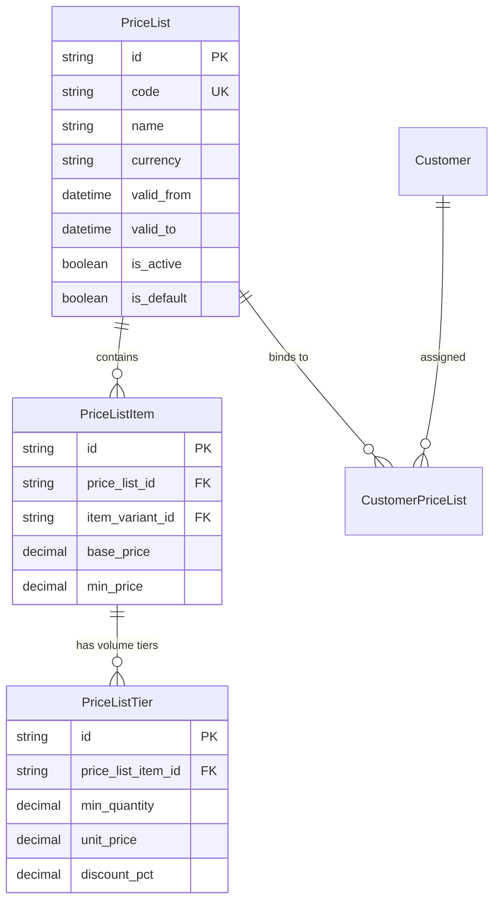
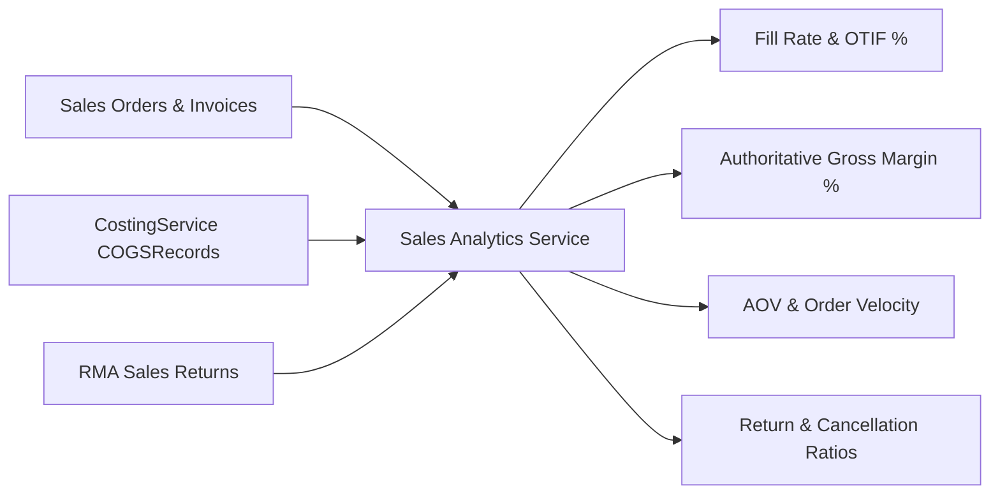

# Phase 8B Architecture Design: Advanced Sales & Multi-Warehouse Fulfillment

## Executive Summary

Phase 8B extends the Phase 8A core sales fulfillment foundation with three advanced enterprise capabilities:
1. **8B.1 — Dynamic Pricing & Price Lists**: Customer-specific price lists, volume tier pricing, promotion discounts, effective date validity windows, and multi-currency exchange rate preservation.
2. **8B.2 — Multi-Warehouse Fulfillment & Split Shipments**: Order routing, fulfillment groups (`SOFulfillmentGroup`), split warehouse allocations, partial/split dispatches, and FEFO lot allocation.
3. **8B.3 — Operational Sales Analytics & Authoritative Gross Margin**: Real-time sales intelligence powered directly by authoritative `COGSRecord`s, order cycle times, fill rates, OTIF (On-Time In-Full), cancellation rates, and return ratios.

The architecture preserves all core invariants:
$$\mathbf{Sales\ Price \ne Inventory\ Cost.}$$
$$\mathbf{Gross\ Margin\ is\ strictly\ derived\ from\ CostingService\ COGS\ Records,\ never\ guessed\ from\ catalog\ markup.}$$
$$\mathbf{PostgreSQL\ Row-Level\ Locking\ ensures\ deterministic\ concurrency\ across\ warehouses\ without\ overselling.}$$

```
                           Sales Order Entry
                                  │
                                  ▼
     ┌─────────────────────────────────────────────────────────┐
     │ 8B.1 Dynamic Pricing Engine                             │
     │ Customer Tier ──► Price List ──► Volume Tier ──► Locked │
     └────────────────────────────┬────────────────────────────┘
                                  │
                                  ▼
     ┌─────────────────────────────────────────────────────────┐
     │ 8B.2 Multi-Warehouse Fulfillment Router                │
     │ SO ──► Fulfillment Groups (WH-East, WH-West)           │
     │   ├── FG 1 (WH-East): PickTask ──► Pack ──► Shipment 1 │
     │   └── FG 2 (WH-West): PickTask ──► Pack ──► Shipment 2 │
     └────────────────────────────┬────────────────────────────┘
                                  │
                                  ▼
     ┌─────────────────────────────────────────────────────────┐
     │ 8B.3 Sales & Margin Analytics Engine                   │
     │ Net Revenue − Authoritative COGSRecords = Gross Margin │
     │ Fill Rate, OTIF, AOV, Cancellation & Return Metrics    │
     └─────────────────────────────────────────────────────────┘
```

---

## 1. Existing Capability Audit & Baseline

| Capability Area | Existing Phase 8A Baseline | Target Phase 8B Implementation | Status |
| :--- | :--- | :--- | :---: |
| **Pricing** | Fixed variant selling price & manual line price | Tiered `PriceList`, `PriceListItem`, volume breakpoints, validity windows | **Phase 8B.1** |
| **Customer Pricing** | Standard default currency | `CustomerPriceList` binding, multi-currency conversion, locked price quotes | **Phase 8B.1** |
| **Fulfillment Scope** | Single warehouse per Sales Order | Multi-warehouse `SOFulfillmentGroup`s with split allocations and split shipments | **Phase 8B.2** |
| **Split Shipments** | Single `Shipment` per SO | Multiple `Shipment` records tied to individual fulfillment groups | **Phase 8B.2** |
| **Warehouse Routing** | Manual warehouse ID selection | Proximity/availability rule-based warehouse allocation | **Phase 8B.2** |
| **Sales Analytics** | Basic counts in dashboard | Real-time analytics engine (Fill rate, OTIF, AOV, Gross Margin via `CostingService`) | **Phase 8B.3** |
| **Gross Margin** | Not aggregated | Aggregated using immutable `COGSRecord.total_cogs_amount` | **Phase 8B.3** |

---

## 2. 8B.1 — Pricing & Price List Architecture



### 2.1 Price Resolution Hierarchy
When an item line is added to a sales order:
1. **Customer Specific Price List**: Check if customer is linked to an active `CustomerPriceList` within the current date window (`valid_from <= NOW() <= valid_to`).
2. **Volume Breakpoint Tier**: Check `PriceListTier` where `quantity_ordered >= min_quantity` (highest matching `min_quantity`).
3. **Default Tenant Price List**: If no customer list matches, evaluate the tenant's default active `PriceList`.
4. **Item Variant Base Price**: Fallback to `ItemVariant.selling_price`.
5. **Historical Price Immutability**: The resolved `unit_price`, `discount_pct`, and `line_total` are permanently recorded on `SOLineItem`. Subsequent price list edits or promotions **never retroactively modify existing orders**.

---

## 3. 8B.2 — Multi-Warehouse Fulfillment & Split Shipments

```mermaid
flowchart TD
    SO[Sales Order: 100 Units SKU-A + 50 Units SKU-B] --> Router{Warehouse Allocation Router}
    Router -->|Rule: Stock Availability| Alloc[Evaluate Regional Warehouse Bins]
    Alloc --> FG1[Fulfillment Group 1: WH-East\n60 Units SKU-A + 50 Units SKU-B]
    Alloc --> FG2[Fulfillment Group 2: WH-West\n40 Units SKU-A (Split Fulfillment)]
    
    FG1 --> Pick1[PickTask 1: WH-East] --> Ship1[Shipment 1: Carrier FDX-01]
    FG2 --> Pick2[PickTask 2: WH-West] --> Ship2[Shipment 2: Carrier UPS-02]
    
    Ship1 --> Ledger1[StockEngine Outbound WH-East\n+ CostingService COGS 1]
    Ship2 --> Ledger2[StockEngine Outbound WH-West\n+ CostingService COGS 2]
```

### 3.1 Fulfillment Group Model (`SOFulfillmentGroup`)
- `id`, `sales_order_id`, `warehouse_id`, `group_number` (e.g. `FG-1001-1`), `status` (`PENDING`, `ALLOCATED`, `PICKING`, `PACKED`, `SHIPPED`, `CANCELLED`).
- `SOAllocation` links directly to `so_line_id`, `fulfillment_group_id`, and `location_bin_id`.
- Multiple `Shipment` records reference `fulfillment_group_id`, enabling independent tracking numbers, packing manifests, and dispatch events.

### 3.2 Concurrency & Multi-Warehouse Locking Strategy
- In multi-warehouse allocations, database row locks (`SELECT FOR UPDATE`) are acquired deterministically in alphabetical order of `(warehouse_id, location_bin_id, item_variant_id)` to completely prevent deadlocks between concurrent fulfillment workers across facilities.

---

## 4. 8B.3 — Operational Sales Analytics & Exact KPI Formulas



### 4.1 Authoritative Mathematical Formulas

#### 1. Real Gross Profit Margin (Powered by `CostingService`)
$$\text{Net Revenue} = \sum (\text{SOLineItem.line\_total} - \text{tax\_amount})$$
$$\text{Authoritative COGS} = \sum \text{COGSRecord.total\_cogs\_amount}$$
$$\text{Gross Profit} = \text{Net Revenue} - \text{Authoritative COGS}$$
$$\text{Gross Margin \%} = \left(\frac{\text{Gross Profit}}{\text{Net Revenue}}\right) \times 100$$

#### 2. Order Fill Rate
$$\text{Fill Rate \%} = \left(\frac{\sum \text{SOLineItem.quantity\_shipped}}{\sum \text{SOLineItem.quantity\_ordered}}\right) \times 100$$

#### 3. On-Time In-Full (OTIF) Rate
$$\text{OTIF \%} = \left(\frac{\text{Count of Orders Delivered On-Time with } 100\% \text{ Quantity Shipped}}{\text{Total Orders Delivered}}\right) \times 100$$

#### 4. Order Cancellation Rate & Return Rate
$$\text{Cancellation Rate \%} = \left(\frac{\text{Cancelled Orders}}{\text{Total Orders Placed}}\right) \times 100$$
$$\text{Return Rate \%} = \left(\frac{\sum \text{SalesReturnLine.quantity\_returned}}{\sum \text{SOLineItem.quantity\_shipped}}\right) \times 100$$

#### 5. Average Order Value (AOV)
$$\text{AOV} = \frac{\sum \text{SalesOrder.total\_amount}}{\text{Total Confirmed Orders}}$$

---

## 5. RBAC & Security Model

| Action | Permission Key | Description |
| :--- | :--- | :--- |
| **Manage Price Lists** | `pricing:write` | Create, update price lists, tiers, and validity dates |
| **View Price Lists** | `pricing:read` | View catalog pricing and volume tiers |
| **Assign Customer Pricing** | `customer:pricing` | Link customers to specific price lists |
| **Allocate Multi-Warehouse**| `sales:allocate` | Route lines across multiple warehouse fulfillment groups |
| **Dispatch Split Shipment** | `sales:dispatch` | Dispatch individual fulfillment group shipments |
| **View Sales Analytics** | `analytics:sales` | Access revenue, margin, fill rate, and OTIF reports |
| **View Gross Margin COGS** | `analytics:margin` | Access authoritative product profitability metrics |

---

## 6. REST API Design Proposals

### 6.1 Pricing APIs (`/api/v1/pricing/*`)
- `GET /api/v1/pricing/price-lists`: List tenant price lists.
- `POST /api/v1/pricing/price-lists`: Create new price list with currency and date window.
- `POST /api/v1/pricing/price-lists/{id}/items`: Add variant price and volume tiers.
- `POST /api/v1/pricing/customers/{customer_id}/assign`: Bind customer to price list.
- `POST /api/v1/pricing/resolve`: Calculate resolved price for customer, variant, and quantity.

### 6.2 Multi-Warehouse Fulfillment APIs (`/api/v1/sales-orders/*`)
- `POST /api/v1/sales-orders/{id}/fulfillment-groups`: Define fulfillment groups across warehouses.
- `POST /api/v1/sales-orders/fulfillment-groups/{fg_id}/allocate`: Allocate specific warehouse group.
- `POST /api/v1/sales-orders/fulfillment-groups/{fg_id}/dispatch`: Dispatch split shipment for group.

### 6.3 Sales Analytics APIs (`/api/v1/analytics/sales/*`)
- `GET /api/v1/analytics/sales/summary`: Executive KPIs (Revenue, Gross Margin, AOV, Fill Rate, OTIF).
- `GET /api/v1/analytics/sales/by-product`: Performance and margin breakdown by SKU.
- `GET /api/v1/analytics/sales/by-customer`: Customer revenue, margin, and order frequency.
- `GET /api/v1/analytics/sales/by-warehouse`: Warehouse outbound fulfillment velocity and fill rates.

---

## 7. Migration & Backward Compatibility Strategy

1. **Price Lists**: Existing `ItemVariant.selling_price` remains the authoritative base fallback price when no active price list is assigned.
2. **Fulfillment Groups**: Single-warehouse orders automatically initialize a single default `SOFulfillmentGroup`, maintaining 100% backward compatibility with Phase 8A workflows and endpoints.
3. **Analytics**: Real-time analytics query historical `SalesOrder` and `COGSRecord` rows without requiring data backfilling.

---

## 8. Implementation Phasing Sequence

```
  Phase 8B.1 (Pricing & Price Lists)
        │
        ▼
  Phase 8B.2 (Multi-Warehouse Fulfillment & Split Shipments)
        │
        ▼
  Phase 8B.3 (Sales & Margin Analytics Engine)
```

1. **Step 1 — Phase 8B.1**: Data models (`PriceList`, `PriceListItem`, `PriceListTier`, `CustomerPriceList`), pricing service resolver, volume tier calculations, and automated test suite.
2. **Step 2 — Phase 8B.2**: Fulfillment group models (`SOFulfillmentGroup`), split allocation logic, split shipment generation, and multi-warehouse concurrency tests.
3. **Step 3 — Phase 8B.3**: Analytics aggregations, authoritative COGS margin calculation, OTIF/fill rate metrics, API endpoints, and web visualization.

---

## 9. Explicitly Deferred Roadmap Items

The following features remain explicitly deferred to future phases:
- Full CRM and lead pipelines.
- Customer self-service web portal.
- Third-party e-commerce marketplace sync (Shopify, Amazon).
- Automated parcel carrier shipping label APIs (FedEx, UPS).
- Card payment gateway integration.
- AI sales demand forecasting.
