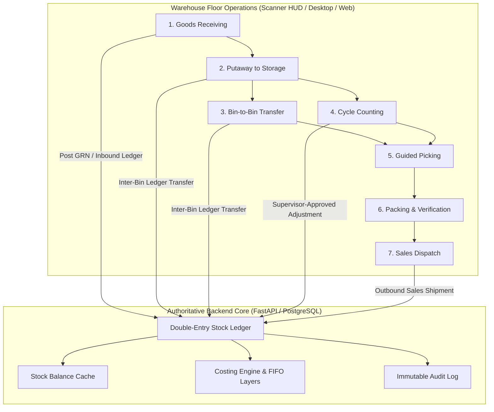
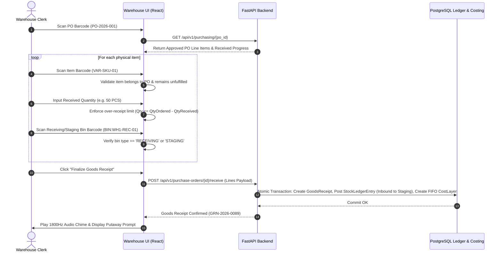
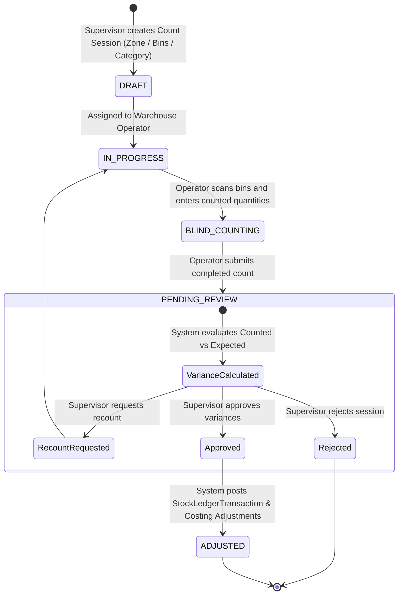
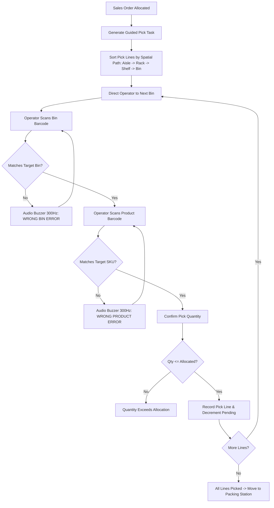
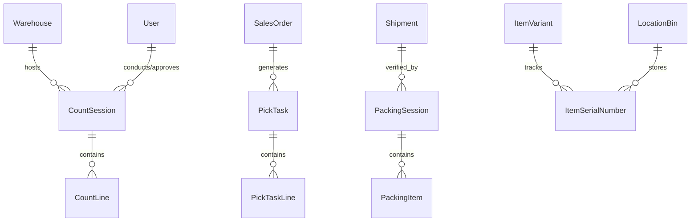

# Phase 4D Architecture: Advanced Warehouse Operations & Barcode Workflows

## 1. Executive Summary & Core Invariants

Phase 4D designs the comprehensive warehouse-floor operational subsystem for AuraStock. It bridges physical warehouse workflows (Receiving, Putaway, Bin-to-Bin Movements, Cycle Counting, Guided Picking, Packing Verification, and Label Printing) with the authoritative double-entry inventory ledger, FIFO/MWA costing engine, and RBAC authorization subsystem.



### 1.1 Invariants & Non-Negotiable Rules
1. **Single Authority for Inventory Mutations**: Warehouse workflows **never** create a secondary inventory tracking store. All physical movements, allocations, adjustments, and receipts commit strictly through the established `StockEngine` and `StockLedgerTransaction` pipeline.
2. **Strict Cost Basis Preservation**: Internal bin movements (e.g. Putaway from Receiving staging to Storage shelf, or bin-to-bin reorganization) are financial non-events ($Cost\ In = Cost\ Out$). They must never mutate cost profiles or create artificial profit/loss.
3. **Pessimistic Row-Level Locking**: High-concurrency operations on bins and variants enforce `SELECT ... FOR UPDATE` ordered deterministically by `(warehouse_id, item_variant_id)` to eliminate race conditions, negative available stock, and deadlocks.
4. **Separation of Count Execution from Stock Mutation**: Physical cycle counts performed by warehouse clerks **never directly mutate inventory**. Variances are recorded in draft `CountSession`s and require explicit supervisor review and approval before generating ledger adjustments.
5. **Strict Online-Only Operation**: Phase 4D operates purely online. Barcode scans interact synchronously with the FastAPI backend over REST/WebSocket. No offline queues, client-side SQLite databases, or local authoritative balances are introduced.

---

## 2. Codebase Inspection & Gap Analysis

An inspection of the existing AuraStock codebase reveals the current baseline:

| Subsystem / Feature | Current State | Phase 4D Architectural Addition |
| :--- | :--- | :--- |
| **Product & Variant Barcodes** | [`Barcode`](file:///d:/antigravity/Intentory%20Management%20Software/apps/backend/app/models/item.py#L50-L58) model exists with `barcode_value`, `symbology`, `is_primary`. | Add unified multi-entity barcode resolver supporting Variants, Bins, POs, SOs, Shipments, and Packages. |
| **Location & Bins** | [`LocationBin`](file:///d:/antigravity/Intentory%20Management%20Software/apps/backend/app/models/warehouse.py#L17-L30) has `type`: `STORAGE`, `RECEIVING`, `SHIPPING`, `STAGING`, `DAMAGE`, `VIRTUAL_ADJUSTMENT`. | Implement automated staging-to-storage putaway routing and bin validation rules. |
| **Goods Receipt (GRN)** | [`GoodsReceipt`](file:///d:/antigravity/Intentory%20Management%20Software/apps/backend/app/models/purchasing.py#L58-L86) posts direct inbound ledger entries and FIFO cost layers. | Add guided barcode-driven receipt workflow with over-receipt limits and multi-bin distribution. |
| **Stock Transfers & Adjustments** | Ledger transfer and adjustment endpoints exist in [`ledger.py`](file:///d:/antigravity/Intentory%20Management%20Software/apps/backend/app/api/v1/endpoints/ledger.py#L300-L438). | Add rapid barcode bin-to-bin transfer and two-person cycle count session approval workflow. |
| **Order Fulfillment** | Allocation, picking, packing, and dispatch exist in [`sales_service.py`](file:///d:/antigravity/Intentory%20Management%20Software/apps/backend/app/services/sales_service.py). | Add guided pick routing, wrong-bin/wrong-item scan rejection, and 100% packing scan verification before dispatch. |
| **Scanner Interface** | [`ScannerHUD.tsx`](file:///d:/antigravity/Intentory%20Management%20Software/apps/web/src/components/ScannerHUD.tsx) supports `@inventory/native-bridge` event subscriptions and audio beeps. | Add dedicated fullscreen scanner-first operational views with single-focus inputs and rapid keyboard-wedge debouncing. |

---

## 3. Unified Barcode Identification Architecture

### 3.1 Barcode Identification Engine
The unified barcode service parses raw scanner input from USB HID keyboard wedges, serial/Tauri native bridges, or manual inputs, determining the entity type from prefix metadata or database lookup:

```mermaid
flowchart TD
    ScanInput[Raw Scanner String / Wedge] --> Clean[Trim & Strip Control Characters]
    Clean --> MatchPrefix{Examine Prefix}
    
    MatchPrefix -- "BIN:" --> LookupBin[Location Bin Resolver]
    MatchPrefix -- "PO:" / "GRN:" --> LookupPurchasing[Purchase Document Resolver]
    MatchPrefix -- "SO:" / "SHP:" --> LookupSales[Sales Document Resolver]
    MatchPrefix -- "PKG:" / "PLT:" --> LookupContainer[Package/Pallet Container Resolver]
    MatchPrefix -- No Prefix --> LookupBarcodeTable[Query barcodes & items & location_bins]

    LookupBarcodeTable --> FoundVariant{Matched?}
    FoundVariant -- Variant --> ReturnVariant[Return Variant Detail & Stock Bins]
    FoundVariant -- Bin Code --> ReturnBin[Return Location Bin Detail]
    FoundVariant -- Not Found --> Return404[Emit Audio Error 300Hz & Error Payload]
```

### 3.2 Barcode Payload Format Standards
- **Product / Variant Barcodes**: Standard EAN-13, UPC-A, or Code128 format (e.g. `8901234567890`, `VAR-WIDGET-01`).
- **Location Bin Barcodes**: `BIN:<bin_code>` or standard bin code (e.g. `BIN:WH1-A-01-02`).
- **Goods Receipt / Document Barcodes**: `GRN:<grn_number>`, `PO:<po_number>`, `SO:<so_number>`.
- **Carton / Shipping Container Barcodes**: `PKG:<shipment_id>-<carton_number>`.

### 3.3 Scanner Input & Keyboard-Wedge Handling
1. **Debounce Buffer**: Aggregates rapid successive keystrokes ($< 35\text{ms}$ interval) into a complete barcode payload, terminating on `Enter` (`\r` or `\n`) or `Tab`.
2. **Audio-Visual Feedback**:
   - **Positive Confirmation (1800Hz Sine Tone for 120ms)**: Valid entity scanned and matched.
   - **Error Buzz (300Hz Sawtooth Tone for 300ms)**: Unrecognized barcode, wrong product, or wrong bin.

---

## 4. Operational Warehouse Workflows

### 4.1 Guided Goods Receiving & Putaway Workflow
> [!IMPORTANT]
> **Existing GRN receiving remains authoritative; Phase 4D extends the receiving process with staging/putaway operations.**
> - **Inbound PO Receipt**: Handled authoritatively by `PurchaseService.receive_goods` under `/api/v1/purchase-orders/{id}/receive`. Validates supplier POs, approval status, per-line quantity ceilings, and generates double-entry `StockLedgerTransaction` (`GOODS_RECEIPT`) into `STAGING` / `RECEIVING` location bins with automatic `CostLayer` acquisition.
> - **Phase 4D Putaway**: Extends receiving by providing barcode-driven floor relocation from `STAGING` bins to final `STORAGE` rack/shelf bins (`WarehouseService.execute_putaway`) preserving exact costing and ledger history ($Cost\ In = Cost\ Out$).



### 4.2 Two-Step Putaway Workflow (Staging $\to$ Storage)
Separates the unloading dock from permanent warehouse shelf storage:

1. **Task Initialization**: Upon GRN completion, a `PutawayTask` is generated for the items placed in the `RECEIVING`/`STAGING` bin.
2. **Operator Execution**:
   - Operator scans the `RECEIVING`/`STAGING` bin to load the items awaiting putaway.
   - Operator scans the product barcode $\to$ System displays recommended storage bins based on existing item stock or empty bins in the appropriate zone.
   - Operator navigates to the aisle/shelf and scans the destination `STORAGE` bin.
   - Operator confirms the transferred quantity.
3. **Backend Execution**:
   - Atomically executes `StockEngine.post_transaction` with `transaction_type="TRANSFER_OUT"` (or `TRANSFER_IN` between bins within the same warehouse).
   - Cost Basis: Retained identically. `ItemCostProfile` and `CostLayer` balances remain untouched because warehouse location has not changed.

---

### 4.3 Bin-to-Bin Inventory Movement
Designed for rapid intra-warehouse stock reorganization and pick-face replenishment:

1. Operator navigates to **Rapid Bin Movement** screen.
2. **Step 1**: Scan Source Bin (e.g. `BIN:WH1-A-03-01`).
3. **Step 2**: Scan Item Variant Barcode. System displays available quantity in source bin.
4. **Step 3**: Enter Transfer Quantity (enforcing $\text{Quantity} \le \text{AvailableQuantity}$).
5. **Step 4**: Scan Destination Bin (e.g. `BIN:WH1-B-01-01`).
6. **Step 5**: Confirm.
7. **Backend Transaction**: Single atomic transaction acquiring row locks on source and destination balance cache rows, posting dual entries to `StockLedgerEntry`.

---

### 4.4 Cycle Counting & Physical Inventory Audits



#### Cycle Count Invariants
- **No Direct Stock Mutation**: Operator submissions only record `CountLine.counted_quantity`.
- **Variance Evaluation**:
  $$\text{QuantityVariance} = \text{CountedQuantity} - \text{SystemQuantityOnHand}$$
  $$\text{ValueVariance} = \text{QuantityVariance} \times \text{VariantCostPrice}$$
- **Approval Execution**:
  - When the Supervisor approves the session, the backend generates an atomic `INVENTORY_ADJUSTMENT` transaction for non-zero variance lines.
  - Automatically invokes `CostingService.record_inventory_adjustment` to update FIFO layers or MWA running values.

---

### 4.5 Barcode-Driven Guided Picking Workflow
Ensures zero-defect order picking with real-time verification against sales order allocations:



---

### 4.6 Packing & 100% Dispatch Verification
Guarantees that no incorrect product or wrong quantity ever leaves the warehouse dock:

1. **Initialize Packing Session**: Operator scans Sales Order or Shipment barcode at the packing bench.
2. **Scan-Verification Loop**:
   - Operator scans each physical unit before placing it into the shipping carton.
   - System increments `packed_quantity` and checks off the line item.
   - Any attempt to pack an item not on the order or exceed the ordered quantity immediately sounds the error alarm and locks the session.
3. **Carton & Package Weighing**: Operator inputs carton dimensions/weight (optional).
4. **Final Dispatch**:
   - Only when $\sum \text{PackedQuantity} == \sum \text{OrderedQuantity}$ ($100\%$ matched), the "Dispatch Shipment" action is enabled.
   - Invokes `SalesService.dispatch_sales_order` $\to$ Posts `SALES_SHIPMENT` $\to$ Depletes FIFO layers $\to$ Generates `COGSRecord` $\to$ Prints packing slip and shipping label.

---

## 5. Barcode Label Generation & Printing Architecture

Reusable label layouts generated through the existing document/PDF generation subsystem:

### 5.1 Label Types & Layout Specifications

| Label Type | Standard Dimensions | Symbology | Header Content | Encoded Payload |
| :--- | :--- | :--- | :--- | :--- |
| **Product / Variant Label** | 2" $\times$ 1" (50mm $\times$ 25mm) | Code128 / QR | Item Name, SKU, Variant Attrs | `<variant_sku>` or Primary Barcode |
| **Location Bin Label** | 4" $\times$ 2" (100mm $\times$ 50mm) | Code128 | Warehouse Code, Zone, Shelf | `BIN:<location_bin_code>` |
| **GRN Pallet / Case Tag** | 4" $\times$ 6" (100mm $\times$ 150mm) | Code128 + Text | GRN #, Supplier, Date, Qty | `GRN:<grn_number>` |
| **Shipping Carton Label** | 4" $\times$ 6" (100mm $\times$ 150mm) | Code128 / QR | Customer, SO #, Carton X of Y | `PKG:<shipment_number>-<carton_id>` |

---

## 6. Lot/Batch & Serial Number Tracking Assessment

### 6.1 Lot / Batch Tracking Assessment
- **Current Data Model**: `StockBatch` is already defined in [`apps/backend/app/models/ledger.py`](file:///d:/antigravity/Intentory%20Management%20Software/apps/backend/app/models/ledger.py#L6-L18) with `batch_number`, `manufacturing_date`, `expiry_date`, and `cost_per_unit`. `StockBalanceCache` and `StockLedgerEntry` already contain `batch_id` foreign keys.
- **Phase 4D Scope**: Full barcode workflow integration for batch-tracked items. When receiving/picking an item with `Item.is_batch_tracked == True`, the UI enforces scanning or entry of the batch number and expiry date, associating the inventory entry with `StockBatch`.

### 6.2 Serial Number Tracking Assessment
> [!NOTE]
> **Serial-number domain foundation implemented; operational serial tracking deferred.**
> - **Domain Foundation**: The database model `ItemSerialNumber` is implemented in [`apps/backend/app/models/warehouse_ops.py`](file:///d:/antigravity/Intentory%20Management%20Software/apps/backend/app/models/warehouse_ops.py) with unique constraints `(tenant_id, item_variant_id, serial_number)` and lifecycle state fields (`RECEIVED`, `IN_STOCK`, `ALLOCATED`, `PICKED`, `DISPATCHED`, `RETURNED`, `SCRAPPED`).
> - **Operational Boundary**: End-to-end multi-step operational serial lifecycle enforcement across purchasing receipts, serial barcode scanning, serial allocation, individual serial pick validation, serial dispatch verification, and RMA customer return serial restoration is deferred to future enterprise extensions.

---

## 7. Data Models for Warehouse Operations



### 7.1 Entity Specifications
1. **`CountSession`**:
   - `id`, `tenant_id`, `warehouse_id`, `session_number`, `status` (`PLANNED`, `IN_PROGRESS`, `PENDING_REVIEW`, `APPROVED`, `REJECTED`), `scope_type` (`FULL_WAREHOUSE`, `ZONE`, `CATEGORY`, `CUSTOM_BINS`), `assigned_to_user_id`, `reviewed_by_user_id`, `created_at`, `approved_at`.
2. **`CountLine`**:
   - `id`, `count_session_id`, `location_bin_id`, `item_variant_id`, `batch_id`, `expected_quantity`, `counted_quantity`, `variance_quantity`, `unit_cost`, `variance_value`, `is_recounted`, `notes`.
3. **`PickTask`**:
   - `id`, `tenant_id`, `warehouse_id`, `sales_order_id`, `task_number`, `status` (`PENDING`, `IN_PROGRESS`, `COMPLETED`, `CANCELLED`), `assigned_to_user_id`, `started_at`, `completed_at`.
4. **`PickTaskLine`**:
   - `id`, `pick_task_id`, `so_line_id`, `location_bin_id`, `item_variant_id`, `batch_id`, `quantity_allocated`, `quantity_picked`, `status` (`PENDING`, `PICKED`).
5. **`PackingSession`**:
   - `id`, `tenant_id`, `shipment_id`, `packed_by_user_id`, `status` (`OPEN`, `COMPLETED`), `carton_count`, `started_at`, `completed_at`.
6. **`PackingItem`**:
   - `id`, `packing_session_id`, `item_variant_id`, `serial_number`, `batch_number`, `quantity_packed`, `carton_number`, `scanned_at`.

---

## 8. API Specifications

All endpoints will be mounted under `/api/v1/warehouse` with strict tenant isolation, RBAC permissions, and warehouse scoping:

| Method | Endpoint | Description | Permission |
| :--- | :--- | :--- | :--- |
| `POST` | `/api/v1/warehouse/barcode/resolve` | Universal barcode scanner identifier | `inventory:read` |
| `POST` | `/api/v1/warehouse/receiving/scan` | Line-by-line barcode goods receipt step | `purchasing:receive` |
| `POST` | `/api/v1/warehouse/putaway/execute` | Atomic transfer from Staging to Storage bin | `ledger:transfer` |
| `POST` | `/api/v1/warehouse/transfer/bin-to-bin` | Rapid barcode-driven bin movement | `ledger:transfer` |
| `POST` | `/api/v1/warehouse/counts/sessions` | Create cycle count session | `inventory:adjust` |
| `POST` | `/api/v1/warehouse/counts/{id}/submit` | Submit clerk count results | `inventory:adjust` |
| `POST` | `/api/v1/warehouse/counts/{id}/approve` | Supervisor variance review and approval | `inventory:adjust` |
| `GET` | `/api/v1/warehouse/picking/{so_id}/task` | Get spatial guided pick route | `sales:fulfill` |
| `POST` | `/api/v1/warehouse/picking/confirm-line` | Scan-verified pick line confirmation | `sales:fulfill` |
| `POST` | `/api/v1/warehouse/packing/verify-item` | Scan-verified packing station step | `sales:fulfill` |
| `POST` | `/api/v1/warehouse/labels/generate` | Batch printable PDF barcode labels | `inventory:read` |

---

## 9. Scanner-First User Experience Design

The warehouse frontend interface will provide dedicated **Floor Mode** screens:
1. **Auto-Focus Single Input Field**: The active scan input maintains permanent focus to capture USB keyboard-wedge strings instantly without mouse interaction.
2. **High-Contrast High-Visibility Typography**: Font sizes $\ge 24\text{px}$ for item names, bin codes, and quantities to ensure legibility on ruggedized handheld mobile computers.
3. **Instant Auditory Feedback**: Audio chime for success, distinct low buzz for mismatch/error.
4. **Zero Unnecessary Clicks**: Scanning a valid bin automatically advances the workflow to the next step.

---

## 10. Concurrency, Race Condition & Deadlock Prevention

1. **Two Operators Picking Same Bin**:
   - Order allocations reserve stock in `StockBalanceCache.quantity_allocated` during order confirmation.
   - Picking physically depletes `quantity_on_hand` and releases `quantity_allocated` under row locks, preventing duplicate depletion.
2. **Cycle Count vs Active Stock Movement**:
   - If stock moves while a count session is `IN_PROGRESS`, the supervisor review screen highlights lines where the system snapshot changed during the session, flagging them for recount.
3. **Simultaneous Multi-Bin Transfers**:
   - Row-level locks on `StockBalanceCache` are acquired in alphabetical order of `(location_bin_id, item_variant_id)` across all endpoints to eliminate deadlock potential.

---

## 11. Verification & Test Strategy

Automated test suite (`apps/backend/tests/test_warehouse_operations.py`) will validate:
1. **Universal Barcode Resolver**: Tests barcode, bin, PO, SO, and container resolution.
2. **Goods Receipt with Staging**: Verifies over-receipt rejection, batch assignment, and inbound staging bin placement.
3. **Putaway Execution**: Verifies transfer from `STAGING` to `STORAGE` bin with zero costing mutation.
4. **Bin-to-Bin Transfers**: Verifies atomic balance updates, available stock bounds, and deadlock-free execution.
5. **Cycle Count Workflow**: Tests draft count submission $\to$ variance calculation $\to$ supervisor approval $\to$ automated ledger adjustment posting and FIFO cost layer creation/depletion.
6. **Guided Pick Verification**: Tests wrong-bin rejection, wrong-product rejection, and over-pick rejection.
7. **Packing Verification**: Tests 100% item matching requirement prior to sales dispatch.
8. **Tenant & Warehouse Security**: Enforces isolation across tenants and unauthorized warehouse scopes.

---

## 12. Conclusion & Review Gate

Phase 4D is fully designed. No source code modifications or implementation steps have been performed. Execution will commence in Phase 4E upon explicit user review and approval.
