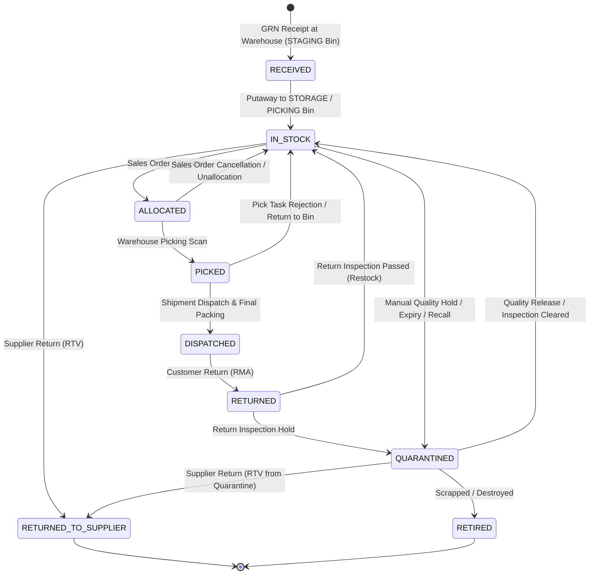
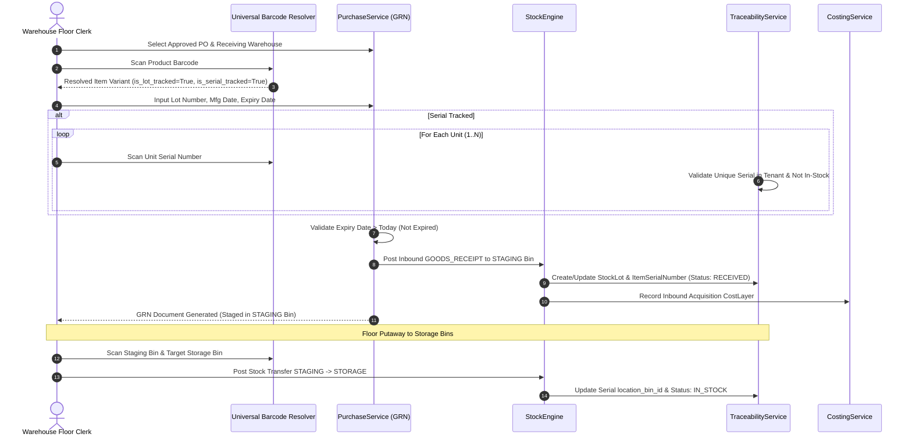
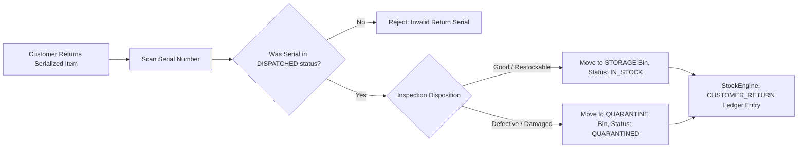
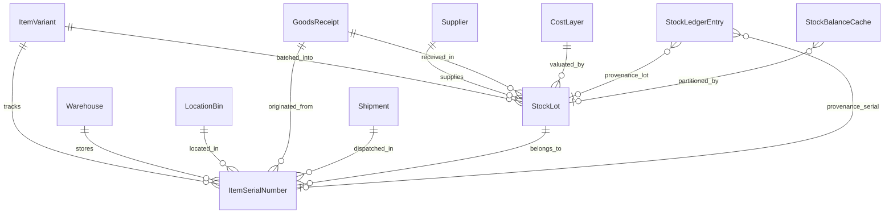

# Phase 6: Lot, Batch & Serial Traceability Architecture

## Executive Summary

Phase 6 designs the **Lot, Batch & Serial Traceability** subsystem for AuraStock. It provides end-to-end provenance, expiry management, quarantine governance, and bidirectional recall traceability across all inventory operations.

The architecture strictly adheres to AuraStock's core principle:
$$\mathbf{Traceability\ is\ Provenance\ Metadata\ Around\ Authoritative\ Ledger\ Transactions,\ NOT\ a\ Second\ Quantity\ System.}$$

```
Warehouse Floor Scan (Lot / Serial / Barcode)
                      ↓
StockEngine (Authoritative Double-Entry Mutation)
                      ↓
Immutable Stock Ledger (StockLedgerTransaction / Entry)
                      ↓
Traceability Context (StockLot / ItemSerialNumber Lifecycle)
                      ↓
CostingService (FIFO / MWA Cost Layers & Valuation)
```

---

## 1. Existing Codebase Audit & Capability Matrix

### 1.1 Codebase Inspection Findings
- **`ItemSerialNumber` Model**: Exists in [`apps/backend/app/models/warehouse_ops.py`](file:///d:/antigravity/Intentory%20Management%20Software/apps/backend/app/models/warehouse_ops.py#L115-L134) as a **Domain Foundation Only**. It contains basic fields (`serial_number`, `status`, `warehouse_id`, `item_variant_id`, `location_bin_id`, `origin_grn_id`, `dispatched_shipment_id`), but is **not** operationally wired into receiving, putaway, picking, packing, dispatch, customer returns, supplier returns, or quarantine transitions.
- **`StockBatch` Model**: Exists in [`apps/backend/app/models/ledger.py`](file:///d:/antigravity/Intentory%20Management%20Software/apps/backend/app/models/ledger.py#L6-L18), but lacks supplier mapping, origin GRN link, quarantine status flags, cost layer provenance, and recall tracking.
- **Item Master Tracking Flags**: [`Item.is_batch_tracked`](file:///d:/antigravity/Intentory%20Management%20Software/apps/backend/app/models/item.py#L29) and [`Item.is_serial_tracked`](file:///d:/antigravity/Intentory%20Management%20Software/apps/backend/app/models/item.py#L30) already exist on the Item entity.
- **Ledger Entries**: [`StockLedgerEntry`](file:///d:/antigravity/Intentory%20Management%20Software/apps/backend/app/models/ledger.py#L39-L59) has optional `batch_id` and `serial_number` fields.
- **Goods Receipt Lines**: [`GoodsReceiptLine`](file:///d:/antigravity/Intentory%20Management%20Software/apps/backend/app/models/purchasing.py#L148-L160) has `batch_number` and `expiry_date`.
- **Location Bins**: [`LocationBin`](file:///d:/antigravity/Intentory%20Management%20Software/apps/backend/app/models/warehouse.py#L28-L50) supports bin types `STAGING`, `STORAGE`, `PICKING`, `RECEIVING`, `SHIPPING`, `DAMAGE`, `QUARANTINE`.

### 1.2 Traceability Capability Matrix

| Capability | Existing | Complete | Extend | Missing | Defer | Notes / Assessment |
| :--- | :---: | :---: | :---: | :---: | :---: | :--- |
| **Item Master Flags** | Yes | **Yes** | — | — | — | `Item.is_batch_tracked` & `Item.is_serial_tracked` exist. |
| **Lot/Batch Entity** | Partial | No | **Yes** | — | — | `StockBatch` is basic. Extend into unified `StockLot` with supplier, origin GRN, manufacturing date, expiry date, status. |
| **Serial Number Entity** | Partial | No | **Yes** | — | — | `ItemSerialNumber` exists as domain foundation only. Needs complete operational state machine and transaction wiring. |
| **Receiving Lot/Serial Capture** | Partial | No | **Yes** | — | — | GRN accepts text batch and expiry. Needs validation for duplicate serials, expired stock, and serial batch creation. |
| **Floor Putaway Traceability** | Partial | No | **Yes** | — | — | Phase 4D putaway moves bins; needs serial location bin synchronisation. |
| **Picking & FEFO Strategy** | No | No | — | **Yes** | — | Picking is currently bin/variant based. Needs First-Expired, First-Out (FEFO) recommendation engine and serial selection. |
| **Packing & Scan Verification** | Partial | Partial | **Yes** | — | — | `PackingSession` and `PackingItem` exist; need strict scan verification against allocated serials. |
| **Sales Dispatch Serial Binding** | No | No | — | **Yes** | — | Missing transition of serials from `PICKED` to `DISPATCHED` with shipment binding. |
| **Customer Returns (RMA) Serials** | No | No | — | **Yes** | — | `SalesReturn` handles quantities; needs serial re-entry and quarantine routing. |
| **Supplier Returns (RTV) Serials** | No | No | — | **Yes** | — | Phase 5 RTV handles quantities; needs serial selection and status transition to `RETURNED_TO_SUPPLIER`. |
| **Quarantine Management** | Partial | No | **Yes** | — | — | `QUARANTINE` bin type exists. Needs status-based lot/serial quarantine and allocation exclusion. |
| **Expiry Alerts & Monitoring** | No | No | — | **Yes** | — | Missing configurable expiry horizon alerts (30d, 60d, 90d) and expired stock quarantine triggers. |
| **Recall Containment Workflow** | No | No | — | **Yes** | — | Missing forward/backward trace reports and 1-click batch quarantine of affected lots. |
| **RFID / Computer Vision Scan** | No | No | — | — | **Yes** | Explicitly deferred to future hardware integration phases. |
| **Automated Recall Broadcasts** | No | No | — | — | **Yes** | Autonomous external customer/vendor emails explicitly deferred. |

---

## 2. Unified Lot & Batch Domain Model

### 2.1 Lot vs. Batch Entity Unification
In manufacturing and discrete distribution, "Lot" (procurement/production lot) and "Batch" (manufacturing run) describe the same physical entity: **a distinct, homogeneous quantity of an item variant sharing common manufacturing date, expiry date, inspection provenance, and supplier origin.**

Creating two separate tables (`lots` and `batches`) would introduce dual-entry bugs, fragmented stock balances, and unnecessary join complexity. Therefore, AuraStock defines a single authoritative entity: **`StockLot`** (with UI alias support for "Batch Number" / "Lot Number").

### 2.2 `StockLot` Data Model Specification
```sql
CREATE TABLE stock_lots (
    id VARCHAR(36) PRIMARY KEY,
    tenant_id VARCHAR(36) NOT NULL,
    item_variant_id VARCHAR(36) NOT NULL REFERENCES item_variants(id) ON DELETE CASCADE,
    lot_number VARCHAR(100) NOT NULL,                    -- Internal or vendor lot identifier
    supplier_id VARCHAR(36) REFERENCES suppliers(id),     -- Origin supplier (if purchased)
    supplier_lot_number VARCHAR(100),                     -- Supplier's native batch/lot code
    origin_grn_id VARCHAR(36) REFERENCES goods_receipts(id), -- Provenance GRN document
    cost_layer_id VARCHAR(36) REFERENCES cost_layers(id), -- Origin acquisition cost layer
    manufacturing_date DATE,                              -- Production date
    expiry_date DATE,                                     -- Hard expiration date
    best_before_date DATE,                                -- Quality advisory date
    initial_quantity NUMERIC(18, 4) NOT NULL,             -- Total initial quantity received
    current_quantity NUMERIC(18, 4) NOT NULL,             -- Total quantity remaining across all bins
    status VARCHAR(30) DEFAULT 'ACTIVE' NOT NULL,         -- ACTIVE, QUARANTINED, RECALLED, EXPIRED, DEPLETED
    quarantine_reason VARCHAR(255),                       -- Reason if status is QUARANTINED or RECALLED
    notes TEXT,
    created_at TIMESTAMP WITH TIME ZONE NOT NULL,
    updated_at TIMESTAMP WITH TIME ZONE NOT NULL,
    is_deleted BOOLEAN DEFAULT FALSE NOT NULL,
    UNIQUE (tenant_id, item_variant_id, lot_number),
    CONSTRAINT chk_lot_qty_non_negative CHECK (current_quantity >= 0),
    CONSTRAINT chk_lot_initial_qty_positive CHECK (initial_quantity > 0)
);
```

---

## 3. Serial-Number Lifecycle State Machine

### 3.1 State Diagram & Allowed Transitions
An `ItemSerialNumber` tracks an individual, uniquely identifiable physical unit. At any point in time, a serial number belongs to exactly **one** discrete lifecycle state, **one** warehouse, and **one** location bin (when in warehouse custody).



### 3.2 Transition Authorization & Validation Rules

| From State | To State | Trigger / Operation | Required RBAC Permission | Location Bin Invariant |
| :--- | :--- | :--- | :--- | :--- |
| `None` | `RECEIVED` | PO Goods Receipt (GRN) | `purchasing:receive` | Must be assigned to `STAGING` bin. |
| `RECEIVED` | `IN_STOCK` | Floor Putaway Execution | `warehouse:putaway` | Moved from `STAGING` to `STORAGE`/`PICKING` bin. |
| `IN_STOCK` | `ALLOCATED` | Sales Order Allocation | `sales:allocate` | Remains in current storage bin. |
| `ALLOCATED` | `IN_STOCK` | SO Cancellation / Unallocate | `sales:write` | Remains in current storage bin. |
| `ALLOCATED` | `PICKED` | Pick Task Execution | `warehouse:pick` | Assigned to picker tote / temporary bin. |
| `PICKED` | `DISPATCHED` | Shipment Dispatch / Packing | `sales:dispatch` | `location_bin_id` set to `NULL` (exited warehouse). |
| `DISPATCHED` | `RETURNED` | Customer Return (RMA) | `sales:return` | Assigned to `RECEIVING` or `QUARANTINE` bin. |
| `RETURNED` / `IN_STOCK` | `QUARANTINED` | Quality Hold / Expiry / Recall | `traceability:quarantine` | Moved to `QUARANTINE` or `DAMAGE` bin. |
| `QUARANTINED` | `IN_STOCK` | Quality Clearance / Release | `traceability:quarantine` | Moved to `STORAGE` bin. |
| `QUARANTINED` / `IN_STOCK` | `RETIRED` | Scrap / Write-off Adjustment | `inventory:adjust` | `location_bin_id` set to `NULL` (stock ledger zeroed). |
| `IN_STOCK` / `QUARANTINED` | `RETURNED_TO_SUPPLIER` | Supplier Return (RTV) | `purchasing:return` | `location_bin_id` set to `NULL` (exited warehouse). |

### 3.3 Contradictory State Prevention
- **Unique Serial Scope**: `UNIQUE (tenant_id, item_variant_id, serial_number)`.
- **Active Custody Guard**: A serial number cannot be received if it already exists in status `RECEIVED`, `IN_STOCK`, `ALLOCATED`, `PICKED`, or `QUARANTINED`.
- **Double Pick/Dispatch Guard**: A serial number cannot be picked or dispatched if its status is not `ALLOCATED` or `IN_STOCK`.

---

## 4. Integration with Authoritative Stock Engine & Ledger

### 4.1 Ledger Provenance Attachment
Traceability metadata attaches directly to the immutable stock ledger without creating parallel inventory balances:

```mermaid
flowchart TD
    Operation[Warehouse Operation: GRN / Putaway / Pick / Dispatch / Return] --> StockEng[StockEngine.post_transaction]
    StockEng --> LedgerTx[StockLedgerTransaction (Immutable Header)]
    StockEng --> LedgerEntry[StockLedgerEntry (Double-Entry Line with lot_id & serial_number)]
    StockEng --> BalCache[StockBalanceCache (warehouse_id, location_bin_id, item_variant_id, lot_id)]
    StockEng --> CostSvc[CostingService.record_inbound / outbound / transfer / adjustment]
    CostSvc --> CostLay[CostLayer (Preserves origin_grn_id & lot_id)]
    StockEng --> SerialEngine[ItemSerialNumber State Update]
```

### 4.2 Stock Balance Cache Scoping
`StockBalanceCache` is extended to include `lot_id VARCHAR(36)` (nullable for non-lot items):
$$\text{Unique Stock Balance} = (\text{tenant\_id}, \text{warehouse\_id}, \text{location\_bin\_id}, \text{item\_variant\_id}, \text{lot\_id})$$
- When an item is **Lot Tracked**, physical quantity on hand is partitioned by lot in each bin.
- When an item is **Serial Tracked**, physical quantity in `StockBalanceCache` is exactly equal to $\text{Count of } \text{ItemSerialNumber} \text{ in } (\text{warehouse}, \text{bin}, \text{variant})$.

---

## 5. Costing Subsystem Interaction (FIFO, MWA, Lots & Serials)

### 5.1 Costing vs. Physical Traceability Boundaries
1. **FIFO Costing**:
   - `CostLayer` represents financial acquisition value ordered chronologically by `layer_timestamp ASC`.
   - Each `CostLayer` links to its origin `StockLot` (`lot_id`) and `origin_grn_id`.
   - Physical picking (e.g. FEFO) consumes the oldest physical batch, while financial COGS recognizes the cost from authoritative cost layers.
2. **Moving Weighted Average (MWA)**:
   - `ItemCostProfile` maintains continuous running moving average per variant in each warehouse.
   - Individual lots maintain their original purchase acquisition price for Purchase Price Variance ($PPV$) and vendor analysis, while inventory balance valuation on the balance sheet utilizes the running MWA.
3. **Serial Tracking Costing**:
   - For high-value serialized equipment, each serial number records its exact acquisition `CostLayer`.
4. **Historical COGS Immutability Invariant**:
   - Traceability lifecycle transitions (e.g. lot status changing to `QUARANTINED` or serial moving to `PICKED`) **never mutate historical COGS records or closed financial periods**.

---

## 6. Receiving & Putaway Workflow



### 6.1 Receiving Validations
- **Duplicate Serial Rejection**: If serial already exists with status $\ne \text{'RETIRED'}$ or $\ne \text{'RETURNED\_TO\_SUPPLIER'}$, receipt is rejected with `422 Unprocessable Content`.
- **Expired Stock Warning/Rejection**: If `expiry_date < CURRENT_DATE`, receipt is rejected or routed directly to `QUARANTINE` bin based on tenant configuration.
- **Serial Count Matching**: The number of scanned serials must exactly equal `quantity_received`.

---

## 7. Picking & Physical FEFO Selection Strategy

### 7.1 FEFO (First Expired, First Out) Algorithm
For perishable, chemical, pharmaceutical, or shelf-life sensitive inventory:
1. When generating pick lists for a Sales Order, `WarehouseService.generate_pick_route` queries bins holding available stock of the required variant.
2. If `Item.is_batch_tracked == True`, candidate bins and lots are sorted by:
   $$\text{Pick Priority} = \text{StockLot.expiry\_date ASC}, \quad \text{StockLot.created\_at ASC}, \quad \text{Bin Route Sequence ASC}$$
3. **Controlled Override**: Operators can scan a specific lot or serial if the sales order line specified an exact lot requirement.
4. **Costing Separation Invariant**: FEFO dictates physical floor movement; financial cost consumption continues to consume according to the item's configured `valuation_method` (FIFO / MWA) in `CostingService`.

---

## 8. Customer Returns & Supplier Returns with Traceability

### 8.1 Customer Return (RMA) Serial Lifecycle


### 8.2 Supplier Return (RTV) Serial Lifecycle
1. User selects `SupplierReturn` with target item variant.
2. System presents list of active serials currently in `IN_STOCK` or `QUARANTINED` status associated with the target supplier.
3. User scans/selects exact serial numbers to return.
4. `PurchaseService.process_supplier_return` validates ownership, deducts stock, sets serial status to `RETURNED_TO_SUPPLIER`, clears `location_bin_id`, and issues `SupplierDebitMemo`.

---

## 9. Dual-Layer Quarantine Architecture

```
                               ┌──────────────────────────────────────────────┐
                               │             QUARANTINE SYSTEM                │
                               └──────────────────────┬───────────────────────┘
                                                      │
                       ┌──────────────────────────────┴──────────────────────────────┐
                       ▼                                                             ▼
       ┌───────────────────────────────┐                             ┌───────────────────────────────┐
       │     LOCATION-BASED ISOLATION  │                             │     STATUS-BASED ISOLATION    │
       ├───────────────────────────────┤                             ├───────────────────────────────┤
       │ Physical Bin Type: QUARANTINE │                             │ StockLot.status = QUARANTINED │
       │ Excluded from SO Allocations  │                             │ Serial.status = QUARANTINED   │
       │ Requires Floor Clerk Move     │                             │ Allocation Engine Hard Lock   │
       └───────────────────────────────┘                             └───────────────────────────────┘
```

- **Allocation Exclusion**: `StockEngine.allocate_stock` automatically excludes all bins where `LocationBin.type IN ('DAMAGE', 'QUARANTINE')` and all lots/serials where `status = 'QUARANTINED'` or `'RECALLED'`.
- **Quality Release Workflow**: Releasing stock from quarantine requires `traceability:quarantine` permission, logs reason and inspector ID, updates status to `ACTIVE`, and triggers transfer from `QUARANTINE` bin to standard `STORAGE` bin.

---

## 10. Expiry Management & Alert Horizons

### 10.1 Configurable Expiry Buckets
The system evaluates active `StockLot` records daily:
1. **Expired Stock ($\text{Expiry Date} < \text{Now}$)**:
   - Automated flag as `EXPIRED`.
   - Generates high-priority operational alert.
   - Recommended action: 1-Click transfer to `QUARANTINE` bin.
2. **Critical Expiry ($\le 30\text{ Days}$)**:
   - Flagged for immediate promotional clearance or FEFO priority dispatch.
3. **Approaching Expiry ($31 - 90\text{ Days}$)**:
   - Warning indicators on picking and replenishment screens.
4. **Healthy ($> 90\text{ Days}$)**:
   - Standard inventory velocity.

---

## 11. Bidirectional Traceability & Recall Management

### 11.1 Forward & Backward Traceability Graph
```mermaid
flowchart LR
    subgraph Backward Trace (Investigation from Customer Incident)
        EndCustomer[Customer Issue] --> ShippedUnit[Shipment & Serial]
        ShippedUnit --> SalesDoc[Sales Order]
        SalesDoc --> LotRef[Stock Lot Number]
        LotRef --> GRNDoc[Goods Receipt GRN]
        GRNDoc --> PODoc[Purchase Order]
        PODoc --> Vendor[Origin Supplier]
    end

    subgraph Forward Trace (Vendor Recall Containment)
        VendorRecall[Supplier Notification of Defective Lot] --> TargetLot[Identify Stock Lot]
        TargetLot --> InWhStock[Locate All Warehouse Bins with Remaining Stock]
        TargetLot --> OutboundOrders[Identify All Sales Orders & Shipments Dispatched]
        InWhStock --> AutoQuarantine[1-Click Lock & Quarantine Remaining Stock]
        OutboundOrders --> AffectedCusts[Generate Customer Containment Manifest]
    end
```

### 11.2 1-Click Recall Containment Execution
When a manufacturer or supplier issues a product safety recall for `StockLot` #`LOT-9988`:
1. **Impact Identification**: Query locates:
   - Total units remaining in warehouse custody across all bins.
   - Total units dispatched to customers across all shipments.
2. **Immediate Containment**:
   - `StockLot.status` atomically transitions to `RECALLED`.
   - All matching `ItemSerialNumber` records transition to `QUARANTINED`.
   - Automated allocation locks immediately block further sales or picking of the lot.
3. **Audit & Manifest Report**:
   - Generates downloadable Recall Containment Manifest with complete customer list, invoice numbers, dispatch dates, and serial numbers.
   - **Governance Boundary**: System does **not** send automated emails to external customers or suppliers; human regulatory officers review and dispatch official notifications.

---

## 12. Security, RBAC & Concurrency Strategy

### 12.1 RBAC Permission Hierarchy

| Role | `traceability:read` | `traceability:manage_lots` | `traceability:manage_serials` | `traceability:quarantine` | `traceability:recall` | `traceability:override_expiry` |
| :--- | :---: | :---: | :---: | :---: | :---: | :---: |
| **Super Admin** | Yes | Yes | Yes | Yes | Yes | Yes |
| **Quality / Compliance Mgr** | Yes | Yes | Yes | Yes | Yes | Yes |
| **Warehouse Manager** | Yes | Yes | Yes | Yes | Yes | Under Threshold |
| **Warehouse Floor Clerk** | Yes | View Only | Scan / Update Bin | Move to Quarantine | No | No |
| **Auditor** | Yes | View Only | View Only | View Only | View Only | No |

### 12.2 Concurrency & Race Condition Prevention
1. **Serial Number Pessimistic Row Locking**:
   - Operations that alter serial status (pick, pack, dispatch, return, quarantine) lock rows with `select(ItemSerialNumber).where(...).with_for_update()`.
   - Two pickers scanning the same serial number concurrently will result in the first picker succeeding and the second receiving `409 Conflict` (`Serial already picked by another active session`).
2. **Lot Quantity Locking**:
   - Updates to `StockLot.current_quantity` execute inside the same database transaction as `StockEngine.post_transaction`, guaranteeing zero divergence between physical bin cache and lot quantity counters.

---

## 13. Proposed REST API Specifications

Mounted under `/api/v1/traceability/*`:

### 13.1 Lot & Batch Endpoints
- `GET /api/v1/traceability/lots` — List lots with search, variant, expiry, and status filters.
- `POST /api/v1/traceability/lots` — Create / register lot master.
- `GET /api/v1/traceability/lots/{id}` — Get lot details with current bin balances and GRN link.
- `PUT /api/v1/traceability/lots/{id}/status` — Transition lot status (`ACTIVE`, `QUARANTINED`, `RECALLED`).

### 13.2 Serial Number Endpoints
- `GET /api/v1/traceability/serials` — List serial numbers with status, warehouse, and bin filters.
- `GET /api/v1/traceability/serials/{serial_number}` — Universal lookup of serial lifecycle history.
- `POST /api/v1/traceability/serials/batch-register` — Batch register received serial numbers.
- `PUT /api/v1/traceability/serials/{id}/quarantine` — Move serial to quarantine status with reason.
- `PUT /api/v1/traceability/serials/{id}/release` — Release serial from quarantine back to stock.

### 13.3 Traceability & Recall Endpoints
- `GET /api/v1/traceability/trace/forward` — Forward trace from Supplier/Lot to Shipments and Customers.
- `GET /api/v1/traceability/trace/backward` — Backward trace from Shipment/Serial to Lot, GRN, and Supplier.
- `POST /api/v1/traceability/recalls/execute` — 1-Click execute batch quarantine on recalled lot.
- `GET /api/v1/traceability/reports/expiry-horizon` — Query lots expiring within 30/60/90 days.
- `GET /api/v1/traceability/reports/quarantine-summary` — List all stock currently held in quarantine.

---

## 14. Entity-Relationship Diagram (ERD) Proposal



---

## 15. Legacy Inventory Migration Strategy

### 15.1 Additive & Backward-Compatible Migrations
1. **Existing Inventory Classification**:
   - Existing items created prior to Phase 6 that have `is_batch_tracked == False` and `is_serial_tracked == False` continue to operate with `lot_id = NULL` and `serial_number = NULL`.
   - Historical inventory ledger entries and cost layers remain 100% valid and untouched.
2. **Untracked Historical Provenance**:
   - For existing stock of items subsequently marked as batch-tracked, the system assigns a synthetic provenance lot labeled `UNTRACKED-LEGACY-STOCK` with `manufacturing_date = NULL` and `expiry_date = NULL`.
   - Under no circumstances does the migration script fabricate synthetic historical serial numbers or fake supplier batch IDs.

---

## 16. Comprehensive Test Strategy

The automated test suite for Phase 6 will cover:

1. **Lot Management & Uniqueness**:
   - Creation of lots with duplicate `(tenant_id, item_variant_id, lot_number)` fails with 400.
2. **Serial Number Lifecycle Integrity**:
   - Full lifecycle progression: `RECEIVED` $\to$ `IN_STOCK` $\to$ `ALLOCATED` $\to$ `PICKED` $\to$ `DISPATCHED`.
   - Rejection of invalid transitions (e.g. attempting to dispatch an unallocated serial).
3. **Receiving Validation**:
   - Receipt of duplicate active serials fails with 422.
   - Receipt of expired lots triggers quarantine bin routing.
4. **FEFO vs. FIFO Picking Routing**:
   - Verify pick routes recommend lot with earliest expiry date first, regardless of bin alphabetization.
   - Verify financial COGS calculation maintains FIFO cost layer consumption.
5. **Returns with Serial Preservation**:
   - Customer return re-activates serial in `QUARANTINED` or `IN_STOCK` status.
   - Supplier return deducts stock and sets status to `RETURNED_TO_SUPPLIER`.
6. **Dual Quarantine Verification**:
   - Quarantined lots and serials are strictly excluded from Sales Order allocations.
7. **Forward & Backward Traceability**:
   - Backward trace from customer shipment accurately returns PO, supplier code, GRN number, and lot number.
   - Forward trace from supplier lot accurately returns all affected customer shipments.
8. **Concurrency & Race Conditions**:
   - Two concurrent pick tasks competing for the same serial number resolve deterministically with zero double-picking.

---

## 17. Implementation Phasing Recommendation

### Phase 6A: Core Lot, Batch & Serial Lifecycle (Must-Have)
- Extended `StockLot` model and `StockBalanceCache` lot partitioning.
- Complete operational `ItemSerialNumber` lifecycle engine (`RECEIVED` $\to$ `DISPATCHED`).
- GRN Receiving validation (duplicate serial guards, lot capture, expiry validation).
- Floor Putaway & Bin Transfer serial synchronization.
- FEFO physical picking recommendation algorithm.
- Sales Order packing scan verification & dispatch serial binding.
- Status-based and location-based quarantine allocation exclusion.
- Comprehensive automated test suite.

### Phase 6B: Advanced Recall, Expiry & Return Workflows (Secondary Scope)
- 1-Click Lot Recall Containment Execution and downloadable containment manifests.
- Serialized Customer Returns (RMA) and Supplier Returns (RTV).
- Expiry horizon monitoring dashboard (30d, 60d, 90d buckets).
- Bidirectional traceability graph visualization API.

### Explicitly Deferred to Future Phases (Not in Phase 6)
- **RFID Gate & Tunnel Readers**: Real-time passive/active RFID hardware scanners.
- **Computer Vision Serial OCR**: AI camera reading of physical etched serial labels.
- **Automated External Recall Broadcasts**: Autonomous email/SMS dispatching to end customers.
- **GS1 Digital Link Cloud Sync**: Direct cloud synchronization with global GS1 product registries.
