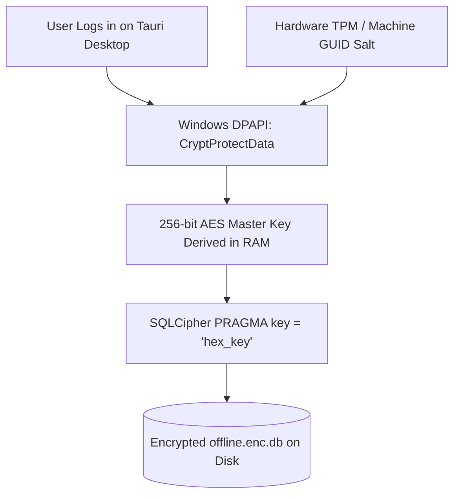
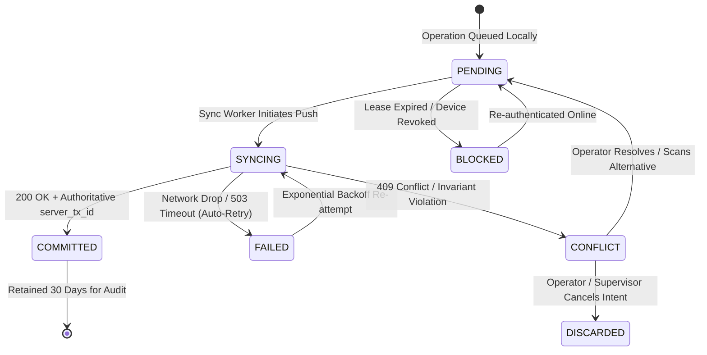
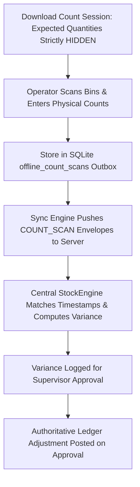

# Phase 7B Architecture Design: Offline UX, Security & Remaining Offline Workflows

## Executive Summary

Phase 7B builds directly upon the approved **Phase 7A Offline Synchronization Engine**, completing the client-side user experience, cryptographic storage security, administrative device controls, and remaining offline warehouse workflows.

The architecture strictly upholds the foundational invariant:
$$\mathbf{PostgreSQL\ is\ the\ Single\ Authoritative\ Source\ of\ Truth.}$$
$$\mathbf{Local\ SQLite\ is\ an\ Encrypted\ Read-Only\ Cache\ and\ Append-Only\ Outbox\ Queue.}$$

---

## 1. Phase 7A Implementation Audit Matrix

| System Component | Existing Status | Completeness | Missing / Deferred Elements | Phase 7B Action |
| :--- | :--- | :--- | :--- | :--- |
| **Sync Protocol (`SyncService`)** | Backend API & Services | **Complete (7A)** | None (Handshake, Upstream, Downstream active) | Retain unchanged; extend with new op handlers |
| **Idempotency Engine** | `sync_idempotency_log` | **Complete (7A)** | None (UUIDv7 deduplication verified) | Extend to `COUNT_SCAN`, `PACK_ITEM`, `CUSTOMER_RETURN` |
| **Device Model & Revocation** | `SyncDevice` + RBAC | **Complete (7A)** | Admin Management Web UI | Implement Device Management UI in Phase 7B-B |
| **Offline Lease Token** | 8-Hour Lease Enforced | **Complete (7A)** | Frontend Lease Countdown Timer | Add visual lease countdown to Desktop Header |
| **Local SQLite Database** | Tauri App Native Storage | **Partial (7A)** | SQLCipher At-Rest Encryption | Implement SQLCipher + Windows DPAPI in Phase 7B-A |
| **Bin Movement & Putaway** | Handled in `SyncService` | **Complete (7A)** | Visual Outbox Queue in Desktop UI | Implement Outbox Table & Status Drawer in Phase 7B-B |
| **Goods Receipt + Lot/Serial** | Handled in `RECEIVE_GOODS`| **Complete (7A)** | Offline GRN Form in Desktop App | Implement Offline Inbound Screen in Phase 7B-C |
| **Serial Pick Concurrency** | Row Locks & 409 Conflict | **Complete (7A)** | Conflict Resolution UI Wizard | Implement Conflict Drawer in Phase 7B-B |
| **Cycle Counting (`COUNT_SCAN`)**| Schema & Handlers Ready | **Partial (7A)** | Offline Blind Count Scan Ingestion | Implement `COUNT_SCAN` Handler & UI in Phase 7B-C |
| **Packing Verification** | Schema Ready | **Partial (7A)** | Offline Carton Scan Verification | Implement `PACK_ITEM` Handler & UI in Phase 7B-C |
| **Customer Return Intake** | Schema Ready | **Partial (7A)** | Offline RMA Intake & Quarantine | Implement `CUSTOMER_RETURN` Handler & UI in Phase 7B-C |

---

## 2. SQLCipher & Windows DPAPI Database Encryption Architecture

### 2.1 Encryption Key Hierarchy
To ensure that local database files cannot be inspected or exfiltrated, Phase 7B implements **page-level 256-bit AES-CBC encryption via SQLCipher**, anchored by Windows OS hardware-backed cryptography:



### 2.2 Security Guarantees
1. **Zero Plaintext Storage**: The encryption key is **never** stored in plaintext inside the database, config files, `localStorage`, or environment variables.
2. **DPAPI Machine & User Isolation**: The key is protected using Windows DPAPI (`CryptProtectData`) with the `CRYPTPROTECT_LOCAL_MACHINE` and `CRYPTPROTECT_UI_FORBIDDEN` flags, binding the cipher to the specific physical device and logged-in OS user profile.
3. **Revocation Key Zeroing**: Upon receiving a `REVOKED` response from the server, the desktop application immediately calls `memset_s` to overwrite key memory, deletes the DPAPI credential blob, and wipes the local database files.

### 2.3 Atomic Migration from Phase 7A Unencrypted SQLite to Phase 7B Encrypted SQLCipher
When upgrading from Phase 7A to Phase 7B, the migration executes seamlessly without data loss:
1. **Inspect**: Check if `offline.db` exists and is unencrypted (reading SQLite header bytes `0..16`).
2. **Derive Key**: Generate DPAPI-protected 256-bit master key.
3. **Cipher Export**:
   ```sql
   ATTACH DATABASE 'offline.enc.db' AS encrypted KEY 'x''...hex_key...''';
   SELECT sqlcipher_export('encrypted');
   DETACH DATABASE encrypted;
   ```
4. **Atomic Swap**: Rename `offline.db` to `offline.bak`, rename `offline.enc.db` to `offline.db`, verify database integrity (`PRAGMA integrity_check;`), and securely erase `offline.bak`.

---

## 3. Offline Sync Status UX Specification

### 3.1 Warehouse Header Status Pill
The desktop top navigation bar exposes an unambiguous sync health badge designed for warehouse lighting and rapid operator readability:

```
┌────────────────────────────────────────────────────────────────────────────────────────┐
│  AuraStock Enterprise    [ WH: Main Distribution ]    🟡 OFFLINE (7 Pending)   [Sync Now]│
└────────────────────────────────────────────────────────────────────────────────────────┘
```

#### Status Indicators
| State | Badge Color | Visual Label | Detail Tooltip |
| :--- | :---: | :--- | :--- |
| **Online & Synced** | 🟢 Green | `ONLINE (All Synced)` | Last sync: 10:42 AM • 0 Pending |
| **Offline Operating** | 🟡 Amber | `OFFLINE (7 Pending)` | Offline lease: 5h 17m remaining • 7 queued |
| **Sync Inflight** | 🔵 Blue | `SYNCING (3/7...)` | Uploading mutation batch to server |
| **Conflict Detected** | 🔴 Red | `SYNC CONFLICT (1 Action)` | Serial collision detected • Click to resolve |
| **Lease Expired** | ⚪ Gray | `LEASE EXPIRED` | Connect to network to re-authenticate |

### 3.2 Operator Sync Summary Flyout
Clicking the status pill opens the **Sync Overview Modal**:
```
┌───────────────────────────────────────────────────────────┐
│ Sync Health & Connection Status                           │
├───────────────────────────────────────────────────────────┤
│ Mode:                    OFFLINE (Network Disconnected)   │
│ Last Successful Sync:    Today at 10:42:15 AM             │
│ Pending Outbox Queue:    7 mutations                      │
│ Failed Retries:          0                                │
│ Unresolved Conflicts:    0                                │
│ Active Lease Window:     5 hours 17 minutes remaining     │
│ Device Identifier:       DEV-WIN11-WH01-SCANNER-A         │
├───────────────────────────────────────────────────────────┤
│ [ Force Sync Reconnect ]          [ View Outbox Details ] │
└───────────────────────────────────────────────────────────┘
```

---

## 4. Outbox & Pending Transactions UX

### 4.1 Mutation Lifecycle State Machine



### 4.2 Operator Outbox Table
The Outbox view displays all queued, inflight, and resolved mutations with immutable audit trails:
- **Columns**: `Status`, `Operation`, `SKU / Item`, `Warehouse / Bin`, `Quantity`, `Scanned Time`, `Retry Count`, `Actions`.
- **Immutability Guard**: Once a mutation reaches `COMMITTED`, it is rendered read-only. Operators cannot edit historical records.

---

## 5. Conflict Resolution Workflow & Taxonomy

### 5.1 Reject-First Philosophy
When server reality contradicts local offline intent, the server **rejects the mutation** (`409 Conflict`), and the desktop opens the **Warehouse Conflict Resolution Wizard**:

```
┌───────────────────────────────────────────────────────────────────────────┐
│ ⚠️ SYNC CONFLICT DETECTED                                                 │
├───────────────────────────────────────────────────────────────────────────┤
│ Operation:           PICK_ITEM                                            │
│ Product:             Thermal Barcode Scanner (SKU-SYNC-01)                │
│ Target Serial:       SN-001                                               │
│                                                                           │
│ Local Offline Scan:  Marked PICKED at 10:35 AM by Operator John           │
│ Server Fact:         Serial SN-001 was already picked by Operator Alice   │
│                                                                           │
│ Resolution Required:                                                      │
│ [ Scan Replacement Serial Unit ]    [ Return Unit to Bin ]    [ Discard ] │
└───────────────────────────────────────────────────────────────────────────┘
```

### 5.2 Conflict Taxonomy & Remediation Matrix

| Conflict Category | Severity | Detection Reason | Operator Action | Supervisor Override? |
| :--- | :---: | :--- | :--- | :---: |
| **Serial Collision** | High | Serial already picked or dispatched by another device | Scan replacement unit from bin | No (Physical must match) |
| **Bin Stock Deficit** | Medium | Available bin balance lower than offline transfer qty | Recount bin or reduce transfer qty | Yes (Force variance review) |
| **Cancelled PO Receipt** | High | Inbound PO cancelled while device was offline | Route stock to `QUARANTINE` bin | Yes (PO reinstatement) |
| **Expired Lot Inbound** | Medium | Lot expiry date earlier than current sync date | Ingest directly into `QUARANTINED` status | Quality Manager approval |
| **Stale Pick Task** | High | Sales order cancelled or line fulfilled elsewhere | Cancel pick and return item to bin | No |
| **Expired Device Lease**| Critical | Offline operation attempted after 8h lease expired | Re-authenticate online | No |

---

## 6. Device Management UI (Web Admin Console)

Super Admins and Warehouse Managers manage handheld terminals via **Settings $\to$ Desktop Devices**:

```
┌───────────────────────────────────────────────────────────────────────────────────────────────────────┐
│ Registered Warehouse Terminals                                                 [ Register New Device ]│
├──────────────────────┬──────────┬───────────┬──────────────┬──────────────┬──────────┬────────────────┤
│ Device Identifier    │ Name     │ Warehouse │ Last Sync    │ Lease Expiry │ Status   │ Actions        │
├──────────────────────┼──────────┼───────────┼──────────────┼──────────────┼──────────┼────────────────┤
│ DEV-WIN11-WH01-A     │ Forklift │ Main WH   │ 2 mins ago   │ In 6 hours   │ 🟢 ACTIVE│ [ Revoke ]     │
│ DEV-WIN11-WH02-B     │ Pack Stn │ West WH   │ 15 mins ago  │ In 4 hours   │ 🟢 ACTIVE│ [ Revoke ]     │
│ DEV-WIN11-WH01-C     │ Handheld │ Main WH   │ 3 days ago   │ Expired      │ 🔴 REVOKED│[ Re-enable ]   │
└──────────────────────┴──────────┴───────────┴──────────────┴──────────────┴──────────┴────────────────┘
```

---

## 7. Remaining Offline Workflows Specification

### 7.1 Offline Blind Cycle Counting (`COUNT_SCAN`)

- **Blind Counting Guarantee**: The local SQLite database stores `expected_quantity = NULL`. The operator must physically inspect and count each bin.
- **Timestamped Variance**: Server evaluates variances relative to the exact physical ledger at the observation timestamp.

### 7.2 Offline Packing Verification (`PACK_ITEM`)
- **Workflow**: Operator scans picking cart and carton barcode. Each scanned SKU and serial is validated against the assigned pick task manifest.
- **Sync Behavior**: Server verifies the sales order has not been cancelled or dispatched by another terminal, records `PackingSession` lines, and updates shipment eligibility.

### 7.3 Offline Customer Return Intake (`CUSTOMER_RETURN`)
- **Workflow**: Customer returns received at loading dock are inspected offline. Operator scans product, serial/lot, inputs reason (e.g. `DAMAGED_TRANSIT`, `WRONG_ITEM`), and places item in `RECEIVING` / `QUARANTINE` bin.
- **Safety Invariant**: Inbound returns **never inflate active available sales inventory** while offline. Stock is routed directly to `QUARANTINE` until authorized quality inspection.

---

## 8. Local Data Retention & Cleanup Policy

1. **Unsynchronized Mutations (`PENDING`, `SYNCING`, `CONFLICT`)**: **Never deleted automatically**. Retained indefinitely until resolved or explicitly discarded by user.
2. **Committed Mutations (`COMMITTED`)**: Retained locally for **30 days** to support shift auditing, then purged during background vacuuming.
3. **Master Catalog & Bin Cache**: Updated incrementally during downstream sync; entries inactive for $> 60\text{ days}$ purged automatically.

---

## 9. Comprehensive Phase 7B Verification & Test Strategy

| Test Domain | Target Scenario | Assertion & Verification |
| :--- | :--- | :--- |
| **SQLCipher Encryption** | Open `offline.db` without DPAPI key | Database engine fails with `file is not a database` (encrypted bytes) |
| **Database Migration** | Migrate Phase 7A plaintext DB to Phase 7B encrypted DB | Zero data loss; all outbox transactions preserved and readable |
| **Lease Countdown** | Desktop clock reaches lease expiry | App transitions to `BLOCKED`; mutation inputs locked until re-auth |
| **Conflict UI Flow** | Simulate 409 serial collision | Outbox displays `CONFLICT`; operator can select replacement serial |
| **Blind Cycle Count** | Ingest offline `COUNT_SCAN` batch | Expected qty hidden locally; server computes variance upon sync |
| **Offline Packing** | Ingest offline `PACK_ITEM` batch | Verifies carton manifest; rejects if order was cancelled |
| **Offline RMA Intake** | Ingest offline `CUSTOMER_RETURN` batch | Stock placed in `QUARANTINE` bin; available stock not inflated |
| **Device Revocation** | Admin revokes device in Web UI | Next sync attempt triggers 403; local DPAPI key zeroed |

---

## 10. Phase 7B Implementation Breakdown

### 7B-A: Security & SQLCipher Encryption
- SQLCipher Rust dependency in `src-tauri/Cargo.toml`.
- Windows DPAPI master key derivation and secure memory management.
- 4-step unencrypted-to-encrypted database migration utility.

### 7B-B: Offline Sync UX & Admin Management
- Top navigation Sync Status Indicator & Countdown Pill.
- Outbox Queue Manager & Conflict Resolution Drawer in Desktop UI.
- Admin Device Management Table in Web Admin Console.

### 7B-C: Remaining Offline Workflows
- `COUNT_SCAN` offline handler & blind count reconciliation.
- `PACK_ITEM` offline packing verification handler.
- `CUSTOMER_RETURN` offline RMA quarantine intake handler.
