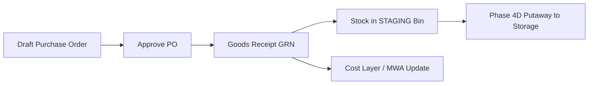
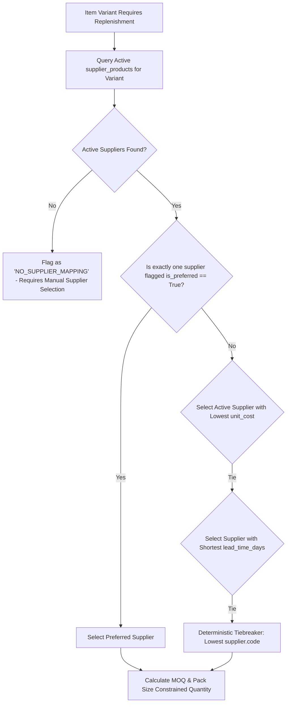
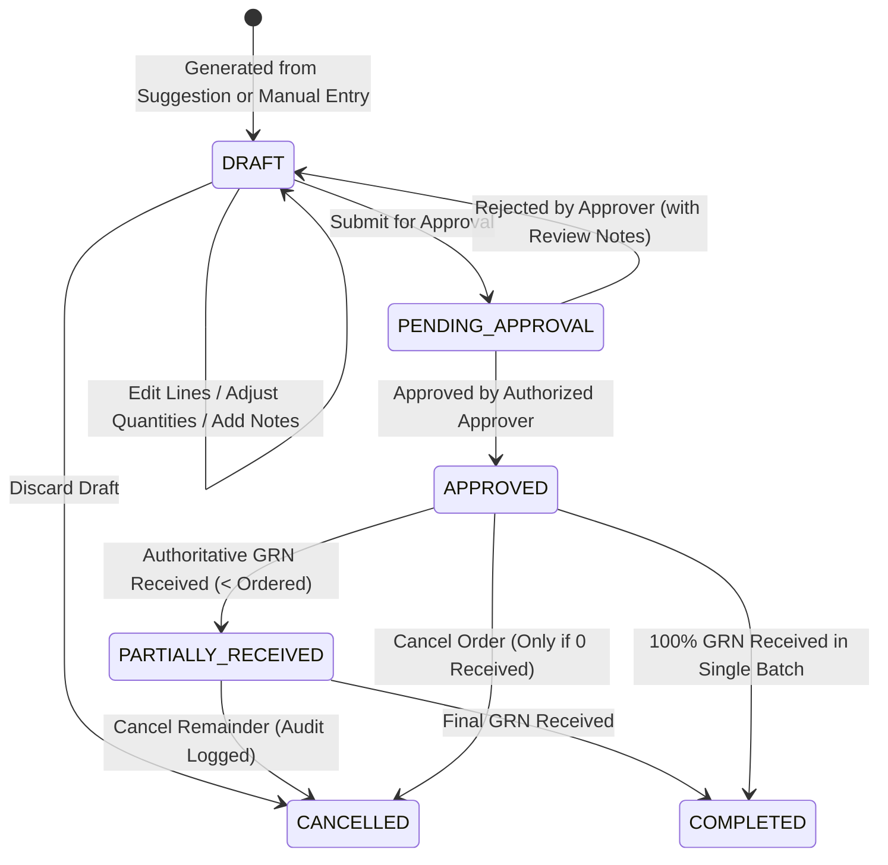
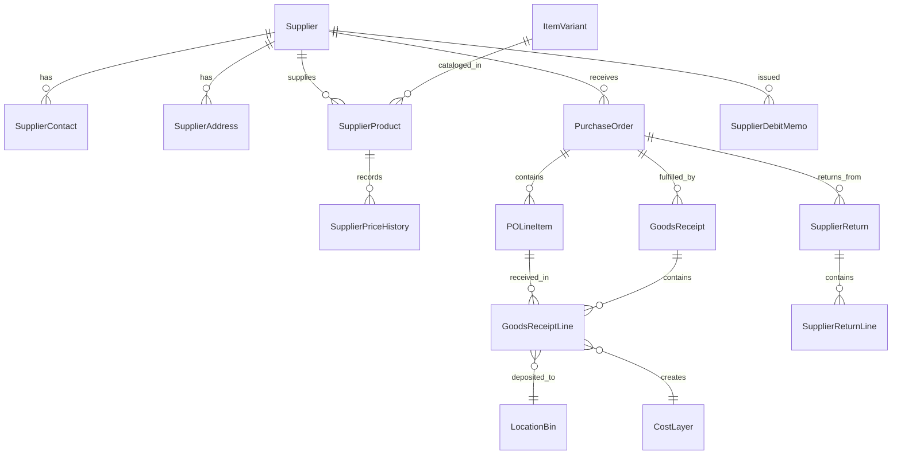

# Phase 5: Purchasing & Supplier Management 2.0 Architectural Design

## Executive Summary

Phase 5 designs the **Purchasing & Supplier Management 2.0** subsystem for AuraStock. It bridges the authoritative inventory analytics and replenishment engines from Phase 4C directly with supplier catalog management, price history, operational supplier scorecards, and human-in-the-loop purchase order generation.

The core guiding principle is **closing the loop with strict human governance**:
$$\text{Inventory Analytics} \longrightarrow \text{Reorder Recommendation} \longrightarrow \text{Supplier Selection} \longrightarrow \text{Purchase Suggestion} \longrightarrow \text{Draft PO} \longrightarrow \mathbf{Human\ Approval} \longrightarrow \text{Approved PO} \longrightarrow \text{GRN / Putaway} \longrightarrow \text{Costing}$$

Under no circumstances does the system execute autonomous purchasing or communicate with external vendors without explicit human approval.

---

## 1. Existing Purchasing Subsystem Audit

### 1.1 Codebase Inspection Findings
- **Authoritative PO Model**: [`PurchaseOrder`](file:///d:/antigravity/Intentory%20Management%20Software/apps/backend/app/models/purchasing.py#L21-L41) and [`POLineItem`](file:///d:/antigravity/Intentory%20Management%20Software/apps/backend/app/models/purchasing.py#L43-L56) track financial headers, line quantities, prices, discounts, and taxes.
- **Authoritative Service**: [`PurchaseService`](file:///d:/antigravity/Intentory%20Management%20Software/apps/backend/app/services/purchase_service.py) handles draft editing, approval transitions (`DRAFT` $\to$ `PENDING_APPROVAL` $\to$ `APPROVED`), cancellation, and atomic goods receipts (`receive_goods`).
- **Costing & Ledger Integration**: `PurchaseService.receive_goods` directly posts double-entry [`StockLedgerTransaction`](file:///d:/antigravity/Intentory%20Management%20Software/apps/backend/app/models/ledger.py#L20-L40) (`GOODS_RECEIPT`) into `STAGING` bins and invokes `CostingService.record_inbound_receipt` to establish active FIFO `CostLayer` or update Moving Weighted Average (`ItemCostProfile`).
- **Analytics & Replenishment**: [`AnalyticsService`](file:///d:/antigravity/Intentory%20Management%20Software/apps/backend/app/services/analytics_service.py#L453-L690) computes 90-day Average Daily Usage ($ADU_{90}$), Reorder Points ($ROP$), Reorder Quantities ($RPQ$), and aggregates basic supplier fill rates and historical lead times from GRNs.

### 1.2 Capability Matrix

| Capability | Existing | Complete | Needs Extension | Missing | Notes / Assessment |
| :--- | :---: | :---: | :---: | :---: | :--- |
| **Supplier Master** | Yes | Partial | **Yes** | — | Basic `Supplier` (code, name, email, phone, JSON address, payment terms, currency). Needs structured contacts, multi-addresses, tax IDs, and status lifecycle. |
| **Supplier-Product Catalog** | No | No | — | **Yes** | Currently, products only have a single global `cost_price`. No supplier-specific SKU, supplier MOQ, pack size, supplier lead time, or preferred vendor flags. |
| **Supplier Price History & PPV** | No | No | — | **Yes** | Historical PO prices are stored in `POLineItem`, but there is no dedicated price tracking, price effective dates, or Purchase Price Variance ($PPV$) reporting against standard costs. |
| **PO Creation & Line Editing** | Yes | **Yes** | — | — | Authoritative in `PurchaseService.create_purchase_order` & `update_draft_purchase_order`. |
| **PO Status Lifecycle & Approval** | Yes | Partial | **Yes** | — | Supports `DRAFT`, `PENDING_APPROVAL`, `APPROVED`, `PARTIALLY_RECEIVED`, `COMPLETED`, `CANCELLED`. Needs configurable authorization spend thresholds. |
| **Goods Receiving (GRN)** | Yes | **Yes** | — | — | Authoritative in `PurchaseService.receive_goods`. Enforces over-receipt prevention, staging bin placement, and ledger/costing posting. |
| **Floor Putaway Integration** | Yes | **Yes** | — | — | Implemented in Phase 4D (`WarehouseService.execute_putaway`) from `STAGING` to `STORAGE`. |
| **Replenishment Recommendations** | Yes | Partial | **Yes** | — | Implemented in Phase 4C (`AnalyticsService.get_replenishment_recommendations`). Needs direct conversion into Purchase Suggestions with supplier selection. |
| **Draft PO Generation from Reorders**| No | No | — | **Yes** | Missing 1-click conversion from Replenishment Suggestion $\to$ Draft PO. |
| **Supplier Lead Time & Scorecard** | Yes | Partial | **Yes** | — | Basic average lead time and fill rate exist in `AnalyticsService.get_supplier_analytics`. Needs on-time delivery rate ($OTD$), price variance, and scorecards. |
| **Supplier Returns (RTV)** | No | No | — | **Yes** | Sales returns exist (`SalesReturn`), but vendor returns (Return to Vendor / RTV) with inventory deduction and credit memo tracking are missing. |
| **Procurement Dashboard** | No | No | — | **Yes** | Executive inventory dashboard exists, but dedicated Procurement & Supplier Operations dashboard is missing. |

---

## 2. Current Purchasing Architecture vs. Target 2.0 Flow

### 2.1 Existing Architecture


### 2.2 Purchasing 2.0 Target Closed-Loop Architecture
```mermaid
flowchart TD
    subgraph Analytics & Recommendations
        InvLedger[(Immutable Stock Ledger)] --> CalcADU[Calculate ADU & Consumption]
        CalcADU --> CalcROP[Calculate ROP & Target Stock]
        CalcROP --> RepRec[Replenishment Recommendation]
    end

    subgraph Supplier Catalog & Rules
        RepRec --> SupSelect{Deterministic Supplier Selection}
        SupCatalog[(Supplier-Product Catalog)] --> SupSelect
        SupSelect --> ApplyConstraints[Apply MOQ & Pack Size Constraints]
        ApplyConstraints --> PurchSugg[Structured Purchase Suggestion]
    end

    subgraph Governance & PO Lifecycle
        PurchSugg --> CreateDraft[1-Click Generate Draft PO]
        ManualInput[Manual Procurement Entry] --> CreateDraft
        CreateDraft --> DraftPO[Draft PO (Editable / Reviewable)]
        DraftPO --> SubmitAppr[Submit for Approval]
        SubmitAppr --> HumanGate{Human Approver / Spend Threshold}
        HumanGate -- Reject/Modify --> DraftPO
        HumanGate -- Approve --> ApprovedPO[Approved Purchase Order]
    end

    subgraph Execution & Valuation
        ApprovedPO --> AuthoritativeGRN[Authoritative Goods Receipt]
        AuthoritativeGRN --> StagingStock[(Staging Stock Balance)]
        AuthoritativeGRN --> RecordCost[(Cost Layer & Historical COGS)]
        AuthoritativeGRN --> CalcPPV[Calculate Purchase Price Variance]
        StagingStock --> FloorPutaway[Floor Putaway to Storage Bins]
    end

    style HumanGate fill:#f96,stroke:#333,stroke-width:2px;
```

---

## 3. Supplier Master & Relationship Management

### 3.1 Extended Supplier Master (`Supplier`)
The existing `Supplier` model will be preserved and extended with structured metadata:
- **Core Master Data**: `code`, `name`, `tax_identifier` (e.g., GSTIN / VAT / EIN), `currency` (ISO-4217), `payment_terms` (`Net 15`, `Net 30`, `Net 60`, `Due on Receipt`), `credit_limit`, `status` (`ACTIVE`, `ON_HOLD`, `INACTIVE`), `notes`.
- **Supplier Contacts (`SupplierContact`)**:
  - `id`, `supplier_id`, `contact_name`, `email`, `phone`, `designation` (e.g., Sales Rep, Accounts, Escalation), `is_primary`.
- **Supplier Addresses (`SupplierAddress`)**:
  - `id`, `supplier_id`, `address_type` (`ORDERING`, `REMITTANCE`, `SHIPPING_ORIGIN`), `address_line1`, `address_line2`, `city`, `state`, `postal_code`, `country`, `is_default`.

### 3.2 Supplier-Product Relationship (`SupplierProduct`)
Decouples supplier purchasing attributes from global item variants:
```sql
CREATE TABLE supplier_products (
    id VARCHAR(36) PRIMARY KEY,
    tenant_id VARCHAR(36) NOT NULL,
    supplier_id VARCHAR(36) NOT NULL REFERENCES suppliers(id) ON DELETE CASCADE,
    item_variant_id VARCHAR(36) NOT NULL REFERENCES item_variants(id) ON DELETE CASCADE,
    supplier_sku VARCHAR(100),               -- Supplier's catalog part number
    supplier_product_name VARCHAR(255),      -- Supplier's item description
    unit_cost NUMERIC(18, 4) NOT NULL,       -- Current contracted purchasing price
    currency VARCHAR(3) DEFAULT 'USD' NOT NULL,
    minimum_order_quantity NUMERIC(18, 4) DEFAULT 1.0 NOT NULL, -- MOQ
    pack_size NUMERIC(18, 4) DEFAULT 1.0 NOT NULL,             -- Multiple constraint
    lead_time_days INTEGER DEFAULT 14 NOT NULL,                -- Contracted lead time
    is_preferred BOOLEAN DEFAULT FALSE NOT NULL,               -- Primary supplier flag
    is_active BOOLEAN DEFAULT TRUE NOT NULL,
    effective_from TIMESTAMP WITH TIME ZONE DEFAULT CURRENT_TIMESTAMP NOT NULL,
    effective_to TIMESTAMP WITH TIME ZONE,
    created_at TIMESTAMP WITH TIME ZONE NOT NULL,
    updated_at TIMESTAMP WITH TIME ZONE NOT NULL,
    UNIQUE (tenant_id, supplier_id, item_variant_id),
    CONSTRAINT chk_supp_prod_moq_positive CHECK (minimum_order_quantity > 0),
    CONSTRAINT chk_supp_prod_pack_positive CHECK (pack_size > 0),
    CONSTRAINT chk_supp_prod_lead_non_negative CHECK (lead_time_days >= 0)
);
```

---

## 4. Supplier Price History & Purchase Price Variance (PPV)

### 4.1 Historical Purchase Price Tracking (`SupplierPriceHistory`)
Stores an immutable log of price changes and receipt execution costs:
```sql
CREATE TABLE supplier_price_histories (
    id VARCHAR(36) PRIMARY KEY,
    tenant_id VARCHAR(36) NOT NULL,
    supplier_product_id VARCHAR(36) NOT NULL REFERENCES supplier_products(id) ON DELETE CASCADE,
    unit_price NUMERIC(18, 4) NOT NULL,
    currency VARCHAR(3) DEFAULT 'USD' NOT NULL,
    effective_date TIMESTAMP WITH TIME ZONE DEFAULT CURRENT_TIMESTAMP NOT NULL,
    source_document_type VARCHAR(30) NOT NULL, -- CONTRACT_UPDATE, PURCHASE_ORDER, GOODS_RECEIPT
    source_document_id VARCHAR(36),
    change_reason VARCHAR(255),
    recorded_by_user_id VARCHAR(36) REFERENCES users(id),
    created_at TIMESTAMP WITH TIME ZONE NOT NULL
);
```

### 4.2 Purchase Price Variance (PPV) Calculation
PPV measures the delta between the expected procurement price (standard cost or contracted catalog price) and the actual invoiced/received price on the GRN:
$$\text{Unit PPV} = \text{Actual Received Unit Price} - \text{Expected Standard Unit Cost}$$
$$\text{Total PPV} = \text{Unit PPV} \times \text{Quantity Received}$$
$$\text{PPV Percentage} = \frac{\text{Unit PPV}}{\text{Expected Standard Unit Cost}} \times 100\%$$

- **Favorable PPV ($\text{Total PPV} < 0$)**: Acquired below baseline cost (cost savings).
- **Unfavorable PPV ($\text{Total PPV} > 0$)**: Acquired above baseline cost (cost overrun).
- **Financial Boundary**: PPV is an operational analysis metric and does **not** retroactively mutate historical cost layers or closed sales transactions.

---

## 5. Supplier Lead-Time Analytics & Performance Scorecard

### 5.1 Deterministic Supplier Metrics
Using authoritative historical `PurchaseOrder` and `GoodsReceipt` records:

1. **Actual Lead Time ($L_{\text{actual}}$)**:
   $$L_{\text{actual}} = \text{GoodsReceipt.received\_at} - \text{PurchaseOrder.ordered\_at} \quad (\text{in whole days})$$
2. **Average Lead Time**: $\mu_L = \frac{1}{N} \sum_{i=1}^N L_{\text{actual}, i}$
3. **Median Lead Time**: $M_L = \text{Median}(\{L_{\text{actual}, i}\}_{i=1}^N)$
4. **Lead Time Variance**: $\sigma_L^2 = \frac{1}{N} \sum_{i=1}^N (L_{\text{actual}, i} - \mu_L)^2$
5. **On-Time Delivery Rate (OTD %)**:
   $$\text{OTD \%} = \frac{\text{Count of Receipts where } \text{received\_at} \le \text{expected\_delivery\_at}}{\text{Total Receipts with Expected Date}} \times 100\%$$
   *(If no expected delivery date was specified on the PO, receipt is excluded from OTD denominator).*
6. **Order Fill Rate %**:
   $$\text{Fill Rate \%} = \frac{\sum \text{POLineItem.quantity\_received}}{\sum \text{POLineItem.quantity\_ordered}} \times 100\%$$
7. **Purchase Price Stability Index**:
   $$\text{Price Stability \%} = \left( 1 - \frac{|\text{Average Invoiced Price} - \text{Contracted Catalog Price}|}{\text{Contracted Catalog Price}} \right) \times 100\%$$

---

## 6. Replenishment $\to$ Supplier Selection & Purchase Suggestions

### 6.1 Deterministic Supplier Selection Algorithm
When `AnalyticsService` identifies that an item variant requires replenishment ($Available + Incoming \le ROP$), the system selects the optimal supplier using strict deterministic precedence rules:



### 6.2 Purchase Suggestion Calculation Formula
Given:
- $S_{\text{target}}$: Target Stock Level
- $S_{\text{avail}}$: Currently Available Stock ($On\ Hand - Allocated$)
- $S_{\text{in}}$: Incoming Purchase Order Stock (`APPROVED` or `PARTIALLY_RECEIVED`)
- $MOQ$: Minimum Order Quantity from `SupplierProduct`
- $P$: Pack Size Multiple from `SupplierProduct`

1. **Gross Recommended Quantity**:
   $$Q_{\text{gross}} = \max(0, S_{\text{target}} - (S_{\text{avail}} + S_{\text{in}}))$$
2. **Pack Size Constrained Quantity**:
   $$Q_{\text{pack}} = \left\lceil \frac{Q_{\text{gross}}}{P} \right\rceil \times P$$
3. **Final Suggested Order Quantity ($Q_{\text{suggested}}$)**:
   $$Q_{\text{suggested}} = \max(MOQ, Q_{\text{pack}})$$

#### Numerical Example:
- $S_{\text{avail}} = 40$, $S_{\text{in}} = 20$, $S_{\text{target}} = 250$, $ROP = 100$.
- Supplier A: $MOQ = 50$, $P = 10$, $Lead\ Time = 14\text{ days}$, $Unit\ Cost = \$12.50$.
- $S_{\text{avail}} + S_{\text{in}} = 60 \le 100$ ($ROP$ breached $\to$ Reorder Required).
- $Q_{\text{gross}} = 250 - 60 = 190$.
- $Q_{\text{pack}} = \lceil 190 / 10 \rceil \times 10 = 190$.
- $Q_{\text{suggested}} = \max(50, 190) = \mathbf{190\text{ units}}$.
- Estimated Spend = $190 \times \$12.50 = \mathbf{\$2,375.00}$.

---

## 7. Draft PO Generation, Editing & Approval Workflow

### 7.1 Lifecycle State Machine


### 7.2 Strict Invariants for Draft POs
1. **Zero Stock Mutation**: Draft POs do **not** allocate stock, increase available stock, or alter incoming inventory totals until approved.
2. **Zero Costing Mutation**: Draft POs do **not** create cost layers or impact Moving Weighted Average valuation.
3. **Zero Supplier Communication**: Draft POs cannot be transmitted to suppliers.
4. **Draft Manipulation**: Operators can freely edit unit prices, quantities, delivery dates, split lines, or discard draft POs without ledger consequences.

### 7.3 Configurable Approval Spend Thresholds
Approval boundaries leverage RBAC permissions (`purchasing:approve`):
- **Standard Buyer (`purchasing:create`)**: Can create and edit draft POs up to configured threshold (e.g., $<\$5,000$).
- **Procurement Manager (`purchasing:approve`)**: Required to approve POs exceeding threshold (e.g., $\ge \$5,000$).
- **Self-Approval Guard**: System prevents the creator of a draft PO from approving their own PO if total spend exceeds the tenant's self-approval threshold limit.

---

## 8. Supplier Returns (Return to Vendor - RTV)

### 8.1 Vendor Return Architecture
When received inventory is defective, damaged, or over-shipped, the warehouse issues an authorized **Supplier Return (RTV)**:
1. **Authorization**: Requires `purchasing:return` permission. Captures Supplier, Warehouse, Source Bin (`STORAGE` or `DAMAGE`), Return Reason (`DEFECTIVE`, `DAMAGED_IN_TRANSIT`, `WRONG_SPECIFICATION`, `EXPIRED`), and Quantity.
2. **Physical Deduction**: Atomically locks `StockBalanceCache` and deducts stock under `SELECT FOR UPDATE`.
3. **Ledger Posting**: Generates immutable `StockLedgerTransaction` (`SUPPLIER_RETURN`) and `StockLedgerEntry` (Source Bin $\to$ External).
4. **Cost Layer Depletion**: Invokes `CostingService.record_outbound_dispatch` or `record_inventory_adjustment` to consume corresponding cost layers at actual historical acquisition cost.
5. **Credit Tracking**: Generates a `SupplierDebitMemo` recording the financial credit expected from the supplier.

---

## 9. Partial Receipts, Backorders & Remainder Management

### 9.1 Multi-Delivery Partial Receipts
- A PO of 100 units can be received across multiple discrete deliveries:
  - Delivery 1: GRN-01 for 60 units $\to$ PO status updates to `PARTIALLY_RECEIVED` ($Remaining = 40$).
  - Delivery 2: GRN-02 for 40 units $\to$ PO status updates to `COMPLETED` ($Remaining = 0$).
- Each delivery generates its own distinct `GoodsReceipt` document and distinct cost layer.

### 9.2 Outstanding Balance Cancellation (Short-Close)
- If the supplier cannot deliver the remaining 40 units, a user with `purchasing:approve` can **Short-Close** the PO:
  - Sets PO status to `COMPLETED` with an explicit reason (`SUPPLIER_BACKORDER_CANCELLED`).
  - Releases the 40 units from incoming inventory projections.
  - Audit log records the short-close event with user ID and timestamp.

---

## 10. Landed-Cost Architecture Assessment

### 10.1 Evaluation & Recommendation
- **Components Evaluated**: Inbound freight, customs duties, port handling charges, transit insurance, import tariffs.
- **Accounting Complexity**: Landed cost requires multi-currency accruals, clearing accounts, invoice matching, and weighted cost apportionment across multiple line items (by value, weight, or volume).
- **Assessment Decision**: **Full automated landed-cost apportionment is deferred to future ERP integration.**
- **Phase 5 Implementation**: Support operational procurement tracking of estimated freight/handling charges at the PO header level (`freight_amount`, `customs_amount`) without altering financial cost-layer valuation. Cost layers continue to be established from authoritative invoiced purchase unit prices.

---

## 11. Multi-Currency & Tax Handling

### 11.1 Multi-Currency Support
- `Supplier` and `SupplierProduct` define their native trading currency (`currency`, e.g., `USD`, `EUR`, `INR`, `GBP`).
- `PurchaseOrder` captures:
  - `currency`: Transaction currency.
  - `exchange_rate_to_base`: Decimal exchange rate multiplier at time of PO approval (e.g., $1\text{ EUR} = 1.0850\text{ USD}$).
  - `base_currency_total`: Exact converted total stored using high-precision decimal arithmetic.
- Historical exchange rates and foreign amounts are immutable and never converted dynamically using present-day spot rates.

### 11.2 Operational Tax Handling
- Each line item supports configurable `tax_pct` and calculated `tax_amount`.
- Tax is stored as an operational procurement surcharge on the PO header and line items.
- Complex multi-jurisdiction tax engines (e.g., Vertex/Avalara) are explicitly out of scope.

---

## 12. Procurement & Supplier Operations Dashboard

The Procurement Dashboard aggregates live operational metrics scoped by tenant and authorized warehouses:

1. **Actionable Pipeline**:
   - Total Open POs count & value.
   - Draft POs awaiting review.
   - Pending Approvals requiring manager review.
   - Overdue POs ($Expected\ Delivery < Now$).
   - Expected Receipts in Next 7 Days.
2. **Replenishment Suggestions Widget**:
   - 1-Click "Convert to Draft PO" for critical stockouts and reorder-required items.
3. **Supplier Scorecard Table**:
   - Supplier Name & Code, Active Orders Count, Total Spend, Average Lead Time, On-Time Delivery Rate (%), Fill Rate (%).
4. **Purchase Price Variance (PPV) Summary**:
   - Net PPV for the rolling 30/90 days, highlighting top favorable and unfavorable supplier variance drivers.

---

## 13. Security, RBAC & Concurrency Strategy

### 13.1 RBAC Permission Matrix

| Role | `suppliers:manage` | `purchasing:create` | `purchasing:approve` | `purchasing:receive` | `purchasing:return` | `procurement:analytics` |
| :--- | :---: | :---: | :---: | :---: | :---: | :---: |
| **Super Admin** | Yes | Yes | Yes | Yes | Yes | Yes |
| **Procurement Manager** | Yes | Yes | Yes | Yes | Yes | Yes |
| **Purchasing Buyer** | View Only | Yes | Under Threshold | No | No | Yes |
| **Warehouse Floor Clerk** | No | No | No | Yes (GRN) | Yes (Floor) | No |
| **Read-Only Auditor** | View Only | View Only | No | View Only | View Only | Yes |

### 13.2 Concurrency & Race Condition Prevention
1. **Pessimistic Locking**: `PurchaseService` operations on POs use `select(PurchaseOrder).with_for_update()` to prevent concurrent double-approval, simultaneous edits, or receiving against cancelled POs.
2. **Deterministic Sequence Monotonicity**: PO numbers and GRN numbers are generated sequentially using PostgreSQL row-locked sequence records in `SequenceService`.
3. **Stale Supplier Price Guard**: Draft PO generation captures the exact `SupplierProduct.unit_cost` snapshot into `POLineItem.unit_price`. Subsequent changes to supplier catalog pricing do **not** mutate existing draft or approved POs.

---

## 14. API Design Specifications

All endpoints are mounted under `/api/v1/suppliers/*`, `/api/v1/purchase-orders/*`, and `/api/v1/procurement/*`:

### 14.1 Supplier Master & Catalog Endpoints
- `GET /api/v1/suppliers` — List suppliers with pagination, search, status filters.
- `POST /api/v1/suppliers` — Create supplier master.
- `GET /api/v1/suppliers/{id}` — Get supplier detail with contacts and addresses.
- `PUT /api/v1/suppliers/{id}` — Update supplier master.
- `POST /api/v1/suppliers/{id}/products` — Map item variant to supplier catalog (SKU, cost, MOQ, pack size, lead time).
- `GET /api/v1/suppliers/{id}/products` — List catalog products for a supplier.
- `PUT /api/v1/suppliers/{id}/products/{product_id}` — Update catalog pricing, MOQ, or preferred status.
- `GET /api/v1/suppliers/{id}/price-history` — Query historical purchase prices and PPV.

### 14.2 Procurement Recommendations & Drafts
- `GET /api/v1/procurement/suggestions` — Fetch replenishment-derived purchase suggestions with supplier selection.
- `POST /api/v1/procurement/draft-po-from-suggestions` — 1-click batch generation of Draft POs grouped by supplier.
- `GET /api/v1/procurement/dashboard` — Executive procurement KPIs, open orders, overdue shipments, and PPV.
- `GET /api/v1/procurement/supplier-scorecards` — Full supplier performance scorecards (OTD, fill rate, lead time).

### 14.3 Authoritative Purchase Orders (Extended)
- `GET /api/v1/purchase-orders` — List POs with status, warehouse, and supplier filters.
- `POST /api/v1/purchase-orders` — Create manual Draft PO.
- `GET /api/v1/purchase-orders/{id}` — Get PO detail with lines and receipt history.
- `PUT /api/v1/purchase-orders/{id}` — Edit draft PO lines, prices, and quantities.
- `POST /api/v1/purchase-orders/{id}/submit-approval` — Submit draft PO for approval.
- `POST /api/v1/purchase-orders/{id}/approve` — Approve PO (verifies spend thresholds & RBAC).
- `POST /api/v1/purchase-orders/{id}/cancel` — Cancel PO (unreceived lines).
- `POST /api/v1/purchase-orders/{id}/receive` — Authoritative Goods Receipt (GRN).
- `POST /api/v1/purchase-orders/{id}/returns` — Create Return to Vendor (RTV) with stock & cost deduction.

---

## 15. Proposed Data Model & Entity Relationships



---

## 16. Database Migration Strategy

### 16.1 Additive & Backward-Compatible Migrations
1. **Migration 1 (`suppliers_table_expansion`)**:
   - Add nullable columns `tax_identifier`, `credit_limit`, `status` (default `'ACTIVE'`) to `suppliers` table.
   - Create `supplier_contacts` and `supplier_addresses` tables.
2. **Migration 2 (`supplier_products_and_history`)**:
   - Create `supplier_products` table with unique constraint `(tenant_id, supplier_id, item_variant_id)`.
   - Create `supplier_price_histories` table.
   - **Backfill Script**: For every existing item variant with a `cost_price > 0`, if a primary supplier exists in the tenant, insert a default `SupplierProduct` mapping with `unit_cost = variant.cost_price`, `is_preferred = TRUE`, `moq = 1.0`, `pack_size = 1.0`.
3. **Migration 3 (`supplier_returns_and_debit_memos`)**:
   - Create `supplier_returns`, `supplier_return_lines`, and `supplier_debit_memos` tables.
4. **Verification & Rollback**:
   - All migrations are non-destructive and preserve existing `purchase_orders`, `purchase_order_lines`, and `goods_receipts`.
   - Rollback scripts drop new tables and columns without affecting core inventory ledger data.

---

## 17. Comprehensive Test Strategy

The automated test suite for Phase 5 will cover:

1. **Supplier Master & Multi-Entity Management**:
   - CRUD operations for suppliers, contacts, and addresses with tenant isolation.
   - Deletion protection for suppliers with open POs or active catalog items.
2. **Supplier-Product Catalog & Price Tracking**:
   - Mapping multiple suppliers to a single variant with distinct MOQs, pack sizes, and prices.
   - Price updates generate immutable `SupplierPriceHistory` records.
3. **Deterministic Supplier Selection & Reorder Sizing**:
   - Verification of reorder calculation with MOQ and pack size rounding:
     $$\text{Gross: } 190, \text{Pack: } 10, \text{MOQ: } 50 \implies \mathbf{190}$$
     $$\text{Gross: } 22, \text{Pack: } 10, \text{MOQ: } 50 \implies \mathbf{50}$$
4. **Draft PO Generation & Approval Governance**:
   - Batch 1-click creation of draft POs from replenishment suggestions.
   - Verification that Draft POs create **zero** stock ledger transactions and **zero** cost layers.
   - Spend threshold authorization testing (requester vs. manager approval).
5. **Purchase Price Variance (PPV)**:
   - PO unit price $\$40.00$, GRN received unit price $\$44.00$ on 50 units $\implies \text{Total PPV } = +\$200.00$ (Unfavorable).
6. **Supplier Return (RTV)**:
   - Returning 10 units of received stock deductions from `STORAGE` bin, creates `SUPPLIER_RETURN` transaction, depletes cost layer, and issues debit memo.
7. **Concurrency & Locking**:
   - Concurrent approval of the same PO fails safely.
   - Concurrent GRN receiving against an approved PO validates remaining line ceilings under row locks.

---

## 18. Phase 5 Implementation Scope Breakdown

### Phase 5A: Core Purchasing & Supplier Management (Must-Have)
- Extended Supplier Master (Contacts, Addresses, Tax ID, Status).
- Supplier-Product Catalog (`SupplierProduct`) with MOQ, Pack Size, Lead Time, and Preferred flags.
- Deterministic Replenishment $\to$ Supplier Selection & Purchase Suggestions.
- 1-Click Draft PO Generation from Replenishment Suggestions.
- Purchase Order Approval Workflow with RBAC spend authorization.
- Supplier Price History tracking & basic PPV reporting.
- Complete automated test suite.

### Phase 5B: Advanced Vendor Operations (Secondary Scope)
- Supplier Returns (Return to Vendor - RTV) with stock & costing deduction.
- Procurement & Supplier Operations Dashboard with Scorecards (OTD %, Fill Rate, Lead Time Variance).
- Multi-currency purchase order conversion with historical exchange rate preservation.
- Purchase order PDF generation with barcode headers.

### Explicitly Deferred to Future Phases (Not in Phase 5)
- **Supplier Portal & External EDI**: Third-party vendor web portal and direct electronic document interchange.
- **Autonomous Purchasing & Automatic Supplier Emails**: Direct automated emailing/dispatching to suppliers without human gate.
- **Full Landed-Cost Accounting**: Complex freight/tariff general-ledger accruals and multi-invoice landed cost allocations.
- **Full Tax Jurisdiction Engine**: Multi-state/international sales & excise tax compliance engine.
