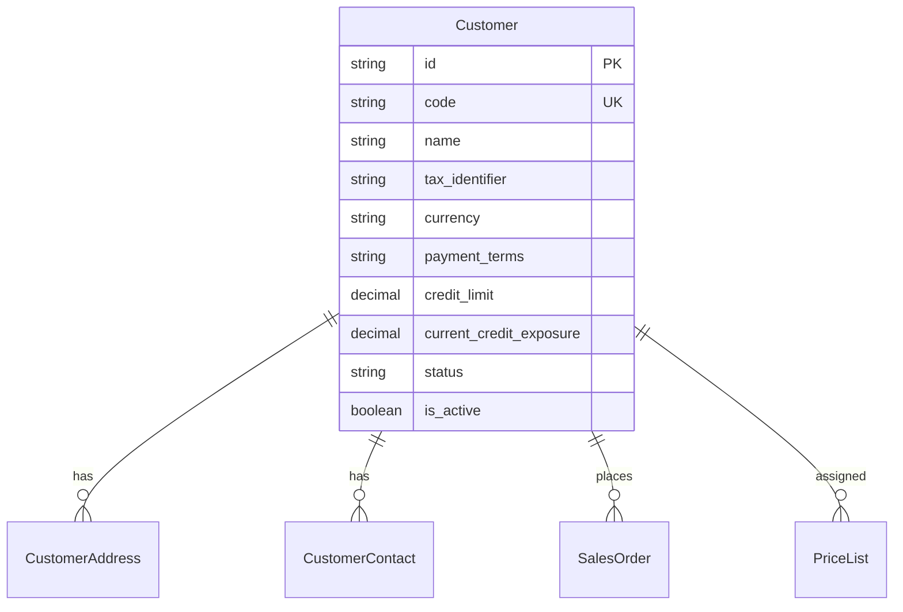
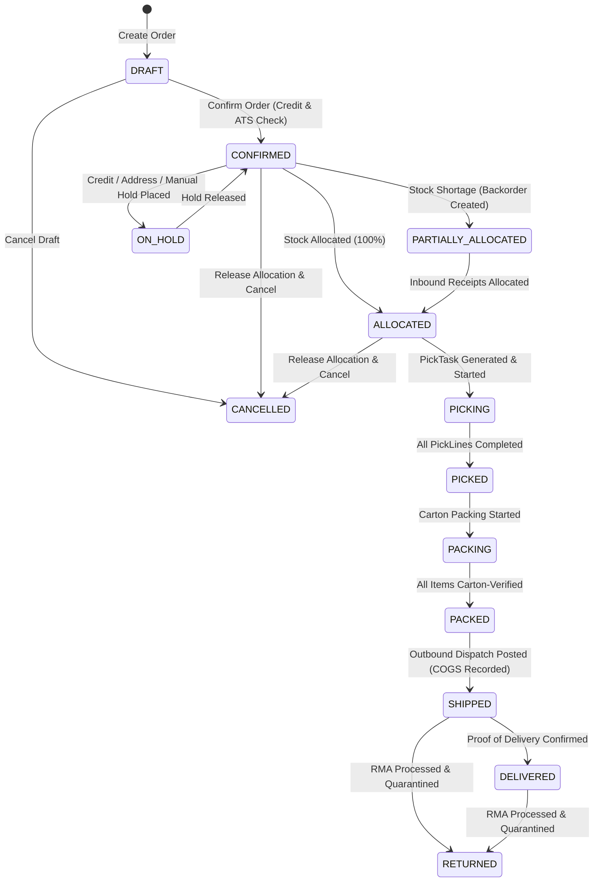
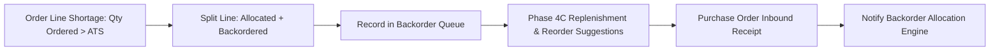
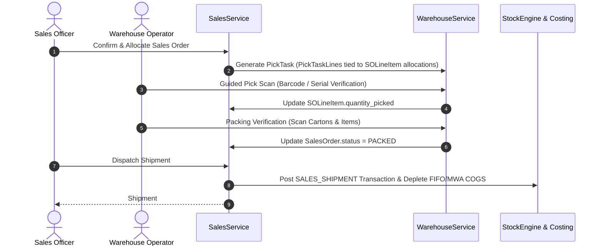
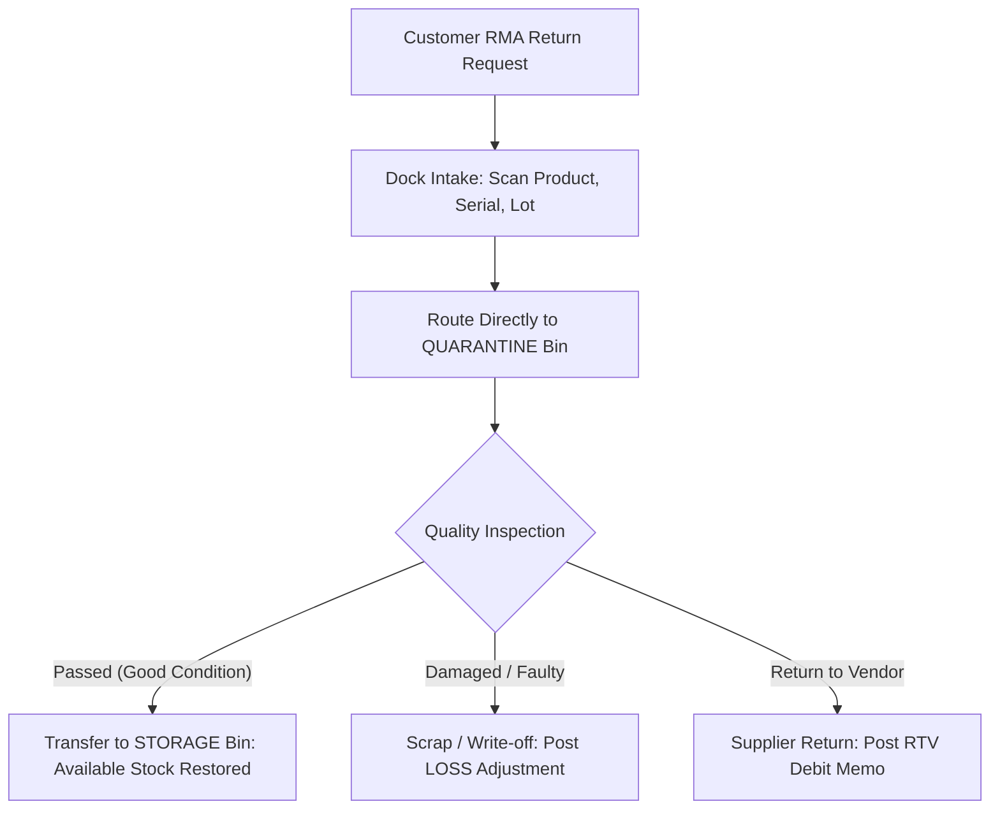
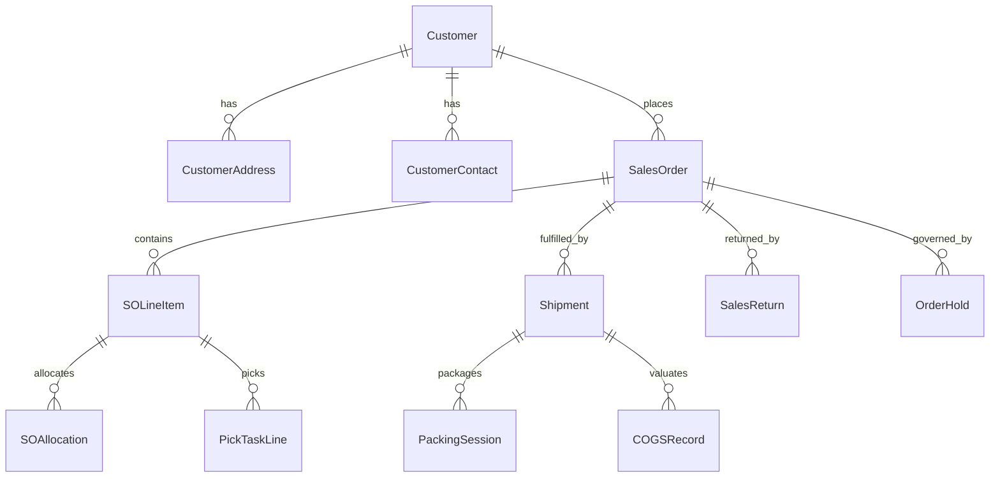

# Phase 8 Architecture Design: Sales & Order Management

## Executive Summary

Phase 8 designs the **Sales & Order Management Architecture** for AuraStock, completing the customer-facing fulfillment lifecycle from customer onboarding, order entry, credit validation, allocation, warehouse picking/packing, outbound dispatch, delivery, and RMA return handling.

The architecture strictly adheres to our foundational core invariants:
$$\mathbf{PostgreSQL\ is\ the\ Sole\ Authoritative\ System\ of\ Record.}$$
$$\mathbf{SalesService\ is\ the\ Unified\ Authoritative\ Sales\ Domain\ Engine.}$$
$$\mathbf{StockEngine\ and\ CostingService\ Remain\ the\ Exclusive\ Authority\ for\ Ledger\ Mutations\ and\ COGS.}$$

```
  Customer Master (Contacts, Addresses, Credit Limits, Price Lists)
                                │
                                ▼
  Sales Order (Draft ──► Confirmed ──► Allocated ──► Picking ──► Packed ──► Shipped ──► Delivered)
                                │
                  ┌─────────────┴─────────────┐
                  ▼                           ▼
       Warehouse Picking & Packing     Outbound Dispatch
       (PickTasks & PackingSessions)   (Shipment & COGS Depletion)
                  │                           │
                  └─────────────┬─────────────┘
                                ▼
                   Customer Returns & RMA
               (Quarantine Intake ──► Restock/Scrap)
```

---

## 1. Existing Sales Architecture Audit & Capability Matrix

| Capability | Existing Implementation | Completeness | Missing / Incomplete Elements | Phase 8 Action |
| :--- | :--- | :--- | :--- | :--- |
| **Customer Master** | `Customer` model in `sales.py` | **Partial** | Multiple addresses, contacts, credit limits, payment terms, tax ID | Extend `Customer` model & create `CustomerAddress` |
| **Sales Order CRUD** | `SalesOrder` + `SOLineItem` | **Complete** | Order holds, cancellation reasons, backorder flags | Extend status enum & add hold/cancellation metadata |
| **Order Line Totals** | Decimal math in `SalesService`| **Complete** | Customer-specific price lists, tier discounts | Formalize Price List engine in Phase 8B |
| **Inventory Availability**| `StockBalanceCache` | **Complete** | Real-time ATS formula (`on_hand - allocated - quarantine`) | Expose ATS endpoint & check during order entry |
| **Stock Allocation** | `SOAllocation` + row locks | **Complete** | Partial allocation, backorder split, FEFO lot priority | Add partial allocation & FEFO auto-allocation |
| **Warehouse Picking** | `PickTask` in `warehouse_ops`| **Partial** | Direct automatic generation of `PickTask` from SO allocation | Implement SO $\to$ `PickTask` workflow bridge |
| **Packing & Cartons** | `PackingSession` + `PackingItem`| **Complete (7B)**| Multi-carton manifest aggregation in Sales UI | Integrate packing manifest into Sales Order detail view |
| **Outbound Dispatch** | `Shipment` + `StockEngine` | **Complete** | Partial shipments, multi-shipment tracking | Extend `dispatch_sales_order` for split shipments |
| **Customer Returns / RMA**| `SalesReturn` + `SalesReturnLine`| **Complete (7B)**| RMA authorization workflow & inspection disposition | Add RMA status progression (`REQUESTED` $\to$ `INSPECTED`) |
| **Order Holds** | None | **Missing** | Credit hold, fraud hold, address hold, inventory hold | Implement Order Hold state machine & release RBAC |
| **Customer Credit Limits**| None | **Missing** | Outstanding balance check, credit exposure calculation | Implement credit exposure guard on SO confirmation |
| **Multi-Warehouse SO** | Single `warehouse_id` per SO | **Partial** | Split-warehouse fulfillment groups | Scope multi-warehouse fulfillment for Phase 8B |
| **Sales Analytics** | Basic reports | **Partial** | Fill rate, backorder rate, gross margin via `CostingService` | Implement dedicated Sales Analytics endpoints |

---

## 2. Authoritative Sales Engine & Boundary Definitions

1. **`SalesService` Authority**:
   - `SalesService` is the single domain entry point for customer orders, confirmations, allocations, dispatches, cancellations, holds, and returns.
   - No parallel order services or duplicate ledger mutation paths are permitted.
2. **Integration with `StockEngine` & `CostingService`**:
   - When orders are allocated: `SalesService` updates `StockBalanceCache.quantity_allocated` and creates `SOAllocation` records under deterministic sorted row locks (`SELECT FOR UPDATE`).
   - When shipments are dispatched: `SalesService` releases allocations, calls `StockEngine.post_transaction` (`SALES_SHIPMENT`), and invokes `CostingService.record_outbound_dispatch` to deplete FIFO/MWA cost layers and write immutable `COGSRecord`s.
   - When returns are ingested: `SalesService` processes the intake through `StockEngine.post_transaction` (`SALES_RETURN`), placing stock into `QUARANTINE` or `RECEIVING` bins without premature available stock inflation.

---

## 3. Customer Master Subsystem



### 3.1 Customer Attributes
- **Identity & Contact**: `id`, `code` (Unique business key e.g. `CUST-1001`), `name`, `tax_identifier` (VAT/GST/EIN), `currency` (Default ISO 4217 code).
- **Credit & Financials**: `payment_terms` (`PREPAID`, `NET_15`, `NET_30`, `NET_60`), `credit_limit` (Decimal), `current_credit_exposure` (Computed sum of unfulfilled orders + unpaid shipments).
- **Multiple Addresses (`CustomerAddress`)**: `address_type` (`BILLING`, `SHIPPING`), `street1`, `street2`, `city`, `state`, `postal_code`, `country`, `is_default`.
- **Multiple Contacts (`CustomerContact`)**: `first_name`, `last_name`, `email`, `phone`, `job_title`, `is_primary`.

---

## 4. Sales Order Lifecycle & State Machine



### 4.1 State Transition Rules Matrix
| Current State | Target State | Permitted Trigger | Invariant & Pre-condition |
| :--- | :--- | :--- | :--- |
| `DRAFT` | `CONFIRMED` | User / API | Order lines validated; customer credit limit verified. |
| `DRAFT` | `CANCELLED` | User / API | No inventory reservations exist. |
| `CONFIRMED` | `ON_HOLD` | User / System | Credit exceeded, address invalid, or supervisor hold. |
| `ON_HOLD` | `CONFIRMED` | Authorized User | Hold condition resolved; audit log recorded. |
| `CONFIRMED` | `ALLOCATED` | System / User | 100% of line quantities successfully allocated in bins. |
| `CONFIRMED` | `PARTIALLY_ALLOCATED`| System | Partial stock allocated; remaining balance marked backordered. |
| `ALLOCATED` | `PICKING` | Warehouse Op | `PickTask` assigned and operator begins scanning. |
| `PICKING` | `PICKED` | Warehouse Op | All allocated items picked and verified. |
| `PICKED` | `PACKED` | Warehouse Op | Items scanned into shipping cartons via `PackingSession`. |
| `PACKED` | `SHIPPED` | Dispatch Clerk| Outbound shipment created, ledger posted, COGS calculated. |
| `SHIPPED` | `DELIVERED` | Logistics Clerk| Delivery confirmed with carrier tracking or recipient signature. |
| `SHIPPED` / `DELIVERED`| `RETURNED`| RMA Clerk | Customer return intake verified; items routed to quarantine. |

---

## 5. Order-Line Lifecycle & Quantity Invariants

For every `SOLineItem`, the system maintains deterministic line quantity progression:
$$\mathbf{quantity\_ordered = quantity\_allocated + quantity\_backordered + quantity\_cancelled}$$
$$\mathbf{quantity\_allocated \ge quantity\_picked \ge quantity\_packed \ge quantity\_shipped \ge quantity\_returned}$$

```
Ordered Quantity: 100
  ├── Allocated:  80 ──► Picked: 80 ──► Packed: 80 ──► Shipped: 80 ──► Returned: 5
  └── Backordered: 20
```

### 5.1 Line Attributes
- `quantity_ordered`: Total customer requested quantity.
- `quantity_allocated`: Stock physically reserved in specific warehouse location bins.
- `quantity_backordered`: Quantity ordered that could not be allocated due to stock deficits.
- `quantity_picked`: Quantity confirmed picked into carts.
- `quantity_packed`: Quantity packed into shipping cartons.
- `quantity_shipped`: Quantity dispatched out of the warehouse.
- `quantity_returned`: Quantity returned via customer RMA.
- `quantity_cancelled`: Quantity explicitly cancelled prior to dispatch.

---

## 6. Inventory Availability & ATS Architecture

### 6.1 Authoritative Available-to-Sell (ATS) Formula
$$ATS = \sum \text{StockBalanceCache.quantity\_on\_hand} - \sum \text{StockBalanceCache.quantity\_allocated} - \text{QuarantinedStock}$$

- **On Hand**: Physical inventory physically present in facility bins.
- **Allocated**: Stock committed to confirmed sales orders awaiting picking/dispatch.
- **Quarantined**: Stock held in `QUARANTINE` status or damaged return bins.
- **Available to Sell (ATS)**: Uncommitted stock eligible for new sales allocations.

---

## 7. Reservation vs. Allocation Distinction

1. **Logical Reservation**:
   - Order claims stock logically during order confirmation to prevent overselling on e-commerce channels.
   - ATS decreases globally, but specific location bins or serials are not locked.
2. **Physical Allocation**:
   - Concrete location bins, lot batches, and serial numbers are committed to the sales order lines.
   - Generates `SOAllocation` records and locks balance rows under pessimistic database row locks (`SELECT FOR UPDATE`).

---

## 8. Allocation Strategy & FEFO Priority

When allocating stock for an order:
1. **Warehouse Matching**: Evaluates stock exclusively within the order's designated facility.
2. **Physical Location Sorting**: Primary pick faces / storage bins sorted by travel path (Aisle $\to$ Rack $\to$ Shelf $\to$ Bin).
3. **Traceability / Expiry Priority (FEFO)**:
   - For batch/lot tracked items, allocations prioritize lots with the earliest expiration date (`expiry_date ASC`).
   - Costing remains strictly governed by the item's configured financial costing engine (FIFO / MWA) independently of physical pick routing.

---

## 9. Multi-Warehouse Fulfillment Strategy (Phase 8A vs. Phase 8B)

- **Phase 8A (Baseline)**: Single warehouse per Sales Order (`SalesOrder.warehouse_id`). 100% of lines allocated and shipped from one facility.
- **Phase 8B (Fulfillment Groups)**:
  - Orders may be split into **Fulfillment Groups** (`SOFulfillmentGroup` with `source_warehouse_id`).
  - Supports split shipments from multiple regional fulfillment centers.

---

## 10. Backorders & Replenishment Integration



- When ATS is insufficient: `quantity_allocated = ATS`, and `quantity_backordered = quantity_ordered - ATS`.
- Backordered quantities feed directly into **Phase 4C Demand & Replenishment recommendations**.
- When new purchase shipments arrive (GRN posted), backordered sales lines are prioritized for fulfillment.

---

## 11. Pricing, Price Lists & Financial Calculations

### 11.1 Decimal-Safe Financial Invariants
$$\text{Line Gross} = \text{round}(\text{quantity\_ordered} \times \text{unit\_price},\ 4)$$
$$\text{Line Discount} = \text{round}\left(\text{Line Gross} \times \frac{\text{discount\_pct}}{100},\ 4\right)$$
$$\text{Line Tax} = \text{round}\left((\text{Line Gross} - \text{Line Discount}) \times \frac{\text{tax\_pct}}{100},\ 4\right)$$
$$\text{Line Total} = (\text{Line Gross} - \text{Line Discount}) + \text{Line Tax}$$
$$\text{Order Grand Total} = \sum \text{Line Total} + \text{shipping\_fee}$$

- **Historical Price Immutability**: Order totals and line prices are permanently recorded on the `SalesOrder` and `SOLineItem` rows upon creation. Future price list changes or tax updates never alter historical orders.

---

## 12. Picking & Packing Subsystem Integration



---

## 13. Outbound Dispatch & Shipping Architecture

- **Shipment Record (`Shipment`)**:
  - `shipment_number`, `carrier` (e.g. `FedEx`, `UPS`, `DHL`, `Internal Fleet`), `tracking_number`, `package_count`, `total_weight`, `shipped_at`, `dispatched_by_user_id`.
- **Atomic Dispatch Execution**:
  1. Validates order status is `PACKED` or `ALLOCATED`.
  2. Releases allocations from `StockBalanceCache` (`quantity_allocated -= ship_qty`).
  3. Posts double-entry stock ledger deduction via `StockEngine.post_transaction` (`SALES_SHIPMENT`).
  4. Depletes cost layers and calculates authoritative COGS via `CostingService.record_outbound_dispatch`.
  5. Transitions serials to `DISPATCHED` and sets `location_bin_id = None`.

---

## 14. Customer Returns (RMA) Subsystem



- **Quarantine Guarantee**: Inbound returns are **never placed into general saleable inventory** until authorized quality inspection is completed and approved.
- **Historical COGS Preservation**: Returns record restitution transactions without corrupting previously finalized historical accounting periods.

---

## 15. Order Cancellation & Hold Architecture

### 15.1 Cancellation Rules Matrix
| Order Status at Cancellation | Inventory Action | Permitted? |
| :--- | :--- | :---: |
| `DRAFT` | No inventory mutations needed | **YES** |
| `CONFIRMED` | Release logical reservations | **YES** |
| `ALLOCATED` | Release physical allocations (`quantity_allocated -= qty`) | **YES** |
| `PICKING` | Cancel pick tasks; transfer picked items back to storage bins | **YES** |
| `PACKED` | Unpack cartons; return items to storage bins | **YES** |
| `SHIPPED` / `DELIVERED` | Blocked; must use Customer Return (RMA) workflow | **NO** |

### 15.2 Order Hold Types
- **`CREDIT_HOLD`**: Placed automatically when customer credit limit is exceeded.
- **`ADDRESS_HOLD`**: Placed when shipping address fails carrier verification.
- **`FRAUD_HOLD`**: Placed for manual risk review.
- **`SUPERVISOR_HOLD`**: Custom administrative hold.

---

## 16. Customer Credit Limit & Exposure Control

$$\text{Credit Exposure} = \sum \text{Unpaid Delivered Invoices} + \sum \text{Shipped Uninvoiced Orders} + \sum \text{Confirmed/Allocated Orders}$$

- **Pre-Confirmation Check**: If $\text{Credit Exposure} + \text{New Order Total} > \text{Customer.credit_limit}$, the order is automatically flagged and placed on `ON_HOLD (CREDIT_EXCEEDED)`.
- **Authorized Override**: Requires `sales:credit_override` permission with audit log capture.

---

## 17. Operational Sales Analytics

The sales analytics subsystem provides operational business intelligence powered by authoritative costing:
1. **Sales Performance**: Revenue, units sold, and average order value (AOV) by product, category, customer, and warehouse.
2. **Order Fulfillment Metrics**: Order cycle time, on-time in-full (OTIF) rate, fill rate, backorder frequency, and cancellation rate.
3. **Customer Return Rate**: Return percentage by product SKU and return reason analysis (`DAMAGED`, `DEFECTIVE`, `WRONG_ITEM`).
4. **Gross Profit Margin Analysis**:
   $$\text{Gross Margin} = \frac{\text{Sales Revenue} - \text{Authoritative COGS}}{\text{Sales Revenue}} \times 100\%$$
   *(Strictly uses historical COGS recorded by `CostingService`)*.

---

## 18. Traceability & Offline Integration

1. **Phase 6 Bidirectional Traceability**:
   - Trace forward from Supplier GRN $\to$ Lots/Serials $\to$ Sales Orders $\to$ Shipments $\to$ Customers.
   - Trace backward from Customer RMA $\to$ Shipment $\to$ Picking Cartons $\to$ Warehouse Bins $\to$ Supplier GRN.
2. **Offline Operations Policy**:
   - `PACK_ITEM`: Offline carton verification enabled (Phase 7B).
   - `CUSTOMER_RETURN`: Offline RMA dock intake enabled (Phase 7B).
   - Order Creation / Confirmation / Allocation: **Online Only** to prevent stock overselling and credit breaches.

---

## 19. RBAC & Separation of Duties

| Action | Required Permission | Separation of Duties |
| :--- | :--- | :--- |
| **Create / Edit Draft Order** | `sales:write` | Standard sales representative |
| **Confirm Order** | `sales:confirm` | Sales manager / clerk |
| **Credit Limit Override** | `sales:credit_override` | Financial controller / Finance admin |
| **Allocate Stock** | `sales:allocate` | Inventory coordinator |
| **Pick & Pack Order** | `warehouse:write` | Warehouse operator |
| **Dispatch Shipment** | `sales:dispatch` | Logistics / Shipping clerk |
| **Cancel Confirmed Order**| `sales:cancel` | Sales manager |
| **Process RMA Return** | `sales:return` | Returns / Quality inspector |
| **Approve Restock / Scrap**| `warehouse:adjust` | Warehouse supervisor |

---

## 20. Concurrency & Locking Strategy

- **Pessimistic Row-Level Locking**: `SalesService.allocate_stock`, `pick_items`, and `dispatch_sales_order` enforce deterministic sorted row locks (`SELECT FOR UPDATE`) on all touched `SalesOrder`, `SOLineItem`, and `StockBalanceCache` rows.
- **Deadlock Prevention**: Balance rows are always locked in ascending alphabetical order of `(warehouse_id, location_bin_id, item_variant_id)`.
- **Zero Lost Updates & Zero Overselling**: Concurrent allocations competing for the same inventory evaluate real-time available balances under locks.

---

## 21. Complete Data Model & Proposed Schema Extensions



---

## 22. Implementation Phasing Recommendation

### Phase 8A: Core Sales Fulfillment & Lifecycle Hardening (Must-Have)
- Extended `Customer` master (addresses, contacts, credit limits, tax IDs).
- Sales order state machine extensions (`ON_HOLD`, `PARTIALLY_ALLOCATED`, `DELIVERED`).
- Backorder tracking and partial allocation support.
- Bridge connecting Sales Order allocation to `PickTask` / `PackingSession`.
- Credit limit enforcement and authorized override workflows.
- RMA inspection disposition (`RESTOCK` vs. `SCRAP`).
- Automated concurrency, allocation, dispatch, and return test suites.

### Phase 8B: Advanced Sales & Price Management
- Tiered Price Lists & Customer Group pricing rules.
- Multi-warehouse fulfillment groups and split shipment routing.
- Dedicated operational Sales Analytics dashboard (AOV, OTIF, Fill Rate, Margin).

### Explicitly Deferred to Future Roadmap Phases
- Full CRM and lead qualification workflows.
- Customer-facing self-service web portal.
- Third-party e-commerce marketplace sync (Shopify / Amazon).
- Automated parcel carrier label generation API integrations (FedEx / UPS).
- Payment gateway card processing.
