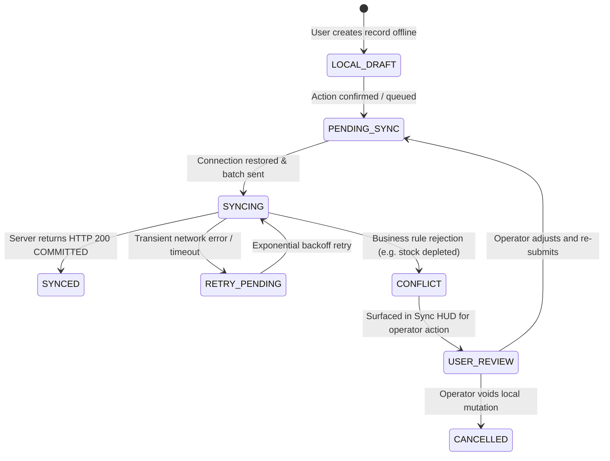

# AuraStock v1.1 Discovery & Architecture Report: Offline-First Desktop Application

## 1. Executive Summary & Context
AuraStock v1.0.0 is formally certified, production-live, and stable. This discovery report defines the technical architecture for **AuraStock v1.1: Offline-First Desktop Application**, enabling the Tauri Windows Desktop client to operate continuously during network interruptions while preserving the server's absolute authority over the General Ledger, inventory costing, and financial controls.

---

## 2. Audit of Existing Platform Foundations

### 2.1 Existing Edge & Offline Synchronization (`SyncService` & `EdgeSyncEngine`)
- **Models**:
  - `SyncDevice` (`apps/backend/app/models/sync.py`): Tracks device hardware identifier, platform, lease expiration (`active_lease_expires_at`), and status (`ACTIVE`, `REVOKED`).
  - `SyncIdempotencyLog` (`apps/backend/app/models/sync.py`): Records `client_transaction_id`, `operation_type`, `status` (`COMMITTED`, `REJECTED`, `CONFLICT`), `server_transaction_id`, and `response_payload`.
  - `EdgeSyncBatch` (`apps/backend/app/models/supply_chain.py`): Batch envelope with HMAC-SHA256 signature verification.
- **Protocol**:
  - `POST /api/v1/sync/handshake`: Issues 8-hour cryptographic offline lease token.
  - `GET /api/v1/sync/downstream/delta`: Retrieves master items, variants, bins, lots, serials, and stock balances.
  - `POST /api/v1/sync/upstream/batch`: Ingests offline mutations sequentially with idempotent log checking.
- **Strengths**: Proven idempotency guards, row locking via `with_for_update()`, strict tenant isolation.
- **Gaps to Address in v1.1**:
  - Expanding supported offline transaction types beyond warehouse scans to include offline Sales Orders, Maintenance Part Consumptions, and Local Draft Receipts.
  - Adding persistent local client-side queue storage surviving app and system power loss.

### 2.2 Existing Tauri Desktop Integration (`apps/desktop-tauri` & `packages/native-bridge`)
- **Runtime**: Tauri v2 with Rust backend and WebView2 frontend.
- **Capabilities**:
  - `NativeBridge` (`packages/native-bridge/src/index.ts`): Barcode hardware wedge listener, raw ZPL/ESC-POS thermal printing, native Windows file dialogs, and secure credential storage hooks.
- **Gaps to Address in v1.1**:
  - Implementing an encrypted local storage engine (SQLite with SQLCipher / Windows DPAPI).
  - Background synchronization worker thread in Rust/TypeScript to handle auto-reconnection and exponential backoff retry loops.

---

## 3. Core Architectural Principle: Server Financial Authority

$$\begin{CD}
\text{Desktop Client (Offline)} @>>> \text{Local Durable Store (PENDING\_SYNC)} \\
@. @VV\text{Network Reconnection}V \\
\text{Server Execution Engine} @<<< \text{Server Ingestion \& Validation} \\
@VV @. \\
\text{Authoritative Stock Ledger \& General Ledger (JV)} @>>> \text{Server ACK (SYNCED)}
\end{CD}$$

1. **Client Never Posts Directly to GL**: Offline transactions create durable local pending mutation records.
2. **Server Validates & Posts**: Upon reconnection, the server validates accounting periods, approvals, stock availability, and DoA limits before generating authoritative double-entry journal vouchers.
3. **Idempotency Invariant**: Every offline mutation contains a client-generated UUIDv7 (`client_tx_id`). Resending an already-processed mutation returns the cached server acknowledgement with zero duplicate accounting or stock entries.

---

## 4. Local Database & Durable Storage Architecture

### 4.1 Local Storage Engine
- **Engine**: Embedded SQLite database (`aurastock_local.db`) managed via Tauri SQLite plugin or encrypted IndexedDB fallback in browser preview mode.
- **Encryption**: AES-256-GCM encryption with encryption key protected via Windows Credential Vault (DPAPI).

### 4.2 Local Schema: `offline_mutation_queue`
```sql
CREATE TABLE offline_mutation_queue (
    operation_id TEXT PRIMARY KEY,        -- UUIDv7 (time-ordered)
    tenant_id TEXT NOT NULL,
    user_id TEXT NOT NULL,
    warehouse_id TEXT NOT NULL,
    entity_type TEXT NOT NULL,           -- INVENTORY_TRANSFER, SALES_ORDER, MWO_COMPLETION, etc.
    entity_id TEXT,                      -- Local temporary ID or target server ID
    operation_type TEXT NOT NULL,        -- BIN_TRANSFER, CREATE_SO, CONSUME_PARTS, COUNT_SCAN
    payload_json TEXT NOT NULL,          -- Full serialized mutation payload
    created_at_utc TEXT NOT NULL,
    client_version TEXT NOT NULL,
    sync_status TEXT NOT NULL,           -- PENDING_SYNC, SYNCING, SYNCED, RETRY_PENDING, CONFLICT
    retry_count INTEGER DEFAULT 0,
    last_error TEXT,
    server_ack_id TEXT,                  -- Returned server_transaction_id
    committed_at_utc TEXT
);

CREATE INDEX idx_queue_status ON offline_mutation_queue (sync_status, created_at_utc);
```

---

## 5. Synchronization State Machine



---

## 6. Financial Offline Policy Matrix

| Subsystem / Workflow | Offline Policy | Rationale & Server Resolution Rule |
| :--- | :---: | :--- |
| **Warehouse Transfers & Bin Moves** | **ALLOWED** | Logged locally against cached stock balances; server validates and posts upon sync. |
| **Physical Cycle Count Scans** | **ALLOWED** | Counts stored locally; server calculates variances and posts adjustments upon sync. |
| **Sales Order Creation (Draft/Confirmed)** | **ALLOWED** | Created with local order reference; server allocates stock and validates pricing upon sync. |
| **Maintenance Spare Parts Consumption** | **ALLOWED** | Work order progress logged locally; server updates inventory and posts GL `1500`/`1200` upon sync. |
| **Customer Payments / AR Collections** | **RESTRICTED** | Offline capture permitted as `PENDING_CLEARANCE` draft; GL `1000`/`1100` posted only upon online sync. |
| **Vendor Invoicing & AP 3-Way Match** | **RESTRICTED** | Draft entry permitted; 3-way matching and GL `2000` posting executed by server upon sync. |
| **Accounting Period Closing / Re-Opening** | **PROHIBITED** | Strictly forbidden offline. Requires online GL supervisor authentication. |
| **Intercompany Consolidation Eliminations** | **PROHIBITED** | Strictly forbidden offline. Requires multi-entity consensus on authoritative server. |
| **Fixed Asset Depreciation Execution** | **PROHIBITED** | Strictly forbidden offline. Handled by authoritative server scheduler. |

---

## 7. Conflict-Resolution Model

1. **Inventory Stock Depletion Conflict**:
   - *Scenario*: User moves 10 units of Variant A offline, but central inventory was depleted by another order online.
   - *Policy*: Server rejects mutation with `INSUFFICIENT_STOCK_CONFLICT`. Local mutation transitions to `CONFLICT`. Surfaced to operator in Sync Center to adjust quantity or transfer from alternate bin.
2. **Sales Order Pricing Conflict**:
   - *Scenario*: Pricing tier updated on server while client was offline.
   - *Policy*: Server respects price locked at time of offline order creation if within authorized discount limits, otherwise flags for pricing review.
3. **Unique Document Sequence Parity**:
   - *Scenario*: Local temporary reference `LOCAL-SO-001` assigned offline.
   - *Policy*: Server assigns authoritative server number (`SO-20260820-0042`) and returns cross-reference mapping in sync acknowledgement.

---

## 8. Authentication & Offline Security Model

1. **Cryptographic 8-Hour Offline Lease**:
   - Device performs online handshake, receiving lease signed with server HMAC.
   - User PIN / biometric unlocks cached encrypted session for the duration of the active lease (8 hours / shift duration).
2. **Anti-Tamper Protections**:
   - Local database encrypted with AES-256-GCM.
   - Secrets stored in Windows Credential Vault (DPAPI).
   - If device is revoked by an admin on the server, the very next sync attempt rejects all mutations and purges the local session.
3. **No Plaintext Credential Storage**: Passwords and raw tokens are never persisted in plaintext.

---

## 9. UI/UX Synchronization Indicators

- **Global Navigation Bar Status**:
  - `● ONLINE (Synced)`: Green indicator with timestamp of last successful synchronization.
  - `● OFFLINE (7 Pending Sync)`: Amber warning badge with counter of pending local changes.
  - `● SYNC CONFLICT (1 Action Required)`: Red alert badge opening the Conflict Resolution Modal.
- **Sync Center Modal (`/sync/center`)**:
  - Live list of pending, syncing, and synced operations.
  - Diff view for conflicts with "Retry with updated quantity", "Re-assign bin", or "Discard local draft".
  - Manual "Sync Now" trigger button.

---

## 10. Verification & Rollout Strategy

1. **Automated Unit & Integration Tests**:
   - Mocking offline disconnection, queuing 20+ mutations, reconnecting, and verifying zero subledger variance ($0.00).
   - Simulating server re-delivery to prove idempotency ($1$ mutation executed, $2$ safe ACKs).
2. **Rollout Phases**:
   - Phase 1: Local durable queue engine & offline indicators.
   - Phase 2: Offline sales orders, warehouse transfers, and maintenance consumption.
   - Phase 3: Conflict resolution UI and final release certification.
