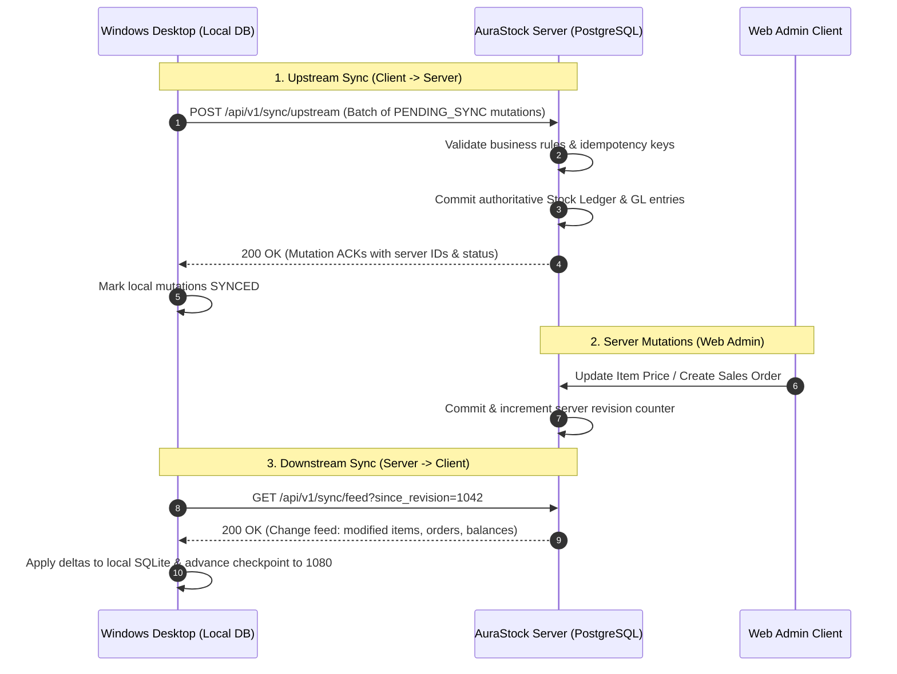

# AuraStock: Web + Windows Offline-First Bidirectional Production Architecture & Discovery Report

## 1. Existing Phase 21 Offline/Edge Synchronization Audit
- **Core Domain Models**:
  - `SyncDevice` ([`apps/backend/app/models/sync.py`](file:///d:/antigravity/Intentory%20Management%20Software/apps/backend/app/models/sync.py)): Tracks device hardware GUID (`device_identifier`), platform (`WINDOWS_DESKTOP`), active lease duration (`active_lease_expires_at`), and status (`ACTIVE`, `REVOKED`).
  - `SyncIdempotencyLog` ([`apps/backend/app/models/sync.py`](file:///d:/antigravity/Intentory%20Management%20Software/apps/backend/app/models/sync.py)): Records unique `client_transaction_id` (UUIDv7), `operation_type`, `status` (`COMMITTED`, `REJECTED`, `CONFLICT`), `server_transaction_id`, and exact JSON payload.
  - `EdgeSyncBatch` ([`apps/backend/app/models/supply_chain.py`](file:///d:/antigravity/Intentory%20Management%20Software/apps/backend/app/models/supply_chain.py)): Manages batch envelopes with HMAC-SHA256 signature verification.
- **Backend Services**:
  - `SyncService` ([`apps/backend/app/services/sync_service.py`](file:///d:/antigravity/Intentory%20Management%20Software/apps/backend/app/services/sync_service.py)): Provides 8-hour cryptographic lease handshakes, upstream mutation batch processing, and downstream delta sync.
  - `EdgeSyncEngine` ([`apps/backend/app/services/edge_sync_engine.py`](file:///d:/antigravity/Intentory%20Management%20Software/apps/backend/app/services/edge_sync_engine.py)): Validates HMAC headers and enforces online-only transaction gates (`BOM_EDIT`, `PO_APPROVE`, `GL_CLOSE`, `CREDIT_LIMIT_OVERRIDE`).
- **REST Endpoints**: Mounted at `/api/v1/sync/handshake`, `/api/v1/sync/upstream`, `/api/v1/sync/downstream`, and `/api/v1/supply-chain/edge/sync`.

---

## 2. Existing Tauri Desktop Application Audit
- **Desktop Runtime**: Tauri v2 with Rust native host (`apps/desktop-tauri/src-tauri/src/main.rs`, `lib.rs`) wrapping WebView2.
- **Native Platform Bridge**: `NativeBridge` in [`packages/native-bridge/src/index.ts`](file:///d:/antigravity/Intentory%20Management%20Software/packages/native-bridge/src/index.ts):
  - Hardware wedge barcode scanner buffer (< 50ms keystroke detector).
  - Raw ZPL/ESC-POS thermal printer spooling.
  - Windows DPAPI credential vault integration (`set_secure_key`, `get_secure_key`, `delete_secure_key`).
  - Local mutation queue abstraction (`queueOfflineMutation`, `getPendingMutations`, `updateMutationStatus`, `clearSyncedMutations`).

---

## 3. Current Web Application Architecture
- **Framework**: React 18 with TypeScript and Vite.
- **State & Context**: `AuthContext` for JWT access/refresh token lifecycle and permission validation; custom events for connectivity changes (`connection:status`).
- **Pages**: Modular single-page architecture covering Dashboard, Inventory Master Catalog, Stock Ledger, Warehouses, Purchasing, Sales, Barcode Station, Financial Reports, Audit Trail, and Operations.
- **Role**: Primary online administrative portal for global configuration, period closing, financial statements, and executive approvals.

---

## 4. Current Backend Architecture
- **Framework**: FastAPI with asynchronous SQLAlchemy 2.0 (`AsyncSession`).
- **Database Engine**: PostgreSQL 16 (production) with SQLite support in local/dev test runners.
- **Caching & Telemetry**: Redis 7 cache/queue; Prometheus `/metrics` exposition and `TelemetryMiddleware` distributed tracing (`X-Trace-ID`).
- **Ledger Invariant**: Double-entry bookkeeping where all stock and commercial mutations post balancing journal vouchers in General Ledger.

---

## 5. Current Synchronization Architecture
- **Client $\to$ Server (Upstream)**: Offline mutations queued on the client and dispatched via `POST /api/v1/sync/upstream` inside `SyncUpstreamBatchRequest`. The server processes each mutation atomically, validates constraints, and commits idempotency log entries.
- **Server $\to$ Client (Downstream)**: `GET /api/v1/sync/downstream?warehouse_id={id}` retrieves active item catalog, bins, stock balances, lots, and serials.

---

## 6. Gap Analysis
1. **Downstream Incremental Checkpoints**: Current downstream sync returns full active snapshots rather than revision-based change feeds (`since_revision` / `since_timestamp`).
2. **Local Client-Side Durable Database**: Needs a structured local embedded SQLite database with Write-Ahead Logging (WAL) and AES-256-GCM encryption on the desktop.
3. **Background Sync Worker**: Needs an automated background daemon in the desktop app to monitor network status, trigger sync upon reconnection, and handle exponential backoff retries.
4. **Interactive Conflict Resolution UI**: Needs an operator diff viewer in the UI for resolving business conflicts (e.g. stock depletion while offline).

---

## 7. Proposed Web + Windows Dual-Client Architecture

$$\begin{CD}
\textbf{AuraStock Server} @>>> \textbf{Authoritative PostgreSQL 16} \\
@AAA @. \\
\textbf{FastAPI Sync Engine} @<<< \textbf{Redis 7 Outbox / Change Feed} \\
@VV @VV \\
\textbf{Web Client (Online-First)} @. \textbf{Windows Client (Offline-First)} \\
\text{(Admin, Approval, Period Close)} @. \text{(Warehouse Ops, Drafts, Scans)} \\
@. @VV \\
@. \textbf{Encrypted Local SQLite (WAL)}
\end{CD}$$

- **Web Client**: Browser-based administrative console for enterprise management, accounting period closing, financial reporting, and DoA approvals.
- **Windows Client**: Production warehouse client with embedded local SQLite database and local transaction queue capable of continuous offline execution.

---

## 8. Proposed Offline-First Architecture
1. **Local Writes**: When offline, supported mutations execute immediately against the local SQLite database and are recorded into `offline_mutation_queue` with status `PENDING_SYNC`.
2. **Upstream Flush**: When online, the client flushes pending mutations in chronological order to `POST /api/v1/sync/upstream`.
3. **Downstream Pull**: The client queries `GET /api/v1/sync/feed?since_revision={rev}` to pull all modifications made on the server (via Web or other clients) since the last checkpoint.

---

## 9. Local Database Architecture (Windows Desktop)
- **Engine**: SQLite 3 with Write-Ahead Logging (`PRAGMA journal_mode = WAL;`) and `PRAGMA synchronous = NORMAL;`.
- **Encryption**: AES-256-GCM database encryption with key stored in Windows Credential Vault (DPAPI).
- **Core Local Tables**:
  - `local_item_catalog` (mirror of items & variants)
  - `local_location_bins` (mirror of warehouse bins)
  - `local_stock_balances` (working balance replica)
  - `offline_mutation_queue` (durable outbox queue)
  - `sync_checkpoint_state` (stores `last_synced_server_revision`)

---

## 10. Bidirectional Synchronization Protocol

---

## 11. Bidirectional Change-Feed Design
- **Server Change Feed Engine**:
  - Tracks entity mutations in `entity_change_feed` table with monotonic `revision_id` (BigInteger autoincrement), `entity_type`, `entity_id`, `change_type` (`INSERT`, `UPDATE`, `DELETE`), `payload_json`, and `created_at`.
- **Incremental Query**:
  $$\text{SELECT} * \text{FROM entity\_change\_feed WHERE tenant\_id = :t AND revision\_id > :since\_rev ORDER BY revision\_id ASC LIMIT 500;}$$
- **Zero Full Dumps**: Transfers only modified rows, eliminating bandwidth bloat.

---

## 12. Operation State Machine

$$\begin{CD}
\text{LOCAL\_DRAFT} @>>> \text{PENDING\_SYNC} @>>> \text{SYNCING} \\
@. @. @VV \\
@. \text{USER\_REVIEW} @<<< \text{CONFLICT} @. \text{SYNCED (HTTP 200)} \\
@. @VV @. @. \\
@. \text{CANCELLED / VOID} @. @. \text{RETRY\_PENDING (Backoff)}
\end{CD}$$

---

## 13. Idempotency Design
- **UUIDv7 Client Transaction IDs**: Every mutation carries a client-generated UUIDv7 containing a millisecond timestamp and cryptographic entropy.
- **Server Verification**: `SyncService` queries `SyncIdempotencyLog` with `with_for_update()` before executing mutations. Duplicate requests immediately return the cached acknowledgement payload with zero duplicate stock movements or GL postings.

---

## 14. Transaction Boundary Design
- **Atomic Batch Envelope**: Multi-line documents (e.g. Sales Order header + lines, Transfer Order header + lines) are encapsulated in a single `SyncMutationEnvelope`.
- **All-or-Nothing Commit**: The server executes the entire document within an ACID database transaction. If any line fails constraint checks, the entire document transaction rolls back and is logged as `CONFLICT` or `REJECTED`.

---

## 15. Conflict-Resolution Model

| Domain | Conflict Scenario | Resolution Policy |
| :--- | :--- | :--- |
| **Physical Stock** | Local consumption requested but stock depleted by Web order | **Server Authoritative Rejection**: Mutation marked `CONFLICT`; operator adjusts quantity in Sync Center. |
| **Master Item Catalog** | Product details updated simultaneously | **Server Wins**: Server change feed overwrites local metadata. |
| **Draft Sales Order** | Customer address updated on Web | **Merge & Accept**: Order created with original items; current active address referenced. |
| **Cycle Count Scan** | Multiple offline scans of the same bin | **Additive Sum**: Scans aggregated into session count total. |

---

## 16. Inventory Synchronization Model
- **Authoritative Ledger**: The central PostgreSQL database is the sole writer of `StockLedgerTransaction` and `StockLedgerEntry`.
- **Local Working Balances**: The desktop app decrements/increments its local `StockBalanceCache` immediately for offline responsiveness. Upon sync, the server computes authoritative FIFO/Moving Average cost layers and reconciles the cache.

---

## 17. Financial Offline Policy Matrix

| Subsystem / Operation | Offline Policy | Rationale |
| :--- | :---: | :--- |
| **Bin Movements & Putaway** | **ALLOWED** | Operational warehouse workflow; GL posted by server on sync. |
| **Cycle Count Scans** | **ALLOWED** | Physical inventory counting; adjustments posted on sync. |
| **Sales Order Creation (Draft)** | **ALLOWED** | Draft orders accepted; stock allocation confirmed on sync. |
| **Maintenance Spare Parts Usage** | **ALLOWED** | MWO parts consumed locally; GL `1500`/`1200` posted on sync. |
| **Customer Payments / AR Intake** | **CONTROLLED** | Recorded as `DRAFT_COLLECTION`; settled only on server sync. |
| **Vendor Invoicing & AP 3-Way Match**| **CONTROLLED** | Draft invoice entry permitted; AP match executed on sync. |
| **Accounting Period Close / Re-open**| **ONLINE ONLY**| Strictly prohibited offline. |
| **Intercompany Eliminations** | **ONLINE ONLY**| Multi-entity reconciliation requires server consensus. |
| **Fixed Asset Depreciation Runs** | **ONLINE ONLY**| Handled exclusively by authoritative server scheduler. |

---

## 18. Authentication Model
- **Online Handshake**: Desktop app authenticates via Argon2id password / TOTP MFA / OIDC SSO.
- **Cryptographic 8-Hour Lease**: Server issues signed `sync_session_token` with an 8-hour expiration.
- **Local Unlock**: User unlocks offline session via local PIN/Windows Hello backed by DPAPI token store.

---

## 19. Offline Authorization Model
- **Minimum Cached Claims**: The offline client retains user permissions (`warehouse:read`, `warehouse:write`, `sales:write`).
- **Server Re-Validation**: The server re-evaluates user permissions and device revocation status (`SyncDevice.status == "ACTIVE"`) upon every sync batch.

---

## 20. Security Threat Model
1. **Device Theft**: Local SQLite database encrypted with AES-256-GCM; key stored in Windows DPAPI vault.
2. **Replay Attacks**: UUIDv7 deduplication in `SyncIdempotencyLog` rejects replayed payloads.
3. **Payload Tampering**: Optional HMAC-SHA256 batch signatures verify message integrity.
4. **Cross-Tenant Leakage**: Tenant ID injected strictly from authenticated claims, never trusted from client JSON.

---

## 21. Document Synchronization Model
- **Metadata Sync**: Document records and cryptographic SHA-256 checksums synchronized in change feed.
- **Lazy Binary Download**: Large PDF/attachment binaries downloaded on-demand when requested by operator.
- **Offline Attachments**: Files staged in local encrypted app storage and uploaded to server storage on reconnect.

---

## 22. Proposed API Enhancements
- `GET /api/v1/sync/feed`: Incremental change-feed endpoint accepting `since_revision: int` and `warehouse_id: str`.
- `POST /api/v1/sync/upstream`: Batch ingestion endpoint supporting expanded offline mutation types.
- `GET /api/v1/sync/status`: Device status and active lease telemetry.

---

## 23. Proposed Database Schema Enhancements
- `entity_change_feed` table:
  - `revision_id` (BigInteger, Primary Key, Autoincrement)
  - `tenant_id` (String(36), Index)
  - `entity_type` (String(50))
  - `entity_id` (String(36))
  - `change_type` (String(20))
  - `payload_json` (JSON)
  - `created_at` (DateTime)

---

## 24. UI/UX Changes
- **Dual-State Connectivity Badge**:
  - `● ONLINE (Synced)` (Green)
  - `● OFFLINE (X Pending Operations)` (Amber)
  - `● SYNCING (Uploading Y / Downloading Z)` (Blue)
  - `● CONFLICT (N Action Items)` (Red)
- **Sync Center Modal**: View mutation queue, trigger manual sync, and review conflict diffs.

---

## 25. Version Compatibility Model
- **Semantic Versioning**: Server and desktop client communicate `client_version` and `server_version` during handshake.
- **Backward Compatibility**: Server v1.1 supports Windows Client v1.0 and v1.1. Incompatible legacy clients are rejected with HTTP 426 Upgrade Required.

---

## 26. Failure & Recovery Model
- **Network Drop During Sync**: Client marks batch `RETRY_PENDING` and triggers exponential backoff (2s, 4s, 8s, 16s, max 60s).
- **Power Loss / Crash**: SQLite WAL mode guarantees zero database corruption; unprocessed queue items remain `PENDING_SYNC` and resume on startup.

---

## 27. Observability Model
- **Prometheus Telemetry Reused**:
  - `aurastock_sync_batches_total`
  - `aurastock_sync_mutations_committed_total`
  - `aurastock_sync_conflicts_total`
  - `aurastock_sync_duration_seconds`
- **Tracing**: `X-Trace-ID` propagated through all sync headers.

---

## 28. Deployment Architecture
- **Server**: Docker Compose multi-container stack (FastAPI backend, PostgreSQL 16, Redis 7, Nginx web proxy).
- **Windows Client**: Tauri MSI / NSIS installer package targeting Windows 10/11 x64.

---

## 29. Migration Strategy
- Add `entity_change_feed` table via standard forward Alembic migration.
- Zero downtime: Existing v1.0.0 web clients and APIs continue operating without interruption.

---

## 30. Testing Strategy
- **Unit Tests**: Offline queue serialization, SQLite encryption, state transitions.
- **Integration Tests**: Bidirectional delta feed and upstream batch processing.
- **Concurrency & Conflict Tests**: Simultaneous Web and multi-desktop mutations on identical inventory items.
- **Financial Parity**: Subledger reconciliation engine asserting $0.00 variance after multi-client synchronization.

---

## 31. Rollout Strategy
1. Deploy server change-feed migration and enhanced sync endpoints.
2. Verify Web application functionality remains 100% stable.
3. Distribute AuraStock v1.1 Windows desktop application installer.

---

## 32. Explicit Limitations
- Accounting period closing and group consolidation eliminations remain strictly prohibited offline.
- Large video/attachment binary synchronization requires active broadband connectivity.

---

## 33. Implementation Sequence
1. Phase A: Server-side `entity_change_feed` model, migrations, and `/sync/feed` endpoint.
2. Phase B: Windows client embedded SQLite storage and background bidirectional sync loop.
3. Phase C: Sync Center UI, conflict diff editor, and status indicators.
4. Phase D: Automated multi-client concurrency test suite and release packaging.

---

## 34. Risk Register

| Risk | Likelihood | Impact | Mitigation |
| :--- | :---: | :---: | :--- |
| **Stale Stock Allocation** | Medium | Medium | Server rejects over-allocations with `CONFLICT` and creates conflict backorders. |
| **Network Flapping** | High | Low | Exponential backoff retry loop with debounce prevents server request flooding. |
| **Database Corruption on Power Cut** | Low | High | SQLite Write-Ahead Logging (WAL) and atomic transaction boundaries. |
| **Stolen Laptop Data Extraction** | Low | Critical | AES-256-GCM database encryption with key secured in Windows DPAPI vault. |
